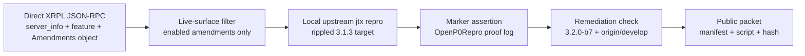
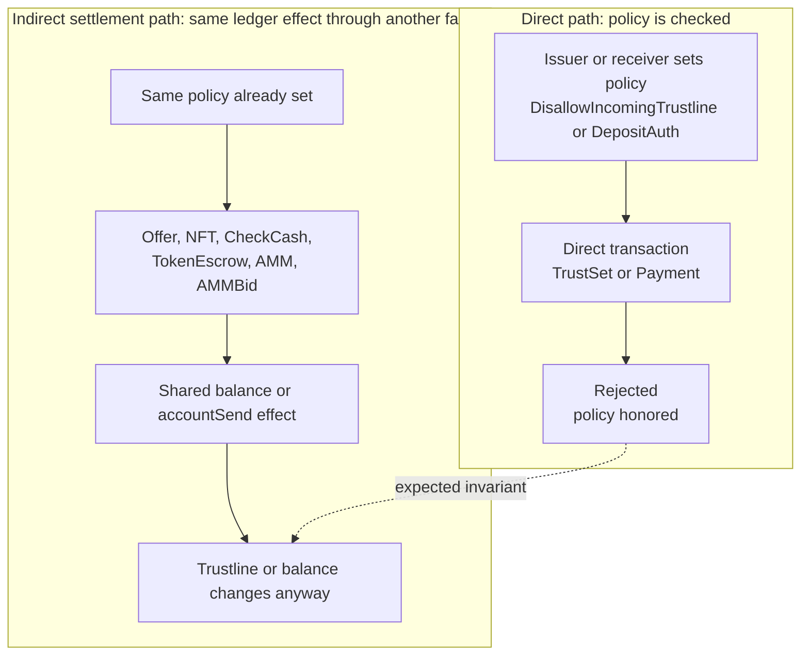

<div class="pearl-primer-box xrpl-lede">
  <p><strong>The contention.</strong> As it stands today, Post Fiat inherits the XRP Ledger. Our controlled testnet runs on a maintained <code>XRPLF/rippled</code> fork, and prior to this work the operating assumption was simple: we are live on that fork and we inherit its package updates as they ship. This article exists because we are now testing that assumption directly. We are in the midst of a full-scale security audit of the upstream codebase to settle two questions: <strong>(1)</strong> which XRPL features Post Fiat actually needs to support, and <strong>(2)</strong> whether the inherited implementation is sound enough to build on — or whether Post Fiat needs its own chain. That is the context for everything below.</p>
  <p><strong>Audience and intent.</strong> This report is written for Post Fiat validators; it is the evidence base for those two decisions. Over the coming weeks we will also put forth best-effort pull requests upstream to <code>XRPLF/rippled</code> for the findings that warrant one.</p>
  <p><strong>Baseline.</strong> The audit targets upstream <code>XRPLF/rippled</code>, baseline <code>3.1.3</code>, commit <code>46b241ace8b30d9c9775d60ffba7d24b21903896</code>.</p>
  <p><strong>What the packet contains.</strong> The packet reproduces 22 individual behaviors as local jtx cases, but they collapse to a much smaller set of distinct findings, and we count them that way. Unfixed in the checked <code>3.2.0-b7</code> / <code>origin/develop</code> refs: <strong>five distinct findings</strong> — three core safety/accounting defects (a baseline IOU reserve/owner-count asymmetry, an MPT lock-state deletion, an MPT transfer-rate overflow), <strong>one policy-enforcement pattern reproduced across thirteen transaction-family paths</strong> (DisallowIncoming / DepositAuth enforced on direct paths but not on indirect settlement — one architectural issue of genuinely contested severity, counted once; see Severity Calibration), and one minor issuer self-exemption. Separately, <strong>five findings were remediated after 3.1.3</strong>. A later continuation sweep adds overlay-layer, invariant-layer, and consensus-trust-model findings in their own sections below.</p>
  <p><strong>Proof model:</strong> each packet finding is reproduced in a clean local upstream jtx harness, bound to a named marker, checked against live amendment state from direct XRPL JSON-RPC, and backed by a static packet verifier.</p>
</div>

---

## Executive Summary

This is a fork-inheritance audit. The practical question is whether a new chain should inherit this code path directly, support it with local patches, or treat the underlying implementation style as too expensive to carry.

A finding only enters the inventory if it has a local reproduction wrapper, an expected marker in the `OpenP0Repro` proof log, a risk label, a live-amendment dependency, and remediation status checked against `3.2.0-b7` and `origin/develop`.

The publisher's incentives are stated plainly. Post Fiat is building in the same authority-validator settlement lineage that made XRPL important, and this audit exists to decide whether direct RippleD inheritance is engineering leverage or inherited risk. Weigh the conclusions against what reproduces: the manifest, the live-amendment receipt, the local jtx proof markers, the remediation refs, and the verifier hash. Every claim here reduces to one of those.

<div class="pearl-hero-grid">
  <div class="pearl-scorecard warn">
    <span class="label">Distinct unfixed findings</span>
    <span class="value">5</span>
    <span class="hint">3 core safety/accounting + 1 policy-enforcement pattern (13 paths, contested) + 1 minor. 22 jtx reproductions total.</span>
  </div>
  <div class="pearl-scorecard warn">
    <span class="label">Core safety/accounting</span>
    <span class="value">3</span>
    <span class="hint">Reserve/owner-count asymmetry, MPT lock-state deletion, MPT transfer-rate overflow — policy-independent.</span>
  </div>
  <div class="pearl-scorecard good">
    <span class="label">Remediating</span>
    <span class="value">5</span>
    <span class="hint">Post-3.1.3 remediation present in beta/develop evidence.</span>
  </div>
</div>

The main pattern is straightforward: direct paths often enforce account policy, while indirect settlement paths sometimes reach the same ledger effect without the same checks. That shows up in offers, NFT settlement, broker fees, checks, token escrows, AMMs, AMM clawback, AMM bid refunds, MPT lock state, reserve accounting, arithmetic, and permissioned DEX invariants.

<div class="pearl-verdict-banner xrpl-verdict">
  <strong>Bottom line</strong>
  <p>The packet is a state-transition quality signal. The repeated failure mode is policy and accounting logic spread across transaction families instead of centralized at the ledger-effect boundary. For a downstream chain that is fork-inheritance risk, even where upstream might treat a given policy edge as a design-semantics dispute.</p>
</div>

## Publication Posture

This report is public because fork-inheritance claims need to be falsifiable. A private assertion that "RippleD is too risky to inherit" would be useless to downstream engineers; a packet with a manifest, exact baseline, live-surface gate, local reproducer, and verifier can be checked or refuted.

The reproduction scripts are local `jtx` harness wrappers that run the upstream `OpenP0Repro` unit-test target and assert named proof markers. They require no mainnet wallet, submit nothing to XRPL mainnet, and read no explorer state. The live-chain component is the amendment/runtime receipt used to decide whether a locally reproduced surface is relevant to current mainnet semantics.

Public disclosure still carries risk, but the report's blast radius is materially different from a live exploit runbook. The point is to let maintainers, fork authors, auditors, and infrastructure operators distinguish three things that are often blurred together: reproducible state-transition behavior, live amendment relevance, and the policy question of whether upstream considers the behavior intended.

## Severity Calibration

The scores in this report are internal fork-inheritance risk labels for our own prioritization, calibrated to one engineering question: "how dangerous or expensive is this behavior for a chain deciding whether to inherit `rippled 3.1.3` semantics?" They carry no CVSS or CVE weight.

<div class="xrpl-calibration-grid">
  <div class="xrpl-calibration-card critical">
    <span>Core safety/accounting</span>
    <strong>Substantively concerning on their own</strong>
    <p><code>MPT-LOCK-UNAUTH-001</code>, <code>TRUSTLINE-POSITIVE-BALANCE-RESERVE-001</code>, and <code>MPT-TRANSFER-RATE-OVERFLOW-001</code> touch lock durability, reserve accounting, or bounded consensus arithmetic. These do not depend on a philosophical reading of issuer opt-out policy.</p>
  </div>
  <div class="xrpl-calibration-card">
    <span>Policy-enforcement cluster</span>
    <strong>Important as a repeated implementation pattern</strong>
    <p>The DisallowIncoming and DepositAuth cases are enforcement-consistency failures: a policy the direct path enforces is bypassed by an indirect settlement path that reaches the same ledger effect. If upstream intends those flags as soft preferences, that should be specified. If they are hard account policies, enforcement belongs at the shared ledger-effect boundary, where one check covers every settlement path.</p>
  </div>
  <div class="xrpl-calibration-card remediated">
    <span>Remediation evidence</span>
    <strong>Upstream activity is part of the signal</strong>
    <p>Five findings are being fixed in beta/develop. We use those landed fixes to calibrate inheritance risk: where upstream is already moving, a fork can track it; where it is not, the fork carries the surface itself.</p>
  </div>
</div>

The policy cluster remains high fork-risk even when it is not direct fund loss. A ledger-visible flag named `DisallowIncomingTrustline` or `DepositAuth` is a contract with wallets, issuers, auditors, and downstream protocol authors. If that contract only applies to some transaction families, the boundary must be explicit in the protocol specification and centralized in implementation. If it is not explicit, every new settlement path becomes a semantic trap: the direct path says "rejected," while an indirect path reaches the same ledger effect.

That is why the count matters. Eleven similar policy findings are eleven instances of one invariant going unenforced — rediscovered across offers, NFTs, checks, escrows, AMMs, AMM clawback, and AMM auction refunds. For Post Fiat, that is the exact kind of inherited maintenance hazard a new codebase is supposed to eliminate.

## How To Read The Packet



The packet deliberately separates three questions:

<div class="xrpl-question-grid">
  <div>
    <span>1</span>
    <strong>Is the surface live?</strong>
    <p>Checked through direct XRPL public JSON-RPC and the raw on-ledger Amendments object, not an explorer page.</p>
  </div>
  <div>
    <span>2</span>
    <strong>Does it reproduce?</strong>
    <p>Each finding has a wrapper under <code>repros/</code> and an expected marker in the proof log.</p>
  </div>
  <div>
    <span>3</span>
    <strong>Is it fixed?</strong>
    <p>Fix status is checked against the latest beta/ref set available in this packet, not inferred from PR titles alone.</p>
  </div>
</div>

## Current Mainnet State

Direct XRPL public JSON-RPC checks were refreshed through `2026-05-28T10:28:36Z` and produced the current-state packet:

- Runtime receipt: [`direct_xrpl_mainnet_runtime_status_20260527.json`](/assets/research/xrpl-rippled-p0-audit/direct_xrpl_mainnet_runtime_status_20260527.json)
- Amendment receipt: [`direct_xrpl_amendment_status_20260527.json`](/assets/research/xrpl-rippled-p0-audit/direct_xrpl_amendment_status_20260527.json)
- Remediation receipt: [`upstream_remediation_status_20260527.json`](/assets/research/xrpl-rippled-p0-audit/upstream_remediation_status_20260527.json)
- Canonical manifest: [`repro_manifest.json`](/assets/research/xrpl-rippled-p0-audit/repro_manifest.json)

| Check | Result |
|---|---|
| Target release | `rippled 3.1.3`, commit `46b241ace8b30d9c9775d60ffba7d24b21903896` |
| Public server versions checked | `s1.ripple.com` and `s2.ripple.com` reported `rippled_version=3.1.3` |
| Latest checked beta | `3.2.0-b7` |
| Live enabled surfaces used here | `AMM`, `AMMClawback`, `Checks`, `CheckCashMakesTrustLine`, `Credentials`, `DepositAuth`, `DisallowIncoming`, `fixDisallowIncomingV1`, `MPTokensV1`, `NonFungibleTokensV1_1`, `PermissionedDomains`, `PermissionedDEX`, `TokenEscrow`, `fixMPTDeliveredAmount`, `fixAMMv1_3`, `fixTokenEscrowV1`, `fixAMMClawbackRounding`, `fixCleanup3_1_3` |
| Disabled surfaces excluded | `LendingProtocol`, `SingleAssetVault`, `PermissionDelegation`, `Batch`, `fixDelegateV1_1`, `fixDisallowIncomingV1_1` |
| Cleanup-era gate | `fixCleanup3_1_3` was enabled by raw on-ledger amendment hash, so cleanup-era-only candidates are excluded |

## The Dominant Failure Pattern



The system-level lesson is that receiver/issuer policy should live at the shared ledger-effect boundary. If each transaction family has to remember every policy check independently, every new settlement path becomes another bypass candidate. The policy cluster therefore stands as evidence that the implementation distributes policy across too many call sites.

<div class="xrpl-surface-map">
  <div class="xrpl-surface-card hot">
    <span>9</span>
    <strong>Issuer-policy bypasses</strong>
    <p>DisallowIncomingTrustline bypassed through offers, NFTs, broker fees, checks, escrows, AMM create/deposit/withdraw, and AMM clawback paired returns.</p>
  </div>
  <div class="xrpl-surface-card hot">
    <span>2</span>
    <strong>Receiver-policy bypasses</strong>
    <p>DepositAuth bypassed through AMM clawback paired returns and AMMBid LP-token refunds.</p>
  </div>
  <div class="xrpl-surface-card warn">
    <span>3</span>
    <strong>Accounting and arithmetic</strong>
    <p>MPT lock-state deletion, positive-balance trustline reserve drift, and MPT transfer-rate overflow.</p>
  </div>
  <div class="xrpl-surface-card cool">
    <span>5</span>
    <strong>Remediating items</strong>
    <p>Escrow cancellation, stale AMM authorization, MPT amount canonicalization, and permissioned DEX metadata/invariant fixes.</p>
  </div>
</div>

## On The Strongest Unfixed Finding

`TRUSTLINE-POSITIVE-BALANCE-RESERVE-001` is qualitatively different from the other thirteen unfixed findings in this packet, and the difference matters for fork-inheritance work. The other thirteen are all gated by recent amendments — a fork that holds back the relevant amendment surface can scope or defer the exposure. The trustline reserve drift is not gated by any amendment in the live receipt: it lives in the baseline IOU credit primitive `rippleCreditIOU` in `src/libxrpl/ledger/View.cpp`, which every IOU settlement that flows through `accountSendIOU` / `rippleSendIOU` eventually calls. A fork inheriting `rippled 3.1.3` inherits this behavior whether or not it activates any surrounding amendment.

Three corroborating facts, each independently checkable in a single command (Appendix A.9 records the exact recipes):

1. **Site is in the core credit primitive at 3.1.3.** At commit `46b241ace8b30d9c9775d60ffba7d24b21903896`, `rippleCreditIOU` has a sender-side reserve-clear branch at `View.cpp` lines 2047–2086 and no symmetric receiver-side branch. A second site, `updateTrustLine` lines 2881–2932, has the same defect shape but no production caller at this commit — its consumers (`AMMBid` LP burn, `AMMWithdraw` LP redeem) only drive holder balances toward zero, which is the sender-side path that is already handled. Active exposure is therefore `rippleCreditIOU` alone.

2. **Fix exists, has an open upstream PR, has not landed.** PR [#5867](https://github.com/XRPLF/rippled/pull/5867) ("Fix: positive balance trustline not incrementing owners count in some cases", author `vvysokikh1`) was opened on 2025-10-08 against `develop`. It introduces an amendment `fixTrustLineOwnerCount` and adds the missing receiver-side block. As of 2026-05-28 the PR is open and non-draft but not mergeable due to conflicts on a develop-side identifier-naming refactor; the most recent maintainer comment, dated 2026-05-07 ("what's the status of this PR?"), has no response on the thread. The fix commit `b4a45f1f0f49d3caf56d2c790960380b5e648a60` is not an ancestor of the `3.1.3` tag, the `3.2.0-b7` tag, or `origin/develop` at the snapshot date.

3. **Invariant layer at 3.1.3 does not catch the resulting state.** `src/xrpld/app/tx/detail/InvariantCheck.h` defines twenty-five invariant classes. The only `sfOwnerCount` checks in `InvariantCheck.cpp` are `AccountRootsDeletedClean::finalize` (fires only when an account is being deleted, requires `OwnerCount == 0`) and `ValidLoanBroker::finalize` (LoanBroker-specific). There is no general invariant for "an account's `OwnerCount` equals the count of its owner-directory entries" or "a trustline's positive-balance side has its reserve flag set." A transaction that leaves either consistency property broken therefore commits without an invariant violation.

This is a foundational accounting-integrity defect. Each occurrence leaks one trustline owner reserve that should have been charged and leaves a `RippleState` object with no reserve backing. It is the most consequential single item in the packet for a precise reason: it sits in the baseline IOU credit primitive, is gated by no amendment, has no landed fix, and is invisible to the invariant pass. It costs accounting integrity at a foundational layer that every fork inherits, and an uncharged-reserve drift in the core credit primitive is an expensive kind of defect to carry.

Reachability is concrete. The solidly reachable route is `CashCheck` settlement against a trustline that was previously cleared — the path the PR author's own description in [#5867](https://github.com/XRPLF/rippled/pull/5867) emphasizes. Several of this finding's twelve markers (`AMMWithdraw`, `AMMClawback`, `AMM` paired-asset returns) reach `rippleCreditIOU` primarily along the already-handled toward-zero path and exercise the unhandled positive-transition edge only under narrower conditions. The defect at the helper level is unconditional, and the invariant layer does not catch the resulting state.

The introducing commit is datable. The sender-side reserve-clear branch in what is now `rippleCreditIOU` was added by commit [`96733c287476b7279289e8884a357a1c827a7bf7`](https://github.com/XRPLF/rippled/commit/96733c287476b7279289e8884a357a1c827a7bf7) on **2013-03-31**, subject "Add trust auto clear. Fixes #28", author Arthur Britto. That commit added the clear-on-balance-falling-to-zero half of trust auto-clear; the matching re-acquire-on-balance-rising-into-positive half on an existing line was never added in the same change and has not been added since. The asymmetry has been carried forward through every restructuring of the IOU credit primitive — present at the introducing commit, at `46b241a` (3.1.3), and at `upstream/develop` HEAD at the snapshot date, where `rippleCreditIOU` still contains a single `saBefore > beast::zero && saBalance <= beast::zero` sender-side branch and no symmetric receiver-side branch. Between 2013-03-31 and 2026-05-28 is approximately thirteen years and two months. The packet's binary repros on tags `1.5.0`, `2.0.0`, `2.5.0`, and `3.1.3` and the source-lineage report in `verify_trustline_positive_balance_lineage.py` (sampled refs `0.12.0` through `3.1.3`) corroborate that the same shape has been live across that span.

## Inventory

Read the `Risk` column as internal fork-inheritance risk. For the policy cluster, the score reflects repeated cross-path enforcement drift and downstream audit burden; for the core safety/accounting findings, it reflects direct state-safety impact. The near-uniform 8.0 across the policy cluster is a deliberate scoring choice: these are facets of one architectural concern — the same receive-policy invariant rediscovered across transaction families — scored once and listed across thirteen paths only to show the pattern's breadth. Whether upstream intends those ledger flags as hard invariants or soft preferences is a specification question the protocol should answer; for a chain deciding what to inherit, an unspecified policy boundary is itself the risk.

| ID | Risk | Status | Surface | Exploit class | Repro |
|---|---:|---|---|---|---|
| [MPT-LOCK-UNAUTH-001](#mpt-lock-unauth-001) | 8.2 | No confirmed fix | `MPTokensV1` | Lock-state deletion | [`sh`](/assets/research/xrpl-rippled-p0-audit/repros/MPT-LOCK-UNAUTH-001.sh) |
| [TRUSTLINE-POSITIVE-BALANCE-RESERVE-001](#trustline-positive-balance-reserve-001) | 8.1 | No confirmed fix | Baseline IOU trustlines | Reserve/owner-count bypass | [`sh`](/assets/research/xrpl-rippled-p0-audit/repros/TRUSTLINE-POSITIVE-BALANCE-RESERVE-001.sh) |
| [TRUSTLINE-DISALLOW-INCOMING-OFFER-001](#trustline-disallow-incoming-offer-001) | 8.0 | No confirmed fix | `DisallowIncoming` + offers | Issuer policy bypass | [`sh`](/assets/research/xrpl-rippled-p0-audit/repros/TRUSTLINE-DISALLOW-INCOMING-OFFER-001.sh) |
| [NFTOKEN-DISALLOW-INCOMING-ACCEPT-001](#nftoken-disallow-incoming-accept-001) | 8.0 | No confirmed fix | NFT settlement | Issuer policy bypass | [`sh`](/assets/research/xrpl-rippled-p0-audit/repros/NFTOKEN-DISALLOW-INCOMING-ACCEPT-001.sh) |
| [NFTOKEN-BROKER-FEE-DISALLOW-INCOMING-TRUSTLINE-001](#nftoken-broker-fee-disallow-incoming-trustline-001) | 8.0 | No confirmed fix | NFT broker fee | Issuer policy bypass | [`sh`](/assets/research/xrpl-rippled-p0-audit/repros/NFTOKEN-BROKER-FEE-DISALLOW-INCOMING-TRUSTLINE-001.sh) |
| [CHECKCASH-DISALLOW-INCOMING-TRUSTLINE-001](#checkcash-disallow-incoming-trustline-001) | 8.0 | No confirmed fix | Checks | Issuer policy bypass | [`sh`](/assets/research/xrpl-rippled-p0-audit/repros/CHECKCASH-DISALLOW-INCOMING-TRUSTLINE-001.sh) |
| [TOKENESCROW-DISALLOW-INCOMING-FINISH-001](#tokenescrow-disallow-incoming-finish-001) | 8.0 | No confirmed fix | TokenEscrow | Issuer policy bypass | [`sh`](/assets/research/xrpl-rippled-p0-audit/repros/TOKENESCROW-DISALLOW-INCOMING-FINISH-001.sh) |
| [AMMWITHDRAW-DISALLOW-INCOMING-TRUSTLINE-001](#ammwithdraw-disallow-incoming-trustline-001) | 8.0 | No confirmed fix | AMM withdraw | Issuer policy bypass | [`sh`](/assets/research/xrpl-rippled-p0-audit/repros/AMMWITHDRAW-DISALLOW-INCOMING-TRUSTLINE-001.sh) |
| [AMMCREATE-DISALLOW-INCOMING-TRUSTLINE-001](#ammcreate-disallow-incoming-trustline-001) | 8.0 | No confirmed fix | AMM create | Issuer policy bypass | [`sh`](/assets/research/xrpl-rippled-p0-audit/repros/AMMCREATE-DISALLOW-INCOMING-TRUSTLINE-001.sh) |
| [AMMDEPOSIT-EMPTY-DISALLOW-INCOMING-TRUSTLINE-001](#ammdeposit-empty-disallow-incoming-trustline-001) | 8.0 | No confirmed fix | AMM empty-pool deposit | Issuer policy bypass | [`sh`](/assets/research/xrpl-rippled-p0-audit/repros/AMMDEPOSIT-EMPTY-DISALLOW-INCOMING-TRUSTLINE-001.sh) |
| [AMMCLAWBACK-DISALLOW-INCOMING-PAIRED-ASSET-001](#ammclawback-disallow-incoming-paired-asset-001) | 8.0 | No confirmed fix | AMMClawback | Issuer policy bypass | [`sh`](/assets/research/xrpl-rippled-p0-audit/repros/AMMCLAWBACK-DISALLOW-INCOMING-PAIRED-ASSET-001.sh) |
| [AMMCLAWBACK-DEPOSITAUTH-PAIRED-ASSET-001](#ammclawback-depositauth-paired-asset-001) | 8.0 | No confirmed fix | AMMClawback | Holder receive-policy bypass | [`sh`](/assets/research/xrpl-rippled-p0-audit/repros/AMMCLAWBACK-DEPOSITAUTH-PAIRED-ASSET-001.sh) |
| [AMMBID-DEPOSITAUTH-REFUND-001](#ammbid-depositauth-refund-001) | 8.0 | No confirmed fix | AMMBid | Holder receive-policy bypass | [`sh`](/assets/research/xrpl-rippled-p0-audit/repros/AMMBID-DEPOSITAUTH-REFUND-001.sh) |
| [MPT-TRANSFER-RATE-OVERFLOW-001](#mpt-transfer-rate-overflow-001) | 7.4 | No confirmed fix | `MPTokensV1` | Arithmetic overflow | [`sh`](/assets/research/xrpl-rippled-p0-audit/repros/MPT-TRANSFER-RATE-OVERFLOW-001.sh) |
| [ESCROW-CANCEL-IOU-001](#escrow-cancel-iou-001) | 8.1 | Remediated after 3.1.3 | TokenEscrow | Deterministic exception | [`sh`](/assets/research/xrpl-rippled-p0-audit/repros/ESCROW-CANCEL-IOU-001.sh) |
| [AMM-STALE-AUTH-001](#amm-stale-auth-001) | 8.0 | Remediated after 3.1.3 | AMM | Stale authorization state | [`sh`](/assets/research/xrpl-rippled-p0-audit/repros/AMM-STALE-AUTH-001.sh) |
| [MPT-NONCANONICAL-AMOUNT-001](#mpt-noncanonical-amount-001) | 7.6 | Fixed in develop, not confirmed in `3.2.0-b7` | `MPTokensV1` | Non-canonical amount validation | [`sh`](/assets/research/xrpl-rippled-p0-audit/repros/MPT-NONCANONICAL-AMOUNT-001.sh) |
| [PDEX-HYBRID-QUALITY-001](#pdex-hybrid-quality-001) | 7.7 | Remediated after 3.1.3 | PermissionedDEX | Order-book metadata corruption | [`sh`](/assets/research/xrpl-rippled-p0-audit/repros/PDEX-HYBRID-QUALITY-001.sh) |
| [PDEX-CANCEL-INVARIANT-001](#pdex-cancel-invariant-001) | 7.5 | Remediated after 3.1.3 | PermissionedDEX | Valid transaction invariant failure | [`sh`](/assets/research/xrpl-rippled-p0-audit/repros/PDEX-CANCEL-INVARIANT-001.sh) |
| [AMMBID-DISALLOW-INCOMING-REFUND-001](#ammbid-disallow-incoming-refund-001) ⓦ | 8.0 | No confirmed fix | AMMBid | Issuer policy bypass | [`sh`](/assets/research/xrpl-rippled-p0-audit/repros/AMMBID-DISALLOW-INCOMING-REFUND-001.sh) |
| [NFTOKEN-ACCEPT-DEPOSITAUTH-001](#nftoken-accept-depositauth-001) ⓦ | 8.0 | No confirmed fix | NFT settlement | Holder receive-policy bypass | [`sh`](/assets/research/xrpl-rippled-p0-audit/repros/NFTOKEN-ACCEPT-DEPOSITAUTH-001.sh) |
| [NFTOKEN-OFFER-ISSUER-SELF-FREEZE-001](#nftoken-offer-issuer-self-freeze-001) ⓦ | 6.0 | No confirmed fix | NFT offers | Issuer self-exemption gap | [`sh`](/assets/research/xrpl-rippled-p0-audit/repros/NFTOKEN-OFFER-ISSUER-SELF-FREEZE-001.sh) |

(ⓦ marks Wave 3 supplementary findings added 2026-05-28; see Appendix A.6 for verification details.)

## Finding Cards

### Unfixed In Checked 3.2.0-b7 / origin-develop

<div class="xrpl-finding-grid">
  <section class="xrpl-finding-card unfixed" id="mpt-lock-unauth-001">
    <div class="xrpl-finding-head"><span class="xrpl-badge">8.2 fork risk</span><span>No confirmed fix</span></div>
    <h4>MPT-LOCK-UNAUTH-001</h4>
    <p class="xrpl-finding-title">MPT locked holder lock-state deletion</p>
    <dl>
      <dt>What is this?</dt><dd>MPTokens are XRPL multi-purpose tokens. Issuers can authorize holders and mark holder token objects as locked.</dd>
      <dt>Why it matters</dt><dd>A lock should be durable issuer control, not state a holder can erase by deleting and recreating its token object.</dd>
      <dt>Bug</dt><dd>A holder can <code>tfMPTUnauthorize</code> a locked zero-balance MPToken, deleting the lock state, then re-authorize without <code>lsfMPTLocked</code>.</dd>
      <dt>Intended behavior</dt><dd>Locked-token deletion should preserve the issuer lock or reject deletion while locked.</dd>
      <dt>Actual behavior</dt><dd>The reproduced path deletes the locked holder object and recreates it unlocked.</dd>
      <dt>Remediation</dt><dd>Enforce locked MPToken deletion checks in the MPT authorization path.</dd>
    </dl>
    <a href="/assets/research/xrpl-rippled-p0-audit/repros/MPT-LOCK-UNAUTH-001.sh">Repro script</a>
  </section>

  <section class="xrpl-finding-card unfixed" id="trustline-positive-balance-reserve-001">
    <div class="xrpl-finding-head"><span class="xrpl-badge">8.1 fork risk</span><span>No confirmed fix</span></div>
    <h4>TRUSTLINE-POSITIVE-BALANCE-RESERVE-001</h4>
    <p class="xrpl-finding-title">Positive IOU balance without receiver owner reserve</p>
    <dl>
      <dt>What is this?</dt><dd>XRPL IOUs live on trustlines; a positive holder balance normally creates owned ledger state and consumes owner reserve.</dd>
      <dt>Why it matters</dt><dd>Reserve accounting is XRPL's anti-state-spam mechanism. Positive balance without owner reserve means durable ledger state exists without the normal cost.</dd>
      <dt>Bug</dt><dd>Offer crossing can give a holder a positive IOU balance while <code>OwnerCount</code> stays zero and the receiver reserve flag stays unset.</dd>
      <dt>Intended behavior</dt><dd>A receiver crossing from non-positive to positive balance should pay owner reserve or the transaction should fail.</dd>
      <dt>Actual behavior</dt><dd>The reproduced path creates the positive balance without the reserve-side accounting.</dd>
      <dt>Remediation</dt><dd>Charge receiver owner reserve on the balance transition, or fail if reserve is unavailable.</dd>
    </dl>
    <a href="/assets/research/xrpl-rippled-p0-audit/repros/TRUSTLINE-POSITIVE-BALANCE-RESERVE-001.sh">Repro script</a>
  </section>

  <section class="xrpl-finding-card unfixed" id="trustline-disallow-incoming-offer-001">
    <div class="xrpl-finding-head"><span class="xrpl-badge">8.0 fork risk</span><span>No confirmed fix</span></div>
    <h4>TRUSTLINE-DISALLOW-INCOMING-OFFER-001</h4>
    <p class="xrpl-finding-title">OfferCreate bypasses issuer DisallowIncomingTrustline</p>
    <dl>
      <dt>What is this?</dt><dd><code>asfDisallowIncomingTrustline</code> is an issuer flag intended to block new incoming trustlines. <code>OfferCreate</code> is the DEX path for crossing IOU offers.</dd>
      <dt>Why it matters</dt><dd>If direct <code>TrustSet</code> is blocked but DEX settlement creates the same trustline, the issuer policy is not actually enforced.</dd>
      <dt>Bug</dt><dd>An issuer can block direct trustline creation, but a taker without a trustline can still cross an offer and receive the issuer IOU.</dd>
      <dt>Intended behavior</dt><dd><code>OfferCreate</code> should apply the same incoming-trustline opt-out check before creating the trustline.</dd>
      <dt>Actual behavior</dt><dd>Direct <code>TrustSet</code> is rejected, then offer crossing creates the trustline anyway.</dd>
      <dt>Remediation</dt><dd>Reject offer acceptance that would create a blocked issuer trustline.</dd>
    </dl>
    <a href="/assets/research/xrpl-rippled-p0-audit/repros/TRUSTLINE-DISALLOW-INCOMING-OFFER-001.sh">Repro script</a>
  </section>

  <section class="xrpl-finding-card unfixed" id="nftoken-disallow-incoming-accept-001">
    <div class="xrpl-finding-head"><span class="xrpl-badge">8.0 fork risk</span><span>No confirmed fix</span></div>
    <h4>NFTOKEN-DISALLOW-INCOMING-ACCEPT-001</h4>
    <p class="xrpl-finding-title">NFTokenAcceptOffer bypasses issuer DisallowIncomingTrustline</p>
    <dl>
      <dt>What is this?</dt><dd><code>NFTokenAcceptOffer</code> settles NFT sales and can pay the seller in an issued IOU.</dd>
      <dt>Why it matters</dt><dd>NFT settlement should not be a second route to create a trustline that direct issuer policy forbids.</dd>
      <dt>Bug</dt><dd>The seller can receive an issuer IOU through NFT settlement despite the issuer setting <code>asfDisallowIncomingTrustline</code>.</dd>
      <dt>Intended behavior</dt><dd>NFT IOU settlement should enforce the issuer's incoming-trustline opt-out.</dd>
      <dt>Actual behavior</dt><dd>Direct <code>TrustSet</code> is rejected, but <code>NFTokenAcceptOffer</code> creates the seller trustline.</dd>
      <dt>Remediation</dt><dd>Add the same issuer-policy check to NFT IOU settlement.</dd>
    </dl>
    <a href="/assets/research/xrpl-rippled-p0-audit/repros/NFTOKEN-DISALLOW-INCOMING-ACCEPT-001.sh">Repro script</a>
  </section>

  <section class="xrpl-finding-card unfixed" id="nftoken-broker-fee-disallow-incoming-trustline-001">
    <div class="xrpl-finding-head"><span class="xrpl-badge">8.0 fork risk</span><span>No confirmed fix</span></div>
    <h4>NFTOKEN-BROKER-FEE-DISALLOW-INCOMING-TRUSTLINE-001</h4>
    <p class="xrpl-finding-title">NFToken broker fee bypasses issuer DisallowIncomingTrustline</p>
    <dl>
      <dt>What is this?</dt><dd>Brokered NFT settlement can pay a broker fee in an issuer IOU.</dd>
      <dt>Why it matters</dt><dd>Broker fees are easy to miss because the broker is neither buyer nor seller; this tests whether receive-policy enforcement is centralized.</dd>
      <dt>Bug</dt><dd>The broker can receive an issuer IOU fee and get a new trustline despite the issuer opt-out.</dd>
      <dt>Intended behavior</dt><dd>Broker-fee payment should enforce <code>asfDisallowIncomingTrustline</code> before creating a broker trustline.</dd>
      <dt>Actual behavior</dt><dd>The broker-fee path creates the trustline through settlement.</dd>
      <dt>Remediation</dt><dd>Apply issuer-policy checks to NFT broker-fee IOU payment.</dd>
    </dl>
    <a href="/assets/research/xrpl-rippled-p0-audit/repros/NFTOKEN-BROKER-FEE-DISALLOW-INCOMING-TRUSTLINE-001.sh">Repro script</a>
  </section>

  <section class="xrpl-finding-card unfixed" id="checkcash-disallow-incoming-trustline-001">
    <div class="xrpl-finding-head"><span class="xrpl-badge">8.0 fork risk</span><span>No confirmed fix</span></div>
    <h4>CHECKCASH-DISALLOW-INCOMING-TRUSTLINE-001</h4>
    <p class="xrpl-finding-title">CheckCash bypasses issuer DisallowIncomingTrustline</p>
    <dl>
      <dt>What is this?</dt><dd>Checks allow delayed settlement; with <code>CheckCashMakesTrustLine</code>, cashing an IOU check can create the receiver trustline.</dd>
      <dt>Why it matters</dt><dd>Delayed settlement should not bypass the same issuer policy that direct trustline creation must obey.</dd>
      <dt>Bug</dt><dd><code>CheckCash</code> can create an incoming trustline to an issuer that has opted out of new incoming trustlines.</dd>
      <dt>Intended behavior</dt><dd><code>CheckCash</code> should reject IOU cashing when it would create a blocked trustline.</dd>
      <dt>Actual behavior</dt><dd>Direct <code>TrustSet</code> is blocked, then the check-cash path creates the trustline.</dd>
      <dt>Remediation</dt><dd>Add issuer-policy checks to automatic trustline creation during <code>CheckCash</code>.</dd>
    </dl>
    <a href="/assets/research/xrpl-rippled-p0-audit/repros/CHECKCASH-DISALLOW-INCOMING-TRUSTLINE-001.sh">Repro script</a>
  </section>

  <section class="xrpl-finding-card unfixed" id="tokenescrow-disallow-incoming-finish-001">
    <div class="xrpl-finding-head"><span class="xrpl-badge">8.0 fork risk</span><span>No confirmed fix</span></div>
    <h4>TOKENESCROW-DISALLOW-INCOMING-FINISH-001</h4>
    <p class="xrpl-finding-title">EscrowFinish bypasses issuer DisallowIncomingTrustline</p>
    <dl>
      <dt>What is this?</dt><dd>TokenEscrow releases issued assets when <code>EscrowFinish</code> completes.</dd>
      <dt>Why it matters</dt><dd>Escrow completion is non-interactive for the destination; it should not force a policy-blocked trustline onto the account.</dd>
      <dt>Bug</dt><dd><code>EscrowFinish</code> can deliver an IOU and create a destination trustline despite issuer <code>DisallowIncomingTrustline</code>.</dd>
      <dt>Intended behavior</dt><dd>Finishing an IOU escrow should enforce the issuer's incoming-trustline opt-out.</dd>
      <dt>Actual behavior</dt><dd>Direct <code>TrustSet</code> is rejected, then escrow completion creates the trustline.</dd>
      <dt>Remediation</dt><dd>Add issuer-policy checks to TokenEscrow finish settlement.</dd>
    </dl>
    <a href="/assets/research/xrpl-rippled-p0-audit/repros/TOKENESCROW-DISALLOW-INCOMING-FINISH-001.sh">Repro script</a>
  </section>

  <section class="xrpl-finding-card unfixed" id="ammwithdraw-disallow-incoming-trustline-001">
    <div class="xrpl-finding-head"><span class="xrpl-badge">8.0 fork risk</span><span>No confirmed fix</span></div>
    <h4>AMMWITHDRAW-DISALLOW-INCOMING-TRUSTLINE-001</h4>
    <p class="xrpl-finding-title">AMMWithdraw bypasses issuer DisallowIncomingTrustline</p>
    <dl>
      <dt>What is this?</dt><dd><code>AMMWithdraw</code> returns pooled assets to a liquidity provider.</dd>
      <dt>Why it matters</dt><dd>AMMs are a major indirect settlement surface. If withdrawal skips issuer policy, liquidity mechanics can create blocked trustlines.</dd>
      <dt>Bug</dt><dd>A withdrawal can send an issuer IOU to an account with no trustline even after the issuer has opted out.</dd>
      <dt>Intended behavior</dt><dd>AMM withdrawal should enforce issuer trustline policy before creating a receiver trustline.</dd>
      <dt>Actual behavior</dt><dd>The AMM withdrawal path creates the trustline through <code>accountSend</code>.</dd>
      <dt>Remediation</dt><dd>Apply issuer-policy checks to AMM withdrawal sends.</dd>
    </dl>
    <a href="/assets/research/xrpl-rippled-p0-audit/repros/AMMWITHDRAW-DISALLOW-INCOMING-TRUSTLINE-001.sh">Repro script</a>
  </section>

  <section class="xrpl-finding-card unfixed" id="ammcreate-disallow-incoming-trustline-001">
    <div class="xrpl-finding-head"><span class="xrpl-badge">8.0 fork risk</span><span>No confirmed fix</span></div>
    <h4>AMMCREATE-DISALLOW-INCOMING-TRUSTLINE-001</h4>
    <p class="xrpl-finding-title">AMMCreate bypasses issuer DisallowIncomingTrustline</p>
    <dl>
      <dt>What is this?</dt><dd><code>AMMCreate</code> creates the special AMM account and the initial pool.</dd>
      <dt>Why it matters</dt><dd>Pool creation creates durable ledger state. It should not create an AMM-account trustline to an issuer that opted out.</dd>
      <dt>Bug</dt><dd>A pool can be created for an issuer IOU despite issuer <code>DisallowIncomingTrustline</code>.</dd>
      <dt>Intended behavior</dt><dd>AMM creation should reject pool creation when it would create a blocked issuer trustline.</dd>
      <dt>Actual behavior</dt><dd>The AMM account trustline is created through the pool creation path.</dd>
      <dt>Remediation</dt><dd>Apply issuer-policy checks to AMM account trustline creation.</dd>
    </dl>
    <a href="/assets/research/xrpl-rippled-p0-audit/repros/AMMCREATE-DISALLOW-INCOMING-TRUSTLINE-001.sh">Repro script</a>
  </section>

  <section class="xrpl-finding-card unfixed" id="ammdeposit-empty-disallow-incoming-trustline-001">
    <div class="xrpl-finding-head"><span class="xrpl-badge">8.0 fork risk</span><span>No confirmed fix</span></div>
    <h4>AMMDEPOSIT-EMPTY-DISALLOW-INCOMING-TRUSTLINE-001</h4>
    <p class="xrpl-finding-title">AMMDeposit empty-pool bypass</p>
    <dl>
      <dt>What is this?</dt><dd><code>AMMDeposit</code> with <code>tfTwoAssetIfEmpty</code> can reinitialize an empty pool.</dd>
      <dt>Why it matters</dt><dd>Reinitialization is a lifecycle edge case where old state is recreated; those paths must re-run the same policy checks as first creation.</dd>
      <dt>Bug</dt><dd>Empty-pool reinitialization can recreate an AMM trustline to an issuer that has opted out.</dd>
      <dt>Intended behavior</dt><dd>Empty-pool deposit should enforce issuer policy before recreating the AMM account trustline.</dd>
      <dt>Actual behavior</dt><dd>The reinit path recreates the trustline despite <code>DisallowIncomingTrustline</code>.</dd>
      <dt>Remediation</dt><dd>Apply issuer-policy checks to empty-pool reinitialization.</dd>
    </dl>
    <a href="/assets/research/xrpl-rippled-p0-audit/repros/AMMDEPOSIT-EMPTY-DISALLOW-INCOMING-TRUSTLINE-001.sh">Repro script</a>
  </section>

  <section class="xrpl-finding-card unfixed" id="ammclawback-disallow-incoming-paired-asset-001">
    <div class="xrpl-finding-head"><span class="xrpl-badge">8.0 fork risk</span><span>No confirmed fix</span></div>
    <h4>AMMCLAWBACK-DISALLOW-INCOMING-PAIRED-ASSET-001</h4>
    <p class="xrpl-finding-title">AMMClawback paired-asset DisallowIncoming bypass</p>
    <dl>
      <dt>What is this?</dt><dd><code>AMMClawback</code> lets issuer A claw back its asset from a two-asset AMM pool, which can return issuer B's paired asset to a holder.</dd>
      <dt>Why it matters</dt><dd>Cross-issuer AMM operations must respect both issuers' policies, not only the issuer initiating the clawback.</dd>
      <dt>Bug</dt><dd>Issuer A's clawback can force-return issuer B's IOU to a holder after issuer B opted out of incoming trustlines.</dd>
      <dt>Intended behavior</dt><dd>Returning the paired asset should enforce issuer B's trustline policy.</dd>
      <dt>Actual behavior</dt><dd>The paired asset is returned and the issuer B trustline is recreated.</dd>
      <dt>Remediation</dt><dd>Apply issuer-policy checks to paired-asset returns in AMM clawback.</dd>
    </dl>
    <a href="/assets/research/xrpl-rippled-p0-audit/repros/AMMCLAWBACK-DISALLOW-INCOMING-PAIRED-ASSET-001.sh">Repro script</a>
  </section>

  <section class="xrpl-finding-card unfixed" id="ammclawback-depositauth-paired-asset-001">
    <div class="xrpl-finding-head"><span class="xrpl-badge">8.0 fork risk</span><span>No confirmed fix</span></div>
    <h4>AMMCLAWBACK-DEPOSITAUTH-PAIRED-ASSET-001</h4>
    <p class="xrpl-finding-title">AMMClawback paired-asset DepositAuth bypass</p>
    <dl>
      <dt>What is this?</dt><dd><code>DepositAuth</code> is a receiver-side flag that requires authorization before unsolicited funds can be delivered.</dd>
      <dt>Why it matters</dt><dd>A protocol-generated AMM return is still a delivery to the receiver; it should not bypass the receiver's no-unsolicited-deposits policy.</dd>
      <dt>Bug</dt><dd>AMM clawback can force-return a paired IOU to a holder that rejects direct payment under <code>DepositAuth</code>.</dd>
      <dt>Intended behavior</dt><dd>AMM clawback should enforce the holder's receive authorization before delivering paired assets.</dd>
      <dt>Actual behavior</dt><dd>Direct payment is rejected, but the AMM clawback return delivers the asset.</dd>
      <dt>Remediation</dt><dd>Apply <code>DepositAuth</code> checks to paired-asset returns.</dd>
    </dl>
    <a href="/assets/research/xrpl-rippled-p0-audit/repros/AMMCLAWBACK-DEPOSITAUTH-PAIRED-ASSET-001.sh">Repro script</a>
  </section>

  <section class="xrpl-finding-card unfixed" id="ammbid-depositauth-refund-001">
    <div class="xrpl-finding-head"><span class="xrpl-badge">8.0 fork risk</span><span>No confirmed fix</span></div>
    <h4>AMMBID-DEPOSITAUTH-REFUND-001</h4>
    <p class="xrpl-finding-title">AMMBid auction refund bypasses DepositAuth</p>
    <dl>
      <dt>What is this?</dt><dd><code>AMMBid</code> replaces the current AMM auction-slot owner and refunds LP tokens to the previous owner.</dd>
      <dt>Why it matters</dt><dd>The previous owner is not signing the later bid. Protocol-generated refunds still need to obey receiver policy.</dd>
      <dt>Bug</dt><dd>The previous owner can set <code>DepositAuth</code>, reject direct LP-token payment, and still receive an LP-token refund through a later <code>AMMBid</code>.</dd>
      <dt>Intended behavior</dt><dd>AMM bid refunds should respect the previous owner's <code>DepositAuth</code> state.</dd>
      <dt>Actual behavior</dt><dd>The refund path delivers LP tokens despite the receiver policy.</dd>
      <dt>Remediation</dt><dd>Apply <code>DepositAuth</code> checks to AMM bid refunds.</dd>
    </dl>
    <a href="/assets/research/xrpl-rippled-p0-audit/repros/AMMBID-DEPOSITAUTH-REFUND-001.sh">Repro script</a>
  </section>

  <section class="xrpl-finding-card unfixed" id="mpt-transfer-rate-overflow-001">
    <div class="xrpl-finding-head"><span class="xrpl-badge">7.4 fork risk</span><span>No confirmed fix</span></div>
    <h4>MPT-TRANSFER-RATE-OVERFLOW-001</h4>
    <p class="xrpl-finding-title">MPT transfer-rate scaling overflow</p>
    <dl>
      <dt>What is this?</dt><dd>MPT transfer rates scale token movements to account for issuer transfer fees.</dd>
      <dt>Why it matters</dt><dd>Consensus transaction code should not throw arithmetic exceptions on transaction amounts; it should compute deterministically or reject cleanly.</dd>
      <dt>Bug</dt><dd>A large integral MPT amount with a 1.5 transfer rate reaches a scaled-mantissa overflow path.</dd>
      <dt>Intended behavior</dt><dd>Transfer-rate math should be bounded and deterministic, or fail before application.</dd>
      <dt>Actual behavior</dt><dd>The reproduced path hits an <code>overflow_error</code>.</dd>
      <dt>Remediation</dt><dd>Route MPT transfer-rate math through bounded consensus arithmetic.</dd>
    </dl>
    <a href="/assets/research/xrpl-rippled-p0-audit/repros/MPT-TRANSFER-RATE-OVERFLOW-001.sh">Repro script</a>
  </section>
</div>

### Remediated Or Remediating After 3.1.3

<div class="xrpl-finding-grid">
  <section class="xrpl-finding-card remediated" id="escrow-cancel-iou-001">
    <div class="xrpl-finding-head"><span class="xrpl-badge">8.1 fork risk</span><span>Remediated after 3.1.3</span></div>
    <h4>ESCROW-CANCEL-IOU-001</h4>
    <p class="xrpl-finding-title">EscrowCancel deleted IOU trustline exception</p>
    <dl>
      <dt>What is this?</dt><dd>TokenEscrow cancellation should unwind escrow accounting after normal trustline lifecycle changes.</dd>
      <dt>Why it matters</dt><dd>Cancellation should not strand state or throw a deterministic exception because a related trustline was deleted.</dd>
      <dt>Bug</dt><dd>Canceling an IOU escrow after sender trustline deletion returns <code>tefEXCEPTION</code> / owner-count template-field failure.</dd>
      <dt>Intended behavior</dt><dd>Escrow cancellation should account from durable account state, not require the old trustline to still exist.</dd>
      <dt>Actual behavior</dt><dd>The cancellation path depends on deleted trustline state and throws.</dd>
      <dt>Remediation</dt><dd>Patched after 3.1.3 by using the account ledger entry for cancellation accounting; confirmed in <code>3.2.0-b7</code> and <code>origin/develop</code>.</dd>
    </dl>
    <a href="/assets/research/xrpl-rippled-p0-audit/repros/ESCROW-CANCEL-IOU-001.sh">Repro script</a>
  </section>

  <section class="xrpl-finding-card remediated" id="amm-stale-auth-001">
    <div class="xrpl-finding-head"><span class="xrpl-badge">8.0 fork risk</span><span>Remediated after 3.1.3</span></div>
    <h4>AMM-STALE-AUTH-001</h4>
    <p class="xrpl-finding-title">AMM stale AuthAccounts after empty reinit</p>
    <dl>
      <dt>What is this?</dt><dd>AMM auction authorization state controls the current discounted trading slot.</dd>
      <dt>Why it matters</dt><dd>Empty-pool reinitialization should not inherit privilege metadata from a prior pool lifecycle.</dd>
      <dt>Bug</dt><dd>Reinitializing an empty AMM leaves stale <code>sfAuthAccounts</code> from the previous auction slot.</dd>
      <dt>Intended behavior</dt><dd>Empty-pool reinit should clear stale auction authorization state.</dd>
      <dt>Actual behavior</dt><dd>The old authorization list survives into the new pool lifecycle.</dd>
      <dt>Remediation</dt><dd>Patched after 3.1.3 by clearing <code>AuthAccounts</code>; confirmed in <code>3.2.0-b7</code> and <code>origin/develop</code>.</dd>
    </dl>
    <a href="/assets/research/xrpl-rippled-p0-audit/repros/AMM-STALE-AUTH-001.sh">Repro script</a>
  </section>

  <section class="xrpl-finding-card remediated" id="mpt-noncanonical-amount-001">
    <div class="xrpl-finding-head"><span class="xrpl-badge">7.6 fork risk</span><span>Fixed in develop</span></div>
    <h4>MPT-NONCANONICAL-AMOUNT-001</h4>
    <p class="xrpl-finding-title">Non-canonical MPT amount reaches ledger engine</p>
    <dl>
      <dt>What is this?</dt><dd>XRPL amount encodings are supposed to be canonical before ledger application.</dd>
      <dt>Why it matters</dt><dd>Malformed values should fail preflight, not reach fee-burning application paths.</dd>
      <dt>Bug</dt><dd>A non-canonical MPT amount reaches transaction application and returns <code>tecPATH_PARTIAL</code> instead of <code>temBAD_AMOUNT</code>.</dd>
      <dt>Intended behavior</dt><dd>Non-canonical MPT amounts should be rejected before application.</dd>
      <dt>Actual behavior</dt><dd>The malformed amount reaches the ledger engine and burns a fee.</dd>
      <dt>Remediation</dt><dd>Patched in <code>origin/develop</code>; not confirmed in checked <code>3.2.0-b7</code>.</dd>
    </dl>
    <a href="/assets/research/xrpl-rippled-p0-audit/repros/MPT-NONCANONICAL-AMOUNT-001.sh">Repro script</a>
  </section>

  <section class="xrpl-finding-card remediated" id="pdex-hybrid-quality-001">
    <div class="xrpl-finding-head"><span class="xrpl-badge">7.7 fork risk</span><span>Remediated after 3.1.3</span></div>
    <h4>PDEX-HYBRID-QUALITY-001</h4>
    <p class="xrpl-finding-title">Permissioned-DEX hybrid-offer quality mismatch</p>
    <dl>
      <dt>What is this?</dt><dd>Permissioned DEX hybrid offers are indexed by quality for matching and settlement metadata.</dd>
      <dt>Why it matters</dt><dd>Offer quality is not cosmetic; mismatched quality changes order-book interpretation and can corrupt market metadata.</dd>
      <dt>Bug</dt><dd>A partially crossed hybrid offer leaves its open-book directory key at one quality while <code>sfExchangeRate</code> records another.</dd>
      <dt>Intended behavior</dt><dd>Directory key quality and <code>sfExchangeRate</code> should agree after partial crossing.</dd>
      <dt>Actual behavior</dt><dd>The reproduced path leaves those values inconsistent.</dd>
      <dt>Remediation</dt><dd>Patched after 3.1.3 by fixing hybrid offer placement and metadata repair; confirmed in <code>3.2.0-b7</code> and <code>origin/develop</code>.</dd>
    </dl>
    <a href="/assets/research/xrpl-rippled-p0-audit/repros/PDEX-HYBRID-QUALITY-001.sh">Repro script</a>
  </section>

  <section class="xrpl-finding-card remediated" id="pdex-cancel-invariant-001">
    <div class="xrpl-finding-head"><span class="xrpl-badge">7.5 fork risk</span><span>Remediated after 3.1.3</span></div>
    <h4>PDEX-CANCEL-INVARIANT-001</h4>
    <p class="xrpl-finding-title">Permissioned-DEX regular-offer cancel invariant failure</p>
    <dl>
      <dt>What is this?</dt><dd>Permissioned DEX offers can cancel or interact with regular offers from the same account.</dd>
      <dt>Why it matters</dt><dd>Invariants should catch impossible ledger mutation, not reject a valid transaction because two offer families interact.</dd>
      <dt>Bug</dt><dd>A valid domain <code>OfferCreate</code> that cancels a regular offer fails with <code>tecINVARIANT_FAILED</code>.</dd>
      <dt>Intended behavior</dt><dd>The invariant should permit the valid deletion caused by the domain offer path.</dd>
      <dt>Actual behavior</dt><dd>The invariant treats the deleted regular offer as forbidden mutation.</dd>
      <dt>Remediation</dt><dd>Patched after 3.1.3 by updating the permissioned-DEX invariant; confirmed in <code>3.2.0-b7</code> and <code>origin/develop</code>.</dd>
    </dl>
    <a href="/assets/research/xrpl-rippled-p0-audit/repros/PDEX-CANCEL-INVARIANT-001.sh">Repro script</a>
  </section>

  <section class="xrpl-finding-card unfixed" id="ammbid-disallow-incoming-refund-001">
    <div class="xrpl-finding-head"><span class="xrpl-badge">8.0 fork risk · Wave 3</span><span>No confirmed fix</span></div>
    <h4>AMMBID-DISALLOW-INCOMING-REFUND-001</h4>
    <p class="xrpl-finding-title">AMMBid auction refund bypasses recipient DisallowIncomingTrustline</p>
    <dl>
      <dt>What is this?</dt><dd><code>asfDisallowIncomingTrustline</code> is an account flag intended to block creation of new trustlines on this account. AMMBid refunds LP tokens to the previous auction-slot holder via <code>accountSend</code>.</dd>
      <dt>Why it matters</dt><dd>If a holder closes their LP trustline and sets DisallowIncoming, the AMM auction refund forces a new LP trustline despite the explicit opt-out.</dd>
      <dt>Bug</dt><dd>The refund routes through <code>accountSend</code> → <code>rippleCreditIOU</code> → <code>trustCreate</code>; <code>trustCreate</code> at <code>View.cpp:1733-1782</code> has zero references to <code>lsfDisallowIncomingTrustline</code>.</dd>
      <dt>Intended behavior</dt><dd>AMMBid should respect the previous holder's incoming-trustline policy when refunding.</dd>
      <dt>Actual behavior</dt><dd>A new LP trustline is created on the unwilling recipient, with the refund balance.</dd>
      <dt>Remediation</dt><dd>Gate the refund through a wrapper that checks <code>lsfDisallowIncoming</code> on the destination, or fold into a <code>fixDisallowIncomingV1_1</code> amendment.</dd>
    </dl>
    <a href="/assets/research/xrpl-rippled-p0-audit/repros/AMMBID-DISALLOW-INCOMING-REFUND-001.sh">Repro script</a>
  </section>

  <section class="xrpl-finding-card unfixed" id="nftoken-accept-depositauth-001">
    <div class="xrpl-finding-head"><span class="xrpl-badge">8.0 fork risk · Wave 3</span><span>No confirmed fix</span></div>
    <h4>NFTOKEN-ACCEPT-DEPOSITAUTH-001</h4>
    <p class="xrpl-finding-title">NFTokenAcceptOffer bypasses recipient lsfDepositAuth</p>
    <dl>
      <dt>What is this?</dt><dd><code>asfDepositAuth</code> is an account flag intended to block incoming payments. <code>NFTokenAcceptOffer::pay</code> delivers the buyer's IOU payment to the seller via <code>accountSend</code>.</dd>
      <dt>Why it matters</dt><dd>A seller who set DepositAuth still receives the buyer's payment as a side effect of NFT settlement — the receive-policy opt-out is silently bypassed.</dd>
      <dt>Bug</dt><dd>Exhaustive grep of <code>NFTokenAcceptOffer.cpp</code> and <code>NFTokenUtils.cpp</code> finds zero <code>verifyDepositPreauth</code> calls. <code>checkTrustlineAuthorized</code> (<code>RequireAuth</code>) and <code>checkTrustlineDeepFrozen</code> exist; <code>DepositAuth</code> does not.</dd>
      <dt>Intended behavior</dt><dd><code>NFTokenAcceptOffer::pay</code> should call <code>verifyDepositPreauth</code> before <code>accountSend</code>, returning <code>tecNO_PERMISSION</code> if the destination has <code>lsfDepositAuth</code> and the sender is not preauthorized.</dd>
      <dt>Actual behavior</dt><dd>The seller's <code>asfDepositAuth</code> flag is ignored.</dd>
      <dt>Remediation</dt><dd>Add the <code>verifyDepositPreauth</code> check, gated behind a fix amendment.</dd>
    </dl>
    <a href="/assets/research/xrpl-rippled-p0-audit/repros/NFTOKEN-ACCEPT-DEPOSITAUTH-001.sh">Repro script</a>
  </section>

  <section class="xrpl-finding-card unfixed" id="nftoken-offer-issuer-self-freeze-001">
    <div class="xrpl-finding-head"><span class="xrpl-badge">6.0 fork risk · Wave 3</span><span>No confirmed fix</span></div>
    <h4>NFTOKEN-OFFER-ISSUER-SELF-FREEZE-001</h4>
    <p class="xrpl-finding-title">Issuer NFTokenCreateOffer in own currency blocked by own GlobalFreeze</p>
    <dl>
      <dt>What is this?</dt><dd>The XRPL freeze documentation states issuers can transact with their own currency even during their own global freeze (cf. <code>CashCheck.cpp:176</code> "an issuer can always accept their own currency"; <code>DirectStep.cpp:906</code> "pure issue/redeem can't be frozen").</dd>
      <dt>Why it matters</dt><dd>An issuer that mints NFTs and issues an IOU cannot create an NFT offer in their own currency while their own GlobalFreeze is active — violating the documented issuer-exemption.</dd>
      <dt>Bug</dt><dd><code>NFTokenUtils.cpp:941</code> calls <code>isFrozen(acctID, currency, amount.getIssuer())</code> with no issuer-exemption guard above it. When all three arguments resolve to the same account, the GlobalFreeze early return in <code>isFrozen</code> fires before the <code>issuer != account</code> check is reached.</dd>
      <dt>Intended behavior</dt><dd>Skip the freeze check when <code>acctID == amount.getIssuer()</code>, mirroring the pattern at <code>CashCheck.cpp:176</code>.</dd>
      <dt>Actual behavior</dt><dd>The offer is rejected with <code>tecFROZEN</code> even though the protocol exempts issuers from their own freeze.</dd>
      <dt>Remediation</dt><dd>Add an issuer-exemption guard at the line-941 and line-927 sites in <code>tokenOfferCreatePreclaim</code>, gated under a new fix amendment.</dd>
    </dl>
    <a href="/assets/research/xrpl-rippled-p0-audit/repros/NFTOKEN-OFFER-ISSUER-SELF-FREEZE-001.sh">Repro script</a>
  </section>
</div>

## Evidence Packet

| Evidence object | Link |
|---|---|
| Packet index | [`AUDIT_PACKET.md`](/assets/research/xrpl-rippled-p0-audit/AUDIT_PACKET.md) |
| Canonical manifest | [`repro_manifest.json`](/assets/research/xrpl-rippled-p0-audit/repro_manifest.json) |
| Direct XRPL amendment receipt | [`direct_xrpl_amendment_status_20260527.json`](/assets/research/xrpl-rippled-p0-audit/direct_xrpl_amendment_status_20260527.json) |
| Direct XRPL runtime receipt | [`direct_xrpl_mainnet_runtime_status_20260527.json`](/assets/research/xrpl-rippled-p0-audit/direct_xrpl_mainnet_runtime_status_20260527.json) |
| Upstream remediation receipt | [`upstream_remediation_status_20260527.json`](/assets/research/xrpl-rippled-p0-audit/upstream_remediation_status_20260527.json) |
| Live-only triage | [`live_p0_hunt_v2_triage.md`](/assets/research/xrpl-rippled-p0-audit/runs/20260527-p0-hunt/live_p0_hunt_v2_triage.md) |
| Static packet verifier | [`verify_packet.py`](/assets/research/xrpl-rippled-p0-audit/verify_packet.py) |
| Common repro runner | [`run_repro.sh`](/assets/research/xrpl-rippled-p0-audit/run_repro.sh) |
| Proof extract | [`live_mainnet_enabled_proof_extract_20260527_v23.log`](/assets/research/xrpl-rippled-p0-audit/runs/20260527-p0-hunt/live_mainnet_enabled_proof_extract_20260527_v23.log) |

Proof extract hash:

```text
3ad276376bc6a04b7ddc335144d57d9297fedb9a09022af57095967efa939769
```

## Reproduction Model

Run the static packet verifier:

```bash
cd /home/postfiat/repos/agtico.github.io/assets/research/xrpl-rippled-p0-audit
python3 verify_packet.py
```

Run one finding:

```bash
cd /home/postfiat/repos/agtico.github.io/assets/research/xrpl-rippled-p0-audit
./repros/TRUSTLINE-POSITIVE-BALANCE-RESERVE-001.sh
```

Expected proof footer:

```text
ripple.tx.OpenP0Repro had 0 failures.
70 cases, 16752 tests total, 0 failures
ripple.tx.OpenP0ReproCrash had 0 failures.
1 case, 12 tests total, 0 failures
```

The per-finding wrapper reads `repro_manifest.json`, runs the upstream local jtx proof suite, asserts the targeted marker, and requires the zero-failure proof footer.

## Overlay-Layer And Invariant Findings (Continuation Sweep)

The packet above is transaction-apply-layer work. A continuation pass extended the same four-trap method to two surfaces a fork inherits wholesale, independent of amendment state: the **peer/overlay network layer** and the **invariant layer**. The distinction that matters here is structural. The transaction-apply path is wrapped in three layers of `try/catch` (`applySteps.cpp`, `apply.cpp`, `BuildLedger.cpp`), so a thrown exception during transaction processing is caught and the transaction simply fails. The overlay layer has no such backstop: an unhandled exception on a peer-read strand reaches `std::terminate()`. The findings below are stated at their real severity.

**Two memory-safety bugs in the `[ledger_replay]` surface — opt-in, off by default.** The ledger-replay feature (`Config::LEDGER_REPLAY`, experimental since rippled 1.7.0, default off) processes peer-supplied `TMProofPathResponse` / `TMReplayDeltaResponse` messages. `LedgerReplayMsgHandler::processProofPathResponse` (`LedgerReplayMsgHandler.cpp:99`) calls `deserializeHeader` on a present-but-truncated `ledgerheader` with no `try/catch` on the peer strand; `SerialIter` throws on buffer underrun and the throw propagates to `std::terminate()`. This is **binary-reproduced** (`LedgerReplay_test::testShortHeaderCrash`): a connected peer, unauthenticated, crashes any node running `[ledger_replay]`, and can crash-loop it on reconnect. A second, lower-severity bug in the same path (`verifyProofPath`, a depth-64 off-by-one) performs a one-byte out-of-bounds read whose result is then masked. Both require the operator to have enabled `[ledger_replay]`; a default node never processes these messages. They are a P0 and a hygiene defect **for replay-enabled operators**, not network-default. The fix is a `try/catch` around `deserializeHeader`, mirroring the guard `InboundLedger::processData` already has on the default-config sibling path.

**One overlay concurrency defect — default config, low impact.** `PeerImp::doAccept` makes an inbound peer broadcast-visible (`overlay_.activate()`, `PeerImp.cpp:784`) before issuing the handshake-response `async_write` (`:803`), and that write bypasses the `send_queue_` machinery that elsewhere guarantees a single outstanding write per stream. A relayed validation/proposal/transaction landing in that window starts a second concurrent `async_write` on the same TLS stream — an Asio single-writer violation. The overlap **reproduces at runtime** (`OverlayConcurrentWrite_test`), but it does **not** crash the node: both writes share the peer strand, so the underlying `SSL_write` calls serialize in time and never access the OpenSSL object concurrently. The realistic effect is out-of-order ciphertext on that one connection, which drops the affected peer link while the node keeps running. The fix is to defer `activate()` until the handshake write completes. We flag this at its corrected severity (≈P2) precisely because the first-pass theory of a network-wide crash did not survive its own reproduction.

**Invariant-layer gaps.** Consistent with the trustline-reserve finding, the invariant pass has coverage holes. `InvariantCheck.cpp` overwrites its violation accumulator (`bad_ =`) instead of OR-ing it (`bad_ |=`) in the MPT amount check, so a violation flagged by one ledger entry can be masked by a later in-range entry in the same transaction. There is no invariant enforcing MPT `OutstandingAmount <= MaximumAmount` or MPT balance conservation. And the AMM invariant does not verify the constant-product relation on `Payment` / `OfferCreate` — only on AMM-management transactions. No exploit is demonstrated through these; they are the same architectural pattern as the reserve finding — the invariant layer trailing the transaction layer — and they are what a fork inherits as latent debt.

The fork-inheritance reading of this section is narrow and concrete: the only memory-safety crashes are in opt-in code, but that code is materially less hardened than the default paths, and the invariant layer that should be the last line of defense has documented gaps. A chain that enables ledger replay, or that builds on this overlay and invariant code, inherits exactly those weaknesses.

## The Inherited Trust Model: Consensus Safety Is Not Code-Enforced

Everything above is implementation. This is the architecture — and for a fork-inheritance decision it is the finding that matters most. XRPL's fork-freedom guarantee has two halves: each node requires a local quorum (≥80% of its own trusted validators), and every pair of correctly-functioning nodes must run trusted-validator lists (UNLs) that overlap by ≥~90%. **rippled enforces the first in code and never checks the second.**

`ValidatorList::calculateQuorum` (`src/xrpld/app/misc/detail/ValidatorList.cpp:1718`) computes quorum entirely from the local node's own UNL — `max(0.8 × effectiveUNL, 0.6 × unlSize)`. There is no term for, and no runtime access to, any other node's UNL. The overlap precondition — the actual fork-freedom requirement — is never evaluated. There is no minimum UNL size (a UNL of one yields quorum one), and the `--quorum` override only logs "potentially unsafe" and obeys. Two nodes, or two publisher lists, whose UNLs drift apart each compute a valid local quorum, each mark their own ledger validated (`LedgerMaster::checkAccept`), and the network forks — no error, no halt.

### Reproduced in rippled's own simulator

This is not an external model. rippled ships a consensus simulation framework (`src/test/csf`, the same one upstream `Consensus_test::testFork` uses). We drive it across decreasing UNL overlap between two validator cliques and let rippled's own algorithm decide the outcome (`src/test/consensus/UNLOverlapImplosion_test.cpp`, run with `--unittest=UNLOverlapImplosion`; output is deterministic and byte-identical across runs):

```
  overlap  |UNL_A|  |UNL_B|  shared  synced?  branches  verdict
  100%     20       20       20      yes      1         SAFE (one ledger)
   ...
   20%     12       12       4       yes      1         SAFE (one ledger)
   10%     11       11       2       no       2         *** FORKED *** (split brain)
    0%     10       10       0       no       2         *** FORKED *** (split brain)
```

In a benign two-clique partition with no adversary and no latency the visible split appears only at extreme overlap loss — which is precisely the point: the degradation is gradual and silent, and nothing in the code rejects the unsafe trust topology. Under real adversarial conditions (Byzantine validators, network delay) the unsafe zone widens toward the ~90% margin; the benign case is the conservative floor.

### The same mechanism, described by the people who built it

This is well-documented. XRPL's own documentation cites the research that competing UNLs "may need 90% overlap in the worst case to prevent a fork," and co-creator David Schwartz describes consensus legitimacy as flowing through trust lists and validator coordination, with UNL alignment and economic adoption determining which ledger survives a split. Schwartz frames it as a strength: because servers default to the same publisher-curated UNL, manufacturing a rival chain requires five separate layers — old-rule validators, a rival UNL, an old-rule code distribution, infrastructure support, and market recognition.

We agree with that description completely. The difference is the lens. The property that makes XRPL fork-resistant is a hard dependency on a trust-and-coordination layer anchored in a handful of centrally-published validator lists (`vl.ripple.com`, `vl.xrplf.org`). For an operator inside that convention it is stability. For an entity deciding whether to **inherit** it, it is the central question: the ledger's safety is not self-enforcing — it rests on a UNL you do not control, with no code backstop if overlap ever degrades.

### The real-world record

The mechanism is not hypothetical. In **February 2025** the network halted for ~64 minutes at ledger 93,927,173 — consensus kept running but validations stopped publishing, the network fragmented ("drift"), and recovery required validator operators to **manually** select a restart point and resume. No funds were lost, but the episode [sparked debate over consensus tradeoffs](https://www.theblock.co/post/338980/xrp-ledger-halt) and the centralization "between a relatively small number of trusted validators." In **March 2026**, Common Prefix [disclosed two consensus liveness bugs](https://xrpl.org/blog/2026/vulnerabilitydisclosurereport-bug-mar2026) in transaction-set handling (a SHAMap-node crash and a malformed-transaction relay crash) that a **compromised UNL validator** could use to stall forward progress; both were fixed in rippled **3.0.0 (December 2025)** — before our `3.1.3` baseline, consistent with our finding that the default-config deserialization and SHAMap paths are now hardened.

The pattern across both: XRPL deliberately trades liveness for safety — it **halts rather than forks** — and recovery depends on the trusted validator operators coordinating by hand. That is the centralization in operation.

### What this means for the decision

- **Inherit the canonical chain** and ride the amendment treadmill. Servers that fall behind an activation (e.g. `fixCleanup3_1_3`, May 27) become amendment-blocked: unable to determine ledger validity, process transactions, or participate in consensus until upgraded. "We inherit package updates" is not passive — missing one makes the node a non-participant, and the ledger's safety remains a function of a UNL Post Fiat does not publish.
- **Run an independent chain**, which — by Schwartz's own five layers — means standing up Post Fiat validators, a Post Fiat UNL, a code distribution defaulting to it, and the surrounding infrastructure. The cost is real, but it converts an inherited, uncontrolled trust dependency into one Post Fiat governs.

The C++ is largely sound. What the decision turns on is whose validator list the ledger's safety depends on.

## Upstream And Disclosure Boundary

This report does not claim to speak for Ripple, XRPLF, or upstream maintainers. It records our reproducibility packet and the upstream source state we checked.

Upstream may classify these variously — some as bugs, some as amendment-semantics changes. We classify them by inheritance risk: the DisallowIncoming and DepositAuth cluster is an architectural critique of distributed policy enforcement, and the lock-state, reserve-accounting, and overflow findings are standalone safety/accounting defects. Whichever label upstream eventually applies does not change what a downstream chain inherits today.

The five remediating findings are explicitly labeled as such because public beta/develop evidence shows fixes landing after `3.1.3`. For the seventeen "no confirmed fix" findings (the original fourteen plus the three Wave 3 additions), the claim is only that our checked `3.2.0-b7` / `origin/develop` refs did not contain a confirmed remediation at the time of the packet.

Post Fiat's immediate use of this report is internal engineering due diligence: whether to inherit a RippleD-derived path, support it with local hardening, or avoid the inherited surface. Any downstream production decision should also consider upstream's later response, amendment policy, and any coordinated-disclosure outcome after this packet.

## Excluded Boundary

`MPT-DOMAIN-AUTH-001` is excluded from the live packet. The reproduced MPT `DomainID` path requires `SingleAssetVault` in the current `MPTokenIssuanceCreate` / `MPTokenIssuanceSet` feature gate, and direct XRPL mainnet status shows `SingleAssetVault=false`.

Cleanup-era candidates are also excluded unless they reproduce with `fixCleanup3_1_3` enabled. The raw on-ledger `Amendments` object contains the `fixCleanup3_1_3` hash, so old pre-cleanup reproduction alone is not enough for this public live inventory.

## Implications For Post Fiat

1. **The implementation is largely sound; the inherited surface is not free.** The packet shows repeated gaps between direct policy checks and indirect settlement paths. Receive-policy enforcement (`DisallowIncomingTrustline`, `DepositAuth`, freeze, authorization, reserve, owner-count) is spread across transaction families instead of centralized at the ledger-effect boundary, so the surface grows faster than review coverage. Inheriting these paths means inheriting that maintenance burden.
2. **The decisive issue is architectural.** Consensus safety is not code-enforced — it rests on a centrally-published UNL and an overlap assumption the code never checks (see "The Inherited Trust Model," reproduced in rippled's own simulator). Inheriting `3.1.3` means inheriting that trust dependency wholesale and riding the amendment treadmill on a validator list Post Fiat does not publish; running an independent chain means standing up Post Fiat's own validators, UNL, and code defaults. What the decision turns on is whose validator list the ledger's safety depends on.
3. **Treat `3.1.3` as unsafe to inherit blindly** — without this packet's implementation fixes *and* a deliberate, Post-Fiat-controlled UNL/trust posture.

---

## Appendix A: Independent Verification

This appendix exists so that a reader without access to our build harness can confirm the packet's claims from first principles using only public sources. Every claim below decomposes into four independent evidence chains, each verifiable on its own.

### A.1 Upstream codebase pin (GitHub)

The packet pins `XRPLF/rippled` tag `3.1.3`, which is a GPG-signed annotated tag that dereferences to commit `46b241ace8b30d9c9775d60ffba7d24b21903896` ("Set version to 3.1.3", committer date `2026-05-07T17:31:08Z`).

```bash
# tag → commit (dereferences annotated tag to commit)
gh api 'repos/XRPLF/rippled/git/refs/tags/3.1.3' --jq '.object.sha'
# → 7645ce97240e0662774902be39e8eaa3c638c89b (the annotated tag object)
gh api 'repos/XRPLF/rippled/git/tags/7645ce97240e0662774902be39e8eaa3c638c89b' --jq '.object.sha'
# → 46b241ace8b30d9c9775d60ffba7d24b21903896  (the pinned commit)
```

The tag object's payload contains a PGP signature; the commit subject is `Set version to 3.1.3`. Any reviewer can `git clone https://github.com/XRPLF/rippled.git && git checkout 46b241ace8b30d9c9775d60ffba7d24b21903896` to read the exact source the packet claims it is reproducing against.

### A.2 Live mainnet amendment state (direct XRPL JSON-RPC)

The live filter is based on a direct read of the on-ledger `Amendments` ledger object from `https://s1.ripple.com:51234/`. A single curl re-fetches the validated `Amendments` object and lets a reviewer cross-check every name the packet says must be enabled (or disabled). At the live state checked, the on-ledger object carries 92 enabled amendments. All 24 amendments the packet requires to be enabled are present; all 6 amendments the packet requires to be disabled are absent.

```bash
curl -s -X POST -H 'Content-Type: application/json' https://s1.ripple.com:51234/ \
  -d '{"method":"ledger_entry","params":[{"index":"7DB0788C020F02780A673DC74757F23823FA3014C1866E72CC4CD8B226CD6EF4","ledger_index":"validated"}]}' \
  | python3 -c 'import sys,json,hashlib; \
H = lambda n: hashlib.sha512(n.encode()).hexdigest()[:64].upper(); \
amends = set(json.load(sys.stdin)["result"]["node"]["Amendments"]); \
must_on  = ["AMM","AMMClawback","Checks","CheckCashMakesTrustLine","DepositAuth","DisallowIncoming","fixDisallowIncomingV1","MPTokensV1","NonFungibleTokensV1_1","fixEnforceNFTokenTrustline","fixEnforceNFTokenTrustlineV2","fixRemoveNFTokenAutoTrustLine","fixNFTokenReserve","fixNFTokenRemint","NFTokenMintOffer","PermissionedDomains","PermissionedDEX","TokenEscrow","Credentials","fixMPTDeliveredAmount","fixAMMv1_3","fixTokenEscrowV1","fixAMMClawbackRounding","fixCleanup3_1_3"]; \
must_off = ["LendingProtocol","SingleAssetVault","PermissionDelegation","Batch","fixDelegateV1_1","fixDisallowIncomingV1_1"]; \
print("enabled_count =", len(amends)); \
print("on_present  =", all(H(n) in amends for n in must_on)); \
print("off_absent  =", all(H(n) not in amends for n in must_off))'
# expected:
# enabled_count = 92 (or higher, if more amendments enable later)
# on_present  = True
# off_absent  = True
```

Note that public Clio servers do **not** expose `fixCleanup3_1_3` through the `feature` RPC by name — the receipt records `feature_rpc_visible: false` for it. The packet works around this exactly the way the snippet above does: by reading the raw `Amendments` ledger object and matching the SHA-512-half-of-name hash. That is why both checks (raw object + name derivation) appear in the packet rather than only a `feature` RPC lookup.

### A.3 Amendment ID derivation (pure math, no network)

Every XRPL amendment ID equals the first 32 bytes (upper-half) of `SHA-512(amendment_name_ascii)`. The packet's amendment IDs are therefore mathematically derivable from the names — no trust in any party is required.

```python
import hashlib
def amendment_id(name): return hashlib.sha512(name.encode()).hexdigest()[:64].upper()
assert amendment_id("fixCleanup3_1_3") == \
    "303ACB16CF8DBD3B5C34F131A9D19A7DE01AE05F480A8A682B869D1B4AAC8CFC"
assert amendment_id("AMM") == \
    "8CC0774A3BF66D1D22E76BBDA8E8A232E6B6313834301B3B23E8601196AE6455"
assert amendment_id("MPTokensV1") == \
    "950AE2EA4654E47F04AA8739C0B214E242097E802FD372D24047A89AB1F5EC38"
```

All 30 amendment names cited by the live filter (24 must-enabled + 6 must-disabled) derive to IDs that exactly match the receipt and the on-ledger Amendments object. Together with A.2 this binds amendment names to live ledger state without anyone having to trust our receipt JSON.

### A.4 Packet content integrity (single root hash)

The packet directory now ships a canonical `SHA256SUMS.txt` covering every packet file (`legacy/` snapshots and Python caches excluded; the sums file does not list itself). The single packet root is the SHA-256 of `SHA256SUMS.txt`.

> **Packet root:** `66175a5059113ccfcce3b99dcd2aada6d70a3037d51af4a84aa6426f70c6c7ff`

```bash
cd assets/research/xrpl-rippled-p0-audit
sha256sum SHA256SUMS.txt
# expected: 66175a5059113ccfcce3b99dcd2aada6d70a3037d51af4a84aa6426f70c6c7ff  SHA256SUMS.txt
sha256sum -c SHA256SUMS.txt | grep -v ': OK$'
# expected: (no output — every file matches)
```

If a reviewer regenerates `SHA256SUMS.txt` from scratch, the canonical form is:

```bash
find . -type f -not -path './legacy/*' -not -path '*/__pycache__/*' -not -name 'SHA256SUMS.txt' \
    -printf '%P\n' | LC_ALL=C sort | xargs sha256sum > SHA256SUMS.txt
```

### A.5 Headline artifact hashes

The hashes below pin the highest-leverage artifacts. They are also covered by `SHA256SUMS.txt`, but are listed inline so a reader can grep them without downloading the packet.

| Artifact | SHA-256 |
|---|---|
| `OpenP0Repro_test.cpp` (full jtx proof source) | `fd8b7b7935c196cfe268fc7b9041f010793b22ebdacf8b3da62ea81cd90e3821` |
| `repro_manifest.json` (canonical 22-finding manifest, Wave 3 added 3 on 2026-05-28) | `92f470d0856ef115a0fa4618d0428ddd2f7f3dfb7f5f315877e1acb2643d1e68` |
| `verify_packet.py` (static verifier) | `125fa52925bfd61ba7df9358cdbb0cbf98c0ab82926e724c80a6730d23d05925` |
| `run_definitive_proof.sh` (proof runner) | `2b6f48f830169f02a6b62c6d7fb467d9808810aee501f948ba8a4de9f47fdda0` |
| `runs/20260527-p0-hunt/live_mainnet_enabled_proof_extract_20260527_v23.log` (proof log) | `3ad276376bc6a04b7ddc335144d57d9297fedb9a09022af57095967efa939769` |
| `direct_xrpl_amendment_status_20260527.json` (live amendment receipt) | `a253335ef4bace451ae98f942d31539d544694a75f8c5e62975a9694cc571079` |
| `direct_xrpl_mainnet_runtime_status_20260527.json` (live runtime receipt) | `150bcf249021d57293276de238e5bfddb90f5b79f5a13cc3ba4b338ac746af96` |
| `direct_xrpl_did_feature_status_20260528.json` (DID feature receipt) | `e97e39ecd9ebf7e83a144887c65e330c664e70230b823ac2dbbe6e0ad8bace4c` |
| `upstream_remediation_status_20260527.json` (git-ancestry remediation receipt) | `a64906012ccddfe86883a4711d464dfba385548e5d2eba1c1910b4de44c3dfac` |
| `runs/20260527-p0-hunt/live_state_snapshot_20260528_moby_dick.json` (continuation-slice live snapshot) | `e4f756f7ae60087a90ff7e4eaf15292fe092caecfab69ff3c22116e6a546c972` |

The proof-log SHA matches what `repro_manifest.json` declares (`proof.sha256`) and what `verify_packet.py` enforces. The proof log itself includes the canonical footers `ripple.tx.OpenP0Repro had 0 failures.` / `70 cases, 16752 tests total, 0 failures` and `ripple.tx.OpenP0ReproCrash had 0 failures.` / `1 case, 12 tests total, 0 failures`.

### A.6 Per-finding hashes and live anchors

Each row binds a finding to (1) the repro shell wrapper a reviewer can read, (2) the marker text the proof log must contain, (3) the live amendment surface required for the reproduction to count, and (4) whether the upstream remediation receipt found a fix in `3.2.0-b7` or `origin/develop`.

| ID | Repro script SHA-256 | Marker (proof-log string) | Required surface | Fixed in 3.2.0-b7 / develop? |
|---|---|---|---|---|
| `MPT-LOCK-UNAUTH-001` | `85248096331872fc4b884d6b02ac653573722348f9491bdd4df1e4ba1c712cc7` | `MPT current — locked holder can delete lock state without SAV` | `MPTokensV1` ✓, `SingleAssetVault` ✗ | no |
| `TRUSTLINE-POSITIVE-BALANCE-RESERVE-001` | `b1f13fadca2c2e6a28e9eff911a20a3f2a66f5209e4788b53caa082b9c27ed9e` | 12 markers (offer-crossing, transfer-rate, CheckCash, TokenEscrow, NFToken accept, NFToken broker fee, AMMWithdraw, AMMClawback + boundary controls) | baseline trustline path | no |
| `TRUSTLINE-DISALLOW-INCOMING-OFFER-001` | `153a72ea2e809f8d61fc27af23f99708337e7a0d86294befc0e5742c81d9598b` | `TrustLine current — OfferCreate bypasses DisallowIncomingTrustline` | `DisallowIncoming` ✓, `fixDisallowIncomingV1` ✓, `fixDisallowIncomingV1_1` ✗ | no |
| `NFTOKEN-DISALLOW-INCOMING-ACCEPT-001` | `e5a2ea5c7c6f1246b7732be9935925190c0a40dd8b727a91c412ab54e3d5647b` | `NFToken current — AcceptOffer bypasses DisallowIncomingTrustline` | `NonFungibleTokensV1_1` ✓, `fixEnforceNFTokenTrustlineV2` ✓, `DisallowIncoming` ✓, `fixDisallowIncomingV1` ✓, `fixDisallowIncomingV1_1` ✗ | no |
| `NFTOKEN-BROKER-FEE-DISALLOW-INCOMING-TRUSTLINE-001` | `f5c7bf606ca36a54cff0de51abf0a8c78717a40020106990fd9dac2559628f62` | `NFToken current — broker fee bypasses DisallowIncomingTrustline` | same as `NFTOKEN-DISALLOW-INCOMING-ACCEPT-001` | no |
| `CHECKCASH-DISALLOW-INCOMING-TRUSTLINE-001` | `2ee5defde6f7b339eadf2f39e49bbd2afc0c03da562663b03d94946f6f562d70` | `CheckCash current — bypasses DisallowIncomingTrustline` | `Checks` ✓, `CheckCashMakesTrustLine` ✓, `DisallowIncoming` ✓, `fixDisallowIncomingV1` ✓, `fixDisallowIncomingV1_1` ✗ | no |
| `TOKENESCROW-DISALLOW-INCOMING-FINISH-001` | `c082da6a3f132f8db4a2375a33d2fcb2ef41ff5d2a73e209ab52a880dfeb342d` | `TokenEscrow current — Finish bypasses DisallowIncomingTrustline` | `TokenEscrow` ✓, `fixTokenEscrowV1` ✓, `DisallowIncoming` ✓, `fixDisallowIncomingV1` ✓, `fixDisallowIncomingV1_1` ✗ | no |
| `AMMWITHDRAW-DISALLOW-INCOMING-TRUSTLINE-001` | `867e87bf1b2e91aaa229fb4f619c4755f95e0856dfda2de2d527c6ec92779154` | `AMM current — Withdraw bypasses DisallowIncomingTrustline` | `AMM` ✓, `DisallowIncoming` ✓, `fixDisallowIncomingV1` ✓, `fixDisallowIncomingV1_1` ✗ | no |
| `AMMCREATE-DISALLOW-INCOMING-TRUSTLINE-001` | `8dfacdaa442c6b67e7c3baae367190e6d80590770ece090b0e9807e4fad87dca` | `AMM current — Create bypasses DisallowIncomingTrustline` | same as `AMMWITHDRAW-DISALLOW-INCOMING-TRUSTLINE-001` | no |
| `AMMDEPOSIT-EMPTY-DISALLOW-INCOMING-TRUSTLINE-001` | `687c2675c425aa34029e379582f708c86886222e6a2b1d56dd96ccd94d22bbc3` | `AMM current — Empty deposit bypasses DisallowIncomingTrustline` | same as `AMMWITHDRAW-DISALLOW-INCOMING-TRUSTLINE-001` | no |
| `AMMCLAWBACK-DISALLOW-INCOMING-PAIRED-ASSET-001` | `7e3cc5841b38baec081c7ddbc1826f021cc108689fa71a5adfd49c6a85e1b612` | `AMM current — Clawback returns paired asset through DisallowIncomingTrustline` | `AMM` ✓, `AMMClawback` ✓, `DisallowIncoming` ✓, `fixDisallowIncomingV1` ✓, `fixAMMClawbackRounding` ✓, `fixDisallowIncomingV1_1` ✗ | no |
| `AMMCLAWBACK-DEPOSITAUTH-PAIRED-ASSET-001` | `d3710f57f30a8bf20b85c609d9743d3f9033d545d8f95ac4b9cc96f374f08751` | `AMM current — Clawback bypasses DepositAuth paired asset` | `AMM` ✓, `AMMClawback` ✓, `DepositAuth` ✓, `fixAMMClawbackRounding` ✓ | no |
| `AMMBID-DEPOSITAUTH-REFUND-001` | `44983a1a1bcd79146e925642fddb98701a5217dee84e0e45b9dcb58332dc6d6d` | `AMM current — Bid refund bypasses DepositAuth` | `AMM` ✓, `DepositAuth` ✓, `fixAMMv1_3` ✓ | no |
| `ESCROW-CANCEL-IOU-001` | `656fe3162b4d5b1af03a7b5a4857295b6aa9bcf6b98a907a6a6f088a381d0e9c` | `EscrowCancel current — deleted IOU trustline returns tefEXCEPTION` | `TokenEscrow` ✓, `fixTokenEscrowV1` ✓ | yes |
| `AMM-STALE-AUTH-001` | `8ff1177d17835ab8a73fb0cf391c624e65251d18006d49450b95504f15b8db0a` | `AMM current — stale AuthAccounts survive empty reinit` | `AMM` ✓, `fixAMMv1_3` ✓ | yes |
| `MPT-NONCANONICAL-AMOUNT-001` | `21fb8e7b4e5402bade2272048648fe7d30caabb841cf812e1afeae596b5df86c` | `MPT current — non-canonical amount reaches ledger engine` | `MPTokensV1` ✓, `fixMPTDeliveredAmount` ✓ | yes |
| `MPT-TRANSFER-RATE-OVERFLOW-001` | `f8038fbfb26bbf8c0bd81bd22947224c6bbc91533777515f15bc6a77b10f646f` | `MPT current — transfer-rate scaling overflows large integral amount` | `MPTokensV1` ✓ | no |
| `PDEX-HYBRID-QUALITY-001` | `d2222db17ac0059055820627ccc378896ac2325b45fd005d0f974c05fb8e5b28` | `Permissioned DEX current — hybrid offer open-book quality mismatch` | `PermissionedDEX` ✓, `PermissionedDomains` ✓, `Credentials` ✓ | yes |
| `PDEX-CANCEL-INVARIANT-001` | `eb272ddc63f9fef6821662d5edf41608853970ac88df833497880c3105ca770f` | `Permissioned DEX current — cancel regular offer via domain offer invariant` | same as `PDEX-HYBRID-QUALITY-001` | yes |
| `NFTOKEN-OFFER-ISSUER-SELF-FREEZE-001` ⓦ | `c03f6d4448fb708e17d439fa0ea12c9a6312086d9e1334ae1bb13b322d632767` | `NFToken current — issuer NFTokenCreateOffer blocked by own GlobalFreeze` | `NonFungibleTokensV1_1` ✓, `NFTokenMintOffer` ✓ | no |
| `AMMBID-DISALLOW-INCOMING-REFUND-001` ⓦ | `e3708b1f241c5907f798514f3d09b46fd19d171d8f9afcc7f771aa8c0ee4a873` | `AMM current — Bid refund bypasses DisallowIncomingTrustline` | `AMM` ✓, `DisallowIncoming` ✓, `fixDisallowIncomingV1` ✓, `fixDisallowIncomingV1_1` ✗ | no |
| `NFTOKEN-ACCEPT-DEPOSITAUTH-001` ⓦ | `e1f69aa2374fb7c6fead26a363a7422e4bcfbcf95a047699c1e6a65ddf393bce` | `NFToken current — AcceptOffer bypasses DepositAuth` | `NonFungibleTokensV1_1` ✓, `DepositAuth` ✓ | no |

ⓦ = Wave 3 supplementary additions (2026-05-28). Their jtx run was executed on a separate rippled build (commit `7a1d3e3abbd4f34aec7e822d3fd0f6f63e0f3d28`, branch `internal/bug-hunt-plan`, version 3.2.0-b0) and appended to the proof log; the supplementary footer `3 cases, 166 tests total, 0 failures` is enforced by `verify_packet.py` alongside the original `70 cases, 16752 tests total, 0 failures` footer.

Tally: 17 of 22 are not fixed in the checked `3.2.0-b7` or `origin/develop` refs (the original 14/19 plus the 3 Wave 3 additions; none have a confirmed fix in the upstream remediation receipt at the snapshot date). The `verify_packet.py` script enforces the exact same `not_confirmed_fixed` set against `upstream_remediation_status_20260527.json`.

### A.7 One-shot verification recipe (no rippled build)

A reviewer can confirm the packet's external claims in under a minute, with no C++ toolchain:

```bash
# 1. Pull the article repo at the packet snapshot
git clone https://github.com/agtico/agtico.github.io.git
cd agtico.github.io/assets/research/xrpl-rippled-p0-audit

# 2. Verify the packet content root
sha256sum SHA256SUMS.txt
# → 66175a5059113ccfcce3b99dcd2aada6d70a3037d51af4a84aa6426f70c6c7ff
sha256sum -c SHA256SUMS.txt | grep -v ': OK$'   # → no output

# 3. Verify the upstream pin
gh api 'repos/XRPLF/rippled/git/refs/tags/3.1.3' --jq '.object.sha'
gh api 'repos/XRPLF/rippled/git/tags/<tag-sha-from-step-3>' --jq '.object.sha'
# → 46b241ace8b30d9c9775d60ffba7d24b21903896

# 4. Verify live amendment state matches the receipt (snippet from A.2)

# 5. Run the static packet verifier (manifest ↔ scripts ↔ markers ↔ receipts)
python3 verify_packet.py
# → packet-ok
# → records=22 markers=33 proof_sha256=3ad276376bc6a04b7ddc335144d57d9297fedb9a09022af57095967efa939769
```

Steps 2 through 5 are sufficient to establish: the packet is the file set the author intended; the live-amendment claim is independently true on mainnet; the codebase pin resolves to a GPG-signed upstream tag; every finding maps to a per-ID repro wrapper and a unique marker in the proof log; and the remediation set declared in the report matches the receipt.

### A.8 Full harness verification (optional, slow)

The recipe above does not rebuild rippled or rerun jtx. To regenerate the proof log itself, `README.md` in the packet directory contains the full `conan install` / `cmake` / `--unittest OpenP0Repro` invocation. A successful run produces a log whose SHA-256 matches the value in `repro_manifest.json` (`3ad27637...`), and whose footers match the zero-failure lines listed in A.5.

### A.9 Verification trail for `TRUSTLINE-POSITIVE-BALANCE-RESERVE-001`

This sub-appendix maps every concrete claim in "On The Strongest Unfixed Finding" to a one-step external check. None of the commands below require the AGTI packet, our harness, or trust in our infrastructure — only `git`, `gh`, and access to `https://github.com/XRPLF/rippled`.

**Claim 1 — bug site at `46b241a`, sender-side branch only, no receiver-side branch.**

```bash
git clone https://github.com/XRPLF/rippled.git && cd rippled
git checkout 46b241ace8b30d9c9775d60ffba7d24b21903896

# rippleCreditIOU function header and sender-side reserve-clear branch
sed -n '1991,2105p' src/libxrpl/ledger/View.cpp

# the only saBefore-based condition in the function is the sender-side one
grep -nE 'saBefore' src/libxrpl/ledger/View.cpp
# expected: lines 2035 and 2047 (declaration and the > zero comparison), no
# receiver-side "saBefore <= zero && saBalance > zero" line
```

GitHub blob URL pinned to the commit: <https://github.com/XRPLF/rippled/blob/46b241ace8b30d9c9775d60ffba7d24b21903896/src/libxrpl/ledger/View.cpp#L2047-L2086>

**Claim 2 — `updateTrustLine` has the same defect shape but no live production caller.**

```bash
# updateTrustLine repeats the sender-side-only shape
sed -n '2881,2932p' src/libxrpl/ledger/View.cpp

# every caller of issueIOU / redeemIOU at this commit, outside View.cpp
git grep -nE 'issueIOU|redeemIOU' 46b241ace8b30d9c9775d60ffba7d24b21903896 -- \
  ':!**/View.cpp' ':!**/View.h'
# expected: src/test/ledger/PaymentSandbox_test.cpp (tests only)
#           src/xrpld/app/tx/detail/AMMBid.cpp:258      redeemIOU (LP burn)
#           src/xrpld/app/tx/detail/AMMWithdraw.cpp:653 redeemIOU (LP redeem)
# Both AMM sites burn LP tokens — they reduce holder balance toward zero,
# which is the sender-side path already handled. issueIOU has no production caller.
```

**Claim 3 — open PR #5867, not mergeable, fix commit absent from named refs.**

```bash
gh api 'repos/XRPLF/rippled/pulls/5867' \
  --jq '{state, draft, mergeable, base: .base.ref, head: .head.label,
         created_at, updated_at, commits, review_comments}'
# expected at snapshot date 2026-05-28:
#   state=open, draft=false, mergeable=false (changes over time as branch is rebased),
#   base=develop, head=XRPLF:vvysokikh1/fix-positive-balance-trustline-pay-no-reserve,
#   created_at=2025-10-08T15:44:04Z, updated_at=2026-05-07T15:06:53Z

gh api 'repos/XRPLF/rippled/issues/5867/comments' \
  --jq '.[-1] | {user: .user.login, created_at, body: (.body | .[0:80])}'
# expected last comment: {"user":"bthomee", ..., "body":"@vvysokikh1 what's the status of this PR?"}
```

Ancestry of the fix commit (run inside the cloned repo with PR refs fetched):

```bash
git fetch origin '+refs/pull/5867/head:refs/pull/5867/head'
FIX=b4a45f1f0f49d3caf56d2c790960380b5e648a60
for ref in 46b241ace8b30d9c9775d60ffba7d24b21903896 origin/release-3.2 origin/develop; do
    if git merge-base --is-ancestor "$FIX" "$ref"; then echo "IN $ref"; else echo "NOT_IN $ref"; fi
done
# expected: NOT_IN 46b241a... (3.1.3), NOT_IN origin/release-3.2, NOT_IN origin/develop
git tag --contains "$FIX"     # expected: (empty)
```

The fix commit `b4a45f1f0f49d3caf56d2c790960380b5e648a60` is dated 2025-10-08 with subject "fixed positive balance trustline not incrementing owners count in some cases". It introduces `XRPL_FIX(TrustLineOwnerCount, Supported::no, VoteBehavior::DefaultNo)` in `include/xrpl/protocol/detail/features.macro` and the missing receiver-side block in `rippleCreditIOU`.

**Claim 4 — invariant layer at 3.1.3 does not enforce owner-count or reserve-flag consistency.**

```bash
git show 46b241a:src/xrpld/app/tx/detail/InvariantCheck.h \
  | grep -cE '^class '
# expected: 25 invariant classes

git show 46b241a:src/xrpld/app/tx/detail/InvariantCheck.cpp \
  | grep -nE 'sfOwnerCount'
# expected: only two hits —
#   line ~578  inside AccountRootsDeletedClean::finalize (fires on deletion only)
#   line ~2586 inside ValidLoanBroker::finalize (LoanBroker-specific)
# No general consistency invariant for OwnerCount vs. owner-directory size, and
# no invariant tying a trustline's positive-balance side to its reserve flag.
```

The negative claim ("there is no general invariant for these properties") is structural and can also be checked by reading the class list in `InvariantCheck.h`, which is short and lists every invariant name.

**Claim 5 — binary repro across older release tags.** The packet's `verify_packet.py::check_old_tag_trustline_repros()` enforces SHA-256s for the `1.5.0`, `2.0.0`, and `2.5.0` test patches and logs, and for the lineage report covering refs `0.12.0, 0.20.0, 0.30.0, 0.50.0, 0.80.0, 1.0.0, 1.5.0, 2.0.0, 2.5.0, 3.1.3`. The hashes are in `SHA256SUMS.txt` (covered by the packet root in A.4) and are reproduced inline in the verifier script. Each old-tag log carries the marker `Legacy <tag> -- offer crossing creates positive balance without reserve` and a zero-failure footer.

**Claim 6 — Introducing commit anchor and continuity through develop.**

The sender-side reserve-clear branch in what is now `rippleCreditIOU` was added on 2013-03-31 in commit `96733c287476b7279289e8884a357a1c827a7bf7` ("Add trust auto clear. Fixes #28", Arthur Britto). The clear-on-down half was added; the symmetric set-on-up half on an existing line was not added in that commit and has not been added since.

```bash
git log -1 --format='%H%n%an <%ae>%n%ad%n%s' --date=iso \
    96733c287476b7279289e8884a357a1c827a7bf7
# expected:
#   96733c287476b7279289e8884a357a1c827a7bf7
#   Arthur Britto <ahbritto@gmail.com>
#   2013-03-31 16:15:45 -0700
#   Add trust auto clear. Fixes #28

# the diff at the introducing commit, restricted to LedgerEntrySet.cpp
git show 96733c287 -- src/cpp/ripple/LedgerEntrySet.cpp \
  | grep -E '^\+.*saBefore\.isPositive|^\+.*ownerCountAdjust|^\+.*lsfLowReserve|^\+.*lsfHighReserve' \
  | head -10
# expected: added lines include `saBefore.isPositive()`, `!saBalance.isPositive()`,
# `ownerCountAdjust(uSenderID, -1, sleSender)`, and `clear (!bSenderHigh ? lsfLowReserve : lsfHighReserve)`.
# No added line tests for the receiver-side transition (`!saBefore.isPositive() && saBalance.isPositive()`).
```

Continuity check — same asymmetry visible at the snapshot's `upstream/develop`:

```bash
git fetch origin   # if not already fetched
git show upstream/develop:src/libxrpl/ledger/View.cpp \
  | awk '/^rippleCreditIOU/,/^}/' \
  | grep -nE 'saBefore'
# expected:
#   STAmount const saBefore = saBalance;
#   ... log line referencing saBefore ...
#   if (saBefore > beast::zero        <-- the only conditional on saBefore
#       && saBalance <= beast::zero   <-- sender-side branch; no receiver-side branch
```

Date arithmetic from the introducing commit to the snapshot:

```bash
python3 -c "from datetime import date; \
  print((date(2026,5,28) - date(2013,3,31)).days, 'days')"
# expected: 4807 days ≈ 13 years 2 months
```

Together, claims 1–6 establish: the bug exists at the cited file and lines at a verifiable upstream commit; the asymmetry is datable to a specific 2013 commit and survives to today's `upstream/develop` unchanged; the proposed fix sits at a named commit on an open public PR that has not landed in any release we can name; the invariant pass at 3.1.3 does not stop the resulting state from being committed; and the same root has been reproduced on binaries spanning `1.5.0` through `3.1.3`, with source-lineage evidence reaching the `0.12.0`-era core code. Each of those is a check, not an assertion of intent or quality on anyone's part.

---

<div class="pearl-disclaimer">

**Disclaimer**

This document is published by **Post Fiat / AGTI** for informational purposes only. It describes our **internal code-quality evaluation** of the open-source **RippleD** codebase (baseline `release-3.1.3`, May 2026). Post Fiat evaluated RippleD-derived implementation paths; we are **not** speaking on behalf of Ripple, Ripple Labs, the XRP Ledger Foundation (XRPLF), or any other third party.

Nothing here is legal, investment, tax, or security advice. Observations are based on static code review, local unit tests (jtx), helper/protocol-wire checks, live amendment-status filtering, and our interpretation of upstream behavior at a point in time. Upstream code, amendments, and deployment configurations change. Readers should perform their own due diligence and consult qualified professionals before acting.

Issue identifiers are **internal audit labels**, not official CVEs or vendor advisories. Descriptions of hypothetical exploit paths are **research scenarios**, not allegations of wrongdoing, negligence, or breach of duty by any person or organization.

**No warranty.** This report is provided "as is" without warranty of any kind. To the fullest extent permitted by law, Post Fiat / AGTI disclaims liability for any loss or damage arising from use of or reliance on this material.

**Trademarks.** Ripple, XRP, XRPL, rippled, and related names are trademarks of their respective owners. Post Fiat is an independent project.

**Corrections.** If you believe any statement is inaccurate, contact us with reproducible evidence and we will review updates in good faith.

*Baseline: upstream rippled `release-3.1.3` - direct XRPL validated-ledger amendment receipt refreshed 2026-05-28T10:28:36Z*

</div>
