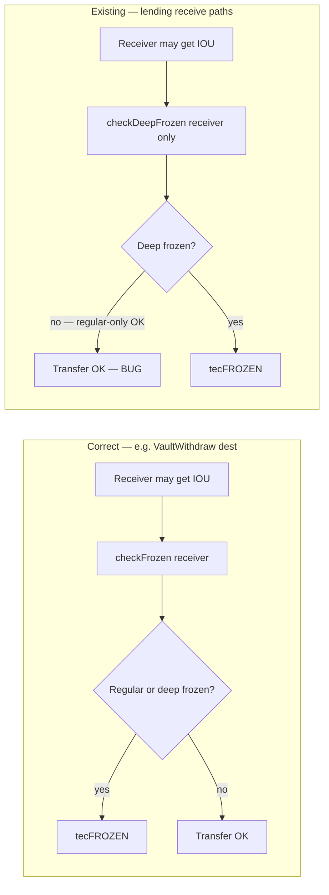
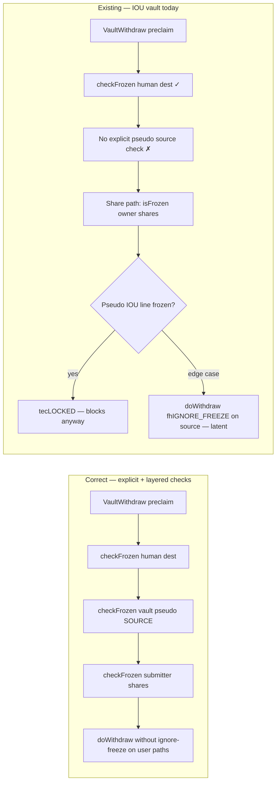
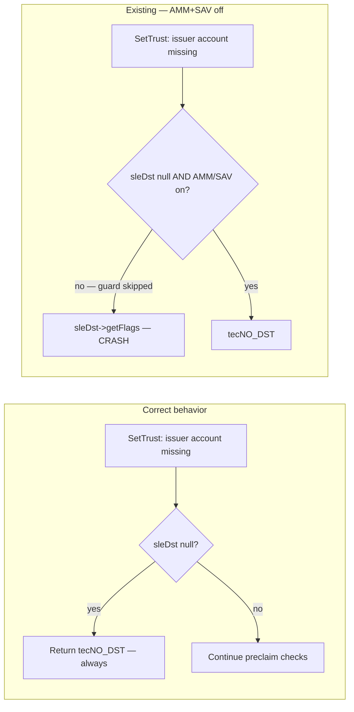
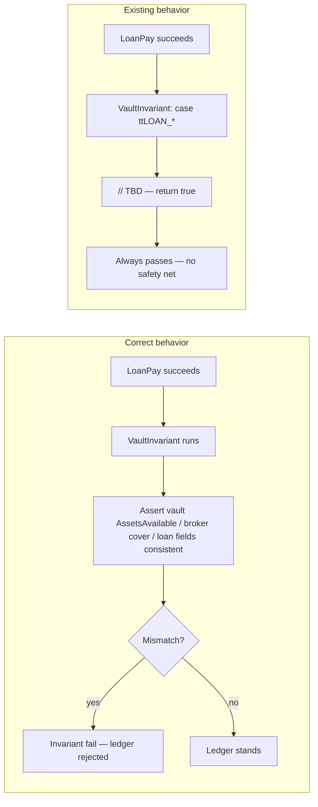
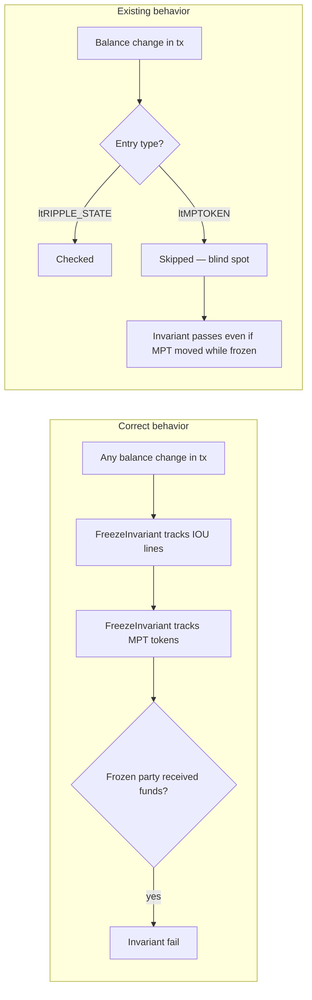
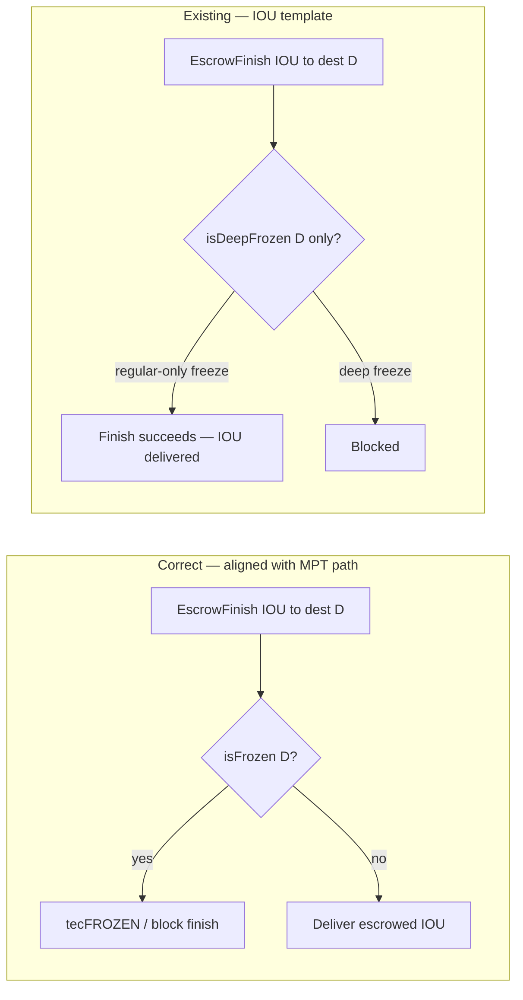
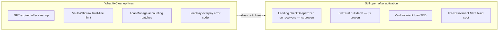

<div class="pearl-hero-grid">
  <div class="pearl-scorecard bad">
    <span class="label">Open P0 confirmed</span>
    <span class="value">12</span>
    <span class="hint">Still in upstream <code>release-3.1.3</code> after fixCleanup3_1_3.</span>
  </div>
  <div class="pearl-scorecard warn">
    <span class="label">jtx proven (fund risk)</span>
    <span class="value">7 lending</span>
    <span class="hint">Regular-freeze bypass — balance change confirmed in unittest.</span>
  </div>
  <div class="pearl-scorecard bad">
    <span class="label">Repro wallet</span>
    <span class="value">Not required</span>
    <span class="hint">jtx standalone mints test XRP.</span>
  </div>
</div>

<div class="pearl-verdict-banner">
  <strong>AGTI bottom line</strong>
  <p>Every section below uses the same three-part layout:</p>
  <ul class="pearl-verdict-list">
    <li><strong>Plain English</strong> — what the bug means without protocol jargon</li>
    <li><strong>How it could be exploited</strong> — who does what, and what breaks in the real world</li>
    <li><strong>Correct vs existing</strong> — diagram comparing intended behavior to rippled today</li>
  </ul>
  <p class="pearl-verdict-foot">Lending freeze bypass is jtx-proven. SetTrust crash is jtx-proven. Vault pseudo “bypass” is refuted for IOU vaults — blocked elsewhere.</p>
</div>

---

## Section A — IOU regular freeze vs deep freeze (root cause)

### Plain English

An IOU issuer can freeze an account in two steps. **Regular freeze** means “this account should not send or receive my token.” **Deep freeze** is a stronger lock layered on top. You can have **regular-only** freeze — and that is the normal compliance case (suspect wallet, court order, fraud response).

Rippled has two API checks: **`checkFrozen`** (blocks both) and **`checkDeepFrozen`** (blocks deep only). Lending code often uses the wrong one on **receivers**.

### How it could be exploited

1. Issuer regular-freezes account **D** (does not need deep freeze).
2. Someone submits a lending transaction that pays **D** (or a frozen broker owner, vault pseudo, etc.).
3. Preclaim calls **`checkDeepFrozen` only** → not blocked.
4. IOU is delivered to an account the issuer thought was frozen.

**Not required:** hacking validators, fake signatures, or deep freeze.

### Correct vs existing functionality

<div class="pearl-split pearl-diagram-split">
  <div class="pearl-panel good">
    <h4>Correct behavior</h4>
    <div class="pearl-mermaid"><div class="mermaid">
flowchart TB
  C1[Issuer regular-freezes D] --> C2[Tx pays D]
  C2 --> C3{checkFrozen D?}
  C3 -->|frozen| C4[tecFROZEN]
  C3 -->|not frozen| C5[IOU delivered]
    </div></div>
  </div>
  <div class="pearl-panel bad">
    <h4>Existing — lending</h4>
    <div class="pearl-mermaid"><div class="mermaid">
flowchart TB
  B1[Issuer regular-freezes D] --> B2[Tx pays D]
  B2 --> B3{checkDeepFrozen only?}
  B3 -->|regular-only| B4[Not blocked]
  B4 --> B5[IOU delivered — bug]
    </div></div>
  </div>
</div>

---

## Section B — Lending freeze bypass (F3.3, F3.5–F3.10) · jtx PROVEN

### Plain English

The **XLS-66 lending** feature (loan brokers, loan pay, cover withdraw, etc.) checks the **wrong freeze level** on almost every path where IOU goes to a **receiver**. The correct pattern already existed in **`VaultWithdraw`** (destination check) but was not copied into lending.

Seven transaction paths share one mistake introduced in PR [#5270](https://github.com/XRPLF/rippled/pull/5270).

### How it could be exploited

| ID | Transaction | Exploit in one sentence |
|----|-------------|-------------------------|
| **F3.3** | CoverWithdraw | Broker sends cover to a **regular-frozen** destination — IOU arrives anyway. |
| **F3.5** | BrokerDelete | Deleting broker sends leftover cover to a **regular-frozen** owner. |
| **F3.6** | LoanPay | Borrower pays loan; **broker fee** still routed to **regular-frozen** owner. |
| **F3.7** | LoanSet | New loan; **origination fee** paid to **regular-frozen** broker owner. |
| **F3.8** | LoanPay | Payment credits a **regular-frozen** vault pseudo-account. |
| **F3.9** | CoverDeposit | Cover deposited into **regular-frozen** broker pseudo. |
| **F3.10** | LoanSet | Fee sent to **regular-frozen** broker pseudo. |

**Real-world harm:** issuer compliance / fraud containment fails — frozen wallets can still receive IOU via lending. **jtx proof (F3.3):** destination balance increased by 10 IOU while regular-frozen.

### Correct vs existing functionality



**Representative code (F3.3):**

```cpp
if (auto const ret = checkDeepFrozen(ctx.view, dstAcct, vaultAsset))
    return ret;
// MISSING: checkFrozen(ctx.view, dstAcct, vaultAsset)
```

---

## Section C — Vault pseudo freeze (F4.6 withdraw · B3-1 deposit)

### Plain English

**Code review finding:** `VaultWithdraw` does not explicitly freeze-check the **vault pseudo-account as IOU source** before `doWithdraw` (which uses `ignore freeze` on source). `VaultDeposit` does not explicitly freeze-check the **vault pseudo as IOU destination**.

**jtx finding:** On IOU vaults, when the issuer regular-freezes the vault pseudo’s IOU trust line, **deposit and withdraw already return `tecLOCKED`** — because share ownership transitively sees the freeze. So this is a **missing explicit check**, not a proven **fund bypass** on IOU vaults today.

### How it could be exploited

**Standard exploit (issuer freezes vault pseudo):** **Does not work on IOU vaults** — jtx shows `tecLOCKED`.

**Latent risk:** If a future path skips the share-level lock but hits `doWithdraw` with `fhIGNORE_FREEZE`, missing pseudo source check could matter. Treat as **defense-in-depth**, not lending-class P0.

### Correct vs existing functionality



---

## Section D — SetTrust validator crash (F6.1) · jtx PROVEN

### Plain English

If someone submits a **SetTrust** (trust line) transaction pointing at an **issuer account that does not exist**, validators should return a clean error (`tecNO_DST`). When AMM and Single-Asset-Vault features are **off**, the code can **skip that check** and **crash** by reading flags from a null account pointer.

This is a **network availability** bug, not a “steal IOU” bug.

### How it could be exploited

1. Attacker crafts SetTrust with a non-existent issuer; features configured so the null guard is off.
2. Transaction reaches **preclaim** on validators.
3. **`sleDst->getFlags()` on null** → validator process segfaults (jtx: **exit 139**).

**Harm:** validator crash, potential consensus disruption if enough nodes hit the same malformed tx — not direct fund theft.

### Correct vs existing functionality



---

## Section E — VaultInvariant loan gap (F2.1)

### Plain English

After every successful transaction, **invariants** are safety nets that assert ledger accounting still makes sense. For **loan** transactions (`LoanSet`, `LoanManage`, `LoanPay`), the vault invariant literally contains **`// TBD`** and **returns true** — no checks run.

### How it could be exploited

**Not directly.** You need a **second bug** in loan math or routing that corrupts vault/broker balances. Without invariants, that corruption **validates successfully** instead of failing the ledger.

**Analogy:** smoke alarm with no battery — fire only hurts you if something else ignites.

### Correct vs existing functionality



---

## Section F — FreezeInvariant MPT gap (F3.1)

### Plain English

`FreezeInvariant` watches IOU trust line balance changes to catch forbidden transfers while frozen. It **only looks at `ltRIPPLE_STATE`** — **MPT token** balance changes are **invisible** to this invariant.

### How it could be exploited

**Not directly.** If any transactor allows a frozen MPT to move (a separate bug), this invariant **will not catch it**. IOU freeze enforcement and MPT freeze enforcement are asymmetric at the invariant layer.

### Correct vs existing functionality



---

## Section G — EscrowFinish IOU (F3.11 candidate)

### Plain English

When finishing an **IOU escrow**, the destination freeze check uses **`isDeepFrozen` only**. The **MPT escrow path in the same file** uses **`isFrozen`**. Tests expect IOU finish to **succeed** when the destination is regular-frozen after escrow was created.

**Status:** candidate P0 — may be intentional legacy behavior for in-flight escrows; not jtx-promoted to confirmed in this report.

### How it could be exploited

1. Escrow created to destination **D**.
2. Issuer regular-freezes **D** (not deep).
3. Finisher submits **EscrowFinish** → IOU may still pay **D**.

Same freeze API mistake as lending, but product intent is unclear.

### Correct vs existing functionality



---

## Section H — fixCleanup3_1_3 vs open issues

### Plain English

**fixCleanup3_1_3** (rippled 3.1.3, May 2026) bundles real fixes: NFT offer cleanup, permissioned-domain failed-tx invariant, vault withdraw trust-line limits, loan accounting patches, LoanPay overpay error code, LoanBroker cover upper bound.

It **does not** fix lending regular-freeze bypass, SetTrust crash, invariant TBD gaps, or Escrow IOU finish semantics.

### How it could be exploited

The amendment itself is not an exploit — the risk is **false confidence**: operators and issuers assume “3.1.3 + fixCleanup = lending/vault security closed” while **jtx-proven lending freeze bypass remains live**.

### Correct vs existing functionality



---

## Section I — Definitive proof (no mainnet wallet)

### Plain English

We ran rippled’s built-in **jtx** test ledger locally — no testnet, no mainnet XRP. Tests mint accounts and assert balances.

### Results

| Finding | Method | Result |
|---------|--------|--------|
| **F3.3** lending freeze | `OpenP0Repro` | **PROVEN** — `tesSUCCESS`, dest +10 IOU |
| **F3.3 control** | deep freeze added | **PROVEN** — `tecFROZEN` |
| **F6.1** SetTrust crash | `OpenP0ReproCrash` | **PROVEN** — segfault exit 139 |
| **F4.6 / B3-1** fund bypass | vault pseudo freeze | **REFUTED** — `tecLOCKED` |
| **Freeze logic** | `freeze_check_model.py` | **PROVEN** |

Repro kit: [assets/research/xrpl-rippled-p0-audit/](https://agti.net/assets/research/xrpl-rippled-p0-audit/) · [`OpenP0Repro_test.cpp`](https://agti.net/assets/research/xrpl-rippled-p0-audit/OpenP0Repro_test.cpp)

---

## Migration implications

1. **Do not treat fixCleanup as security closure.**
2. **Issuer regular-freeze is unreliable on lending** — jtx-proven fund movement.
3. **Vault IOU path:** explicit code gaps exist; jtx shows share path blocks standard freeze exploit.
4. **Invariant gaps** mean the next loan/MPT bug may not trip safety nets.
5. **SetTrust crash** is a consensus/ops risk on malformed txs.

---

*Disclaimer: Independent AGTI research. Not investment or legal advice. Baseline: rippled 3.1.3 / AGTI audit corpus May 2026.*
