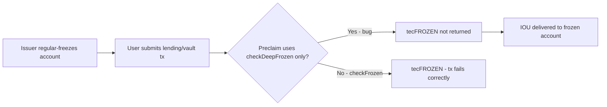
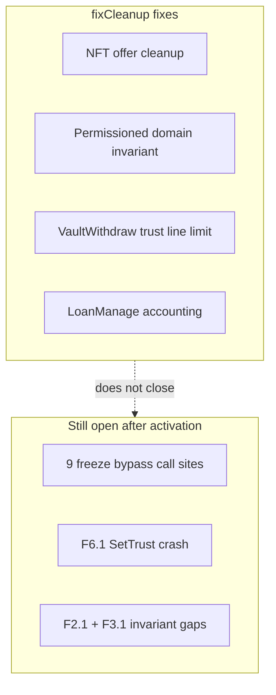
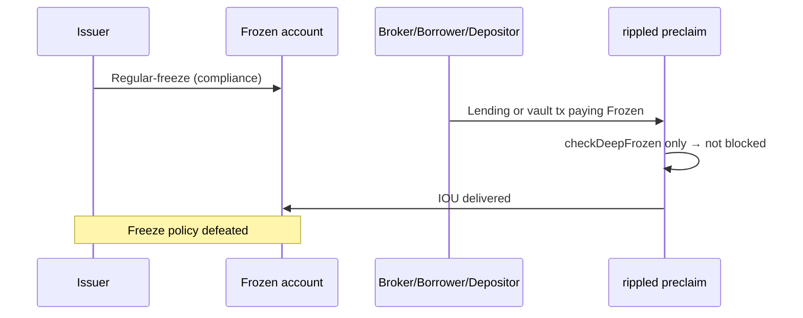

<div class="pearl-hero-grid">
  <div class="pearl-scorecard bad">
    <span class="label">Open P0 confirmed</span>
    <span class="value">12</span>
    <span class="hint">Still in upstream <code>release-3.1.3</code> source after fixCleanup3_1_3.</span>
  </div>
  <div class="pearl-scorecard warn">
    <span class="label">jtx proven (fund risk)</span>
    <span class="value">7 lending</span>
    <span class="hint">Regular-freeze bypass on XLS-66 paths — balance change confirmed.</span>
  </div>
  <div class="pearl-scorecard bad">
    <span class="label">Repro wallet</span>
    <span class="value">Not required</span>
    <span class="hint">jtx standalone mints test XRP. Mainnet only if you demo live.</span>
  </div>
</div>

<div class="pearl-verdict-banner">
  <strong>AGTI bottom line</strong>
  <p><strong>fixCleanup3_1_3</strong> is real maintenance — but it does <em>not</em> fix the dominant open risk class: <strong>IOU regular-freeze bypass in lending</strong> (jtx-proven). SetTrust preclaim crash is jtx-proven (segfault). Vault pseudo “bypass” is <em>not</em> fund-exploitable on IOU vaults — blocked by share path. Two invariant gaps remain defense-in-depth failures.</p>
</div>

## 0. Do you need a funded XRP wallet?

<div class="pearl-primer-box">
  <p><strong>No</strong> — for the repro kit and logic proof in this report.</p>
  <ul>
    <li><strong>Python model</strong> (<a href="https://agtico.github.io/assets/research/xrpl-rippled-p0-audit/freeze_check_model.py"><code>freeze_check_model.py</code></a>) — no wallet, no node.</li>
    <li><strong>rippled jtx unit tests</strong> — standalone test env creates funded accounts automatically. Zero mainnet XRP.</li>
    <li><strong>Devnet / testnet</strong> — faucet XRP only if you want a public demo.</li>
    <li><strong>Mainnet</strong> — only if you deliberately demo on live ledger (real fees + real IOU). Not needed to prove the bugs exist.</li>
  </ul>
  <p style="margin-top:12px"><strong>Run locally:</strong> <code>curl -LO https://agtico.github.io/assets/research/xrpl-rippled-p0-audit/freeze_check_model.py && python3 freeze_check_model.py</code></p>
</div>

---

## 1. The twelve open P0s (plain English)

| # | ID | What breaks | Can money move wrong? |
|---|-----|-------------|------------------------|
| 1–7 | **F3.3, F3.5–F3.10** | Lending paths use wrong freeze check on receivers | **Yes** — IOU to/from regular-frozen accounts |
| 8 | **F4.6** | Vault withdraw missing freeze on vault source account | **Yes** |
| 9 | **B3-1** | Vault deposit missing freeze on vault destination account | **Yes** |
| 10 | **F6.1** | Bad SetTrust tx crashes validators | **No direct theft** — network crash |
| 11 | **F2.1** | Loan txs skip invariant checks (`// TBD`) | Only with a second bug |
| 12 | **F3.1** | Freeze invariant ignores MPT tokens | Only with a second bug |

**+1 candidate:** F3.11 (EscrowFinish IOU) — not counted in the 12.

**Authoritative index:** audit corpus `P0_INVENTORY.md` on rippled `internal/bug-hunt-plan`.

---

## 2. Why regular freeze fails (one diagram)

On IOU trust lines, **regular freeze** and **deep freeze** are separate flags. Deep freeze always implies regular freeze — but **regular-only freeze is valid** (typical compliance / fraud-response case).

<div class="pearl-figure">
  <div class="pearl-figure-head">
    <h3>checkFrozen vs checkDeepFrozen on a regular-frozen receiver</h3>
    <span class="tag">Root cause</span>
  </div>
  <svg class="pearl-matrix" viewBox="0 0 920 280" role="img" aria-label="Freeze check comparison">
    <text x="40" y="32" fill="#6ee58f" font-family="monospace" font-size="11" font-weight="700">ISSUER ACTION</text>
    <rect x="40" y="44" width="840" height="44" fill="#0d2818" stroke="#6ee58f" rx="4"/>
    <text x="460" y="72" fill="#9dffc8" text-anchor="middle" font-size="13">Regular-freeze account D (NOT deep-frozen)</text>

    <text x="40" y="118" fill="#ff5a42" font-family="monospace" font-size="11" font-weight="700">CORRECT: checkFrozen(dest)</text>
    <rect x="40" y="130" width="400" height="56" fill="#1a1210" stroke="#ff5a42" rx="4"/>
    <text x="240" y="156" fill="#ffb4a8" text-anchor="middle" font-size="13" font-weight="700">BLOCKS</text>
    <text x="240" y="174" fill="#a87878" text-anchor="middle" font-size="11">VaultWithdraw dest pattern (#5572)</text>

    <text x="480" y="118" fill="#ff5a42" font-family="monospace" font-size="11" font-weight="700">BUG: checkDeepFrozen(dest) only</text>
    <rect x="480" y="130" width="400" height="56" fill="#2a1010" stroke="#ff5a42" rx="4"/>
    <text x="680" y="156" fill="#ffb4a8" text-anchor="middle" font-size="13" font-weight="700">ALLOWS IOU DELIVERY</text>
    <text x="680" y="174" fill="#a87878" text-anchor="middle" font-size="11">All 7 lending receive paths (#5270)</text>

    <text x="40" y="220" fill="#8aa898" font-family="monospace" font-size="11">SIMULATION OUTPUT (regular-freeze-only row):</text>
    <rect x="40" y="232" width="840" height="36" fill="#0a0e0e" stroke="#444" rx="4"/>
    <text x="60" y="254" fill="#9dffc8" font-family="monospace" font-size="11">checkFrozen blocks? True · checkDeepFrozen blocks? False · Bug path allows IOU? True</text>
  </svg>
  <p class="pearl-figure-caption">Reproduce: <a href="https://agtico.github.io/assets/research/xrpl-rippled-p0-audit/freeze_check_model.py"><code>freeze_check_model.py</code></a></p>
</div>



---

## 3. Major problem A — lending freeze bypass (7 bugs)

**Introduced:** Ed Hennis, PR [#5270](https://github.com/XRPLF/rippled/pull/5270) (Dec 2025), XLS-66 lending.

**Correct pattern existed:** Bronek Kozicki `VaultWithdraw` destination uses `checkFrozen()` ([#5572](https://github.com/XRPLF/rippled/pull/5572)) — never copied to lending.

### Who does what

| ID | Transaction | Who acts | Who is frozen | Result today |
|----|-------------|----------|---------------|--------------|
| F3.3 | CoverWithdraw | Broker owner | Destination | Cover paid to frozen dest |
| F3.5 | BrokerDelete | Broker owner | Owner | Leftover cover returned to frozen owner |
| F3.6 | LoanPay | Borrower | Broker owner | Fee routed to frozen owner |
| F3.7 | LoanSet | Borrower + broker | Broker owner | Origination fee to frozen owner |
| F3.8 | LoanPay | Borrower | Vault pseudo | Payment hits frozen vault acct |
| F3.9 | CoverDeposit | Broker owner | Broker pseudo | Deposit into frozen pseudo |
| F3.10 | LoanSet | Borrower + broker | Broker pseudo | Fee to frozen pseudo |

### Code evidence — F3.3 (representative)

`LoanBrokerCoverWithdraw::preclaim()` checks deep freeze on destination but not regular freeze:

```cpp
// Destination account cannot receive if asset is deep frozen
if (auto const ret = checkDeepFrozen(ctx.view, dstAcct, vaultAsset))
    return ret;
// MISSING: checkFrozen(ctx.view, dstAcct, vaultAsset)
```

Local path: `src/libxrpl/tx/transactors/lending/LoanBrokerCoverWithdraw.cpp` ~103–112  
Upstream 3.1.3: `src/xrpld/app/tx/detail/LoanBrokerCoverWithdraw.cpp` ~109–112

### Repro

**Logic (no build):**

```bash
curl -LO https://agtico.github.io/assets/research/xrpl-rippled-p0-audit/freeze_check_model.py
python3 freeze_check_model.py
```

**jtx (rippled built, no mainnet wallet):**

1. Create broker + cover (see `LoanBroker_test.cpp` helpers).
2. `env(trust(issuer, asset(0), dest, tfSetFreeze));` — **regular only**, no `tfSetDeepFreeze`.
3. `env(coverWithdraw(...), destination(dest));`
4. **Today:** succeeds. **After fix:** `ter(tecFROZEN)`.

Snippet: [`repro_f3_3_regular_freeze.jtx.cpp`](https://agtico.github.io/assets/research/xrpl-rippled-p0-audit/repro_f3_3_regular_freeze.jtx.cpp)

**Test gap:** `LoanBroker_test.cpp` ~951 uses `tfSetFreeze | tfSetDeepFreeze` together — never exercises regular-only on destination.

---

## 4. Vault pseudo freeze (F4.6 / B3-1) — code gap, not fund bypass

Preclaim is missing explicit pseudo-account freeze checks (mirror of the Bronek #5572 dest pattern). **`doWithdraw` uses `fhIGNORE_FREEZE` on the source path.**

**jtx verdict (definitive):** when the issuer regular-freezes the vault pseudo IOU line, deposit and withdraw return **`tecLOCKED`** — same as upstream `Vault_test.cpp` (“IOU frozen trust line to vault account”). Transitive `isFrozen` on vault shares blocks movement.

| Claim | Status |
|-------|--------|
| Missing pseudo check in code | **True** |
| Issuer freeze → funds still move | **False on IOU vaults** (jtx refuted) |
| Severity | **Defense-in-depth**, not same class as F3.3 |

---

## 5. Major problem C — SetTrust validator crash (F6.1)

**Who:** Anyone submits SetTrust where the **issuer account does not exist**.

**When:** AMM / SingleAssetVault features **off** — code skips `tecNO_DST` and dereferences null:

```cpp
auto const sleDst = ctx.view.read(keylet::account(uDstAccountID));
if ((ammEnabled(...) || featureSingleAssetVault) && sleDst == nullptr)
    return tecNO_DST;
if (sleDst->getFlags() & lsfDisallowIncomingTrustline)  // crash if null
```

Path: `SetTrust.cpp` ~196–204

**Fund loss?** No direct theft — **validators crash** on malformed tx (consensus / availability risk).

**Repro:** Submit SetTrust JSON with bogus issuer; observe preclaim crash in standalone — **no funded wallet beyond jtx env**.

---

## 6. Major problem D — missing safety nets (F2.1, F3.1)

| ID | Gap | Fund loss alone? |
|----|-----|------------------|
| **F2.1** | `VaultInvariant` has `// TBD` for all loan tx types | No — needs second bug in loan math |
| **F3.1** | `FreezeInvariant` only tracks IOU trust lines, not MPT | No — needs MPT transactor bug |

These are **defense-in-depth failures** — the ledger won't catch accounting or MPT freeze mistakes at invariant time.

---

## 7. fixCleanup3_1_3 does not fix the 12

Amendment `fixCleanup3_1_3` (rippled 3.1.3, supermajority May 2026) fixes NFT cleanup, permissioned-domain failed-tx invariant, vault withdraw **trust-line limits**, loan accounting patches, LoanPay overpay error code, LoanBroker cover upper bound.

**It does not touch:** any of the 12 confirmed P0s above.



---

## 8. Exploit flow (freeze class — fund movement)



---

## 9. Repro kit (AGTI)

| Asset | URL |
|-------|-----|
| README | [assets/research/xrpl-rippled-p0-audit/](https://agtico.github.io/assets/research/xrpl-rippled-p0-audit/) |
| Freeze logic model | [`freeze_check_model.py`](https://agtico.github.io/assets/research/xrpl-rippled-p0-audit/freeze_check_model.py) |
| jtx snippet F3.3 | [`repro_f3_3_regular_freeze.jtx.cpp`](https://agtico.github.io/assets/research/xrpl-rippled-p0-audit/repro_f3_3_regular_freeze.jtx.cpp) |
| Runner | [`run_repro.sh`](https://agtico.github.io/assets/research/xrpl-rippled-p0-audit/run_repro.sh) |

```bash
mkdir xrpl-p0-repro && cd xrpl-p0-repro
curl -LO https://agtico.github.io/assets/research/xrpl-rippled-p0-audit/freeze_check_model.py
curl -LO https://agtico.github.io/assets/research/xrpl-rippled-p0-audit/run_repro.sh
chmod +x run_repro.sh
./run_repro.sh
```

**Optional full jtx:** build rippled with tests, run `./xrpld --unittest OpenP0Repro`. See [`DEFINITIVE_PROOF.md`](https://agtico.github.io/assets/research/xrpl-rippled-p0-audit/DEFINITIVE_PROOF.md).

---

## 10. Definitive proof (jtx — no mainnet wallet)

| Finding | Method | Result |
|---------|--------|--------|
| **F3.3** lending freeze | `OpenP0Repro` unittest | **PROVEN** — `tesSUCCESS`, dest IOU balance +10 |
| **F3.3 control** | deep freeze on same dest | **PROVEN** — `tecFROZEN` |
| **F6.1** SetTrust crash | `OpenP0ReproCrash` unittest | **PROVEN** — segfault (exit 139) |
| **F4.6 / B3-1** fund bypass | vault pseudo freeze jtx | **REFUTED** — `tecLOCKED` |
| **Freeze logic** | `freeze_check_model.py` | **PROVEN** — regular-only row allows bug path |

```bash
curl -LO https://agtico.github.io/assets/research/xrpl-rippled-p0-audit/freeze_check_model.py
python3 freeze_check_model.py
# Full proof (requires built rippled): see DEFINITIVE_PROOF.md
```

Test source: [`OpenP0Repro_test.cpp`](https://agtico.github.io/assets/research/xrpl-rippled-p0-audit/OpenP0Repro_test.cpp)

---

## 11. Migration implications

1. **Do not treat fixCleanup activation as security closure.**
2. **Issuer freeze is not reliable on lending** (jtx-proven). Vault IOU path is blocked by share lock — but code gaps remain.
3. **Tests encode the bug** in places (deep+regular together; EscrowFinish permissive finish).
4. **Exit risk** is protocol-trust, not node-count — validator supermajority ≠ app-layer safety.

---

*Disclaimer: Independent AGTI research for informational purposes. Not investment or legal advice. Audit baseline: rippled `release-3.1.3` / local `internal/bug-hunt-plan` corpus.*
