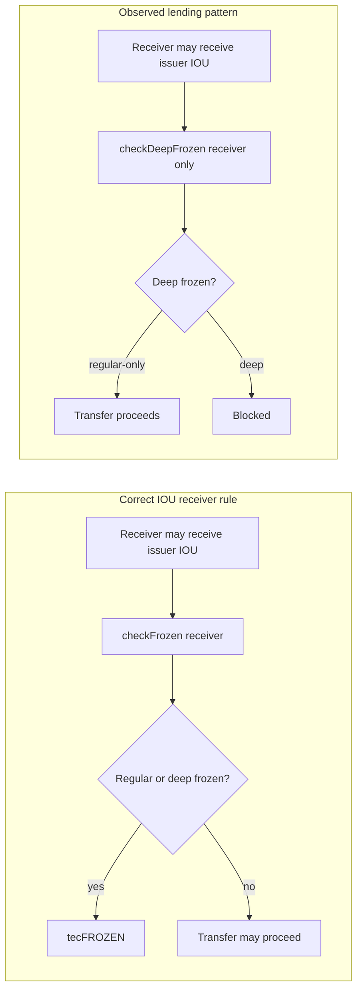
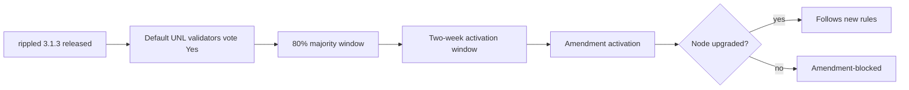

<div class="pearl-primer-box">
  <p><strong>Context:</strong> Post Fiat evaluated a <strong>RippleD-derived implementation path</strong>. This report is the reproducibility packet for what we found in upstream <code>XRPLF/rippled</code>, baseline <code>3.1.3</code>, commit <code>46b241ace8b30d9c9775d60ffba7d24b21903896</code>.</p>
  <p style="margin-top:12px"><strong>Scope:</strong> This is not a vendor advisory and not a mainnet exploit guide. It covers only behavior reproduced on a clean local upstream jtx build or a direct helper/protocol-wire proof in the same suite. Public testnet is not the primary proof surface because public amendment state and server configuration move; the local standalone jtx ledger is deterministic and repeatable.</p>
  <p style="margin-top:12px"><strong>Legacy preservation:</strong> The previous narrative version of this article is archived at <a href="/assets/research/xrpl-rippled-p0-audit/legacy/2026-05-26-xrpl-rippled-open-p0-freeze-audit.pre-evidence-rewrite.md">the legacy source file</a>. The fixCleanup/governance context is retained below, but this version leads with evidence, scripts, and severity boundaries.</p>
</div>

---

## Executive Summary

Post Fiat ran an internal audit of upstream `rippled` because relying on release cadence, amendment activation, or public statements about maintenance fixes is not enough when considering a RippleD-derived implementation path. The resulting proof suite identifies **37 reproduced evidence items** across authorization, issuer controls, precision/accounting, invariant enforcement, MPT behavior, batching, permissioned DEX, and historical cleanup-era logic.

The most important current findings are not a single isolated defect. They are a pattern: authorization objects can outlive their intended control boundary; delegated permissions can authorize or mutate more than their name implies; batch signer signatures were not bound to the outer batch account; issuer freeze and transfer restrictions were inconsistently applied; and several precision/invariant paths convert valid operations into internal failures or malformed state.

The proof packet is intentionally conservative:

- **Promoted findings require a clean local repro.** Code review alone is not counted.
- **Current and historical findings are separated.** Historical/replay-era cases fixed by `fixCleanup3_1_3` are not described as current 3.1.3 transaction-path bugs.
- **Helper/accounting/invariant proofs are labeled.** They are serious quality and consensus-safety signals, but not all are equivalent to direct user-level fund movement.
- **Demoted false positives remain visible.** The report names candidate classes we tested and did not promote.

<div class="pearl-hero-grid">
  <div class="pearl-scorecard warn">
    <span class="label">Evidence items</span>
    <span class="value">37</span>
    <span class="hint">All promoted items have clean local repro evidence.</span>
  </div>
  <div class="pearl-scorecard warn">
    <span class="label">Proof cases</span>
    <span class="value">47</span>
    <span class="hint">OpenP0Repro passed 47 cases / 9,119 tests with zero failures.</span>
  </div>
  <div class="pearl-scorecard good">
    <span class="label">Mainnet wallet</span>
    <span class="value">Not required</span>
    <span class="hint">jtx standalone mints local test accounts.</span>
  </div>
</div>

## Evidence Packet

| Evidence object | Link |
|---|---|
| Audit packet index | [`AUDIT_PACKET.md`](/assets/research/xrpl-rippled-p0-audit/AUDIT_PACKET.md) |
| Repro manifest | [`repro_manifest.json`](/assets/research/xrpl-rippled-p0-audit/repro_manifest.json) |
| Static packet verifier | [`verify_packet.py`](/assets/research/xrpl-rippled-p0-audit/verify_packet.py) |
| Common runner | [`run_repro.sh`](/assets/research/xrpl-rippled-p0-audit/run_repro.sh) |
| Definitive proof runner | [`run_definitive_proof.sh`](/assets/research/xrpl-rippled-p0-audit/run_definitive_proof.sh) |
| jtx source | [`OpenP0Repro_test.cpp`](/assets/research/xrpl-rippled-p0-audit/OpenP0Repro_test.cpp) |
| Final proof log | [`definitive_proof_batch_signer_outer_replay_20260527.log`](/assets/research/xrpl-rippled-p0-audit/runs/20260527-p0-hunt/definitive_proof_batch_signer_outer_replay_20260527.log) |
| Candidate matrix | [`candidate_matrix.md`](/assets/research/xrpl-rippled-p0-audit/runs/20260527-p0-hunt/candidate_matrix.md) |
| Repro results journal | [`repro_results.md`](/assets/research/xrpl-rippled-p0-audit/runs/20260527-p0-hunt/repro_results.md) |
| Legacy article source | [`pre-evidence rewrite archive`](/assets/research/xrpl-rippled-p0-audit/legacy/2026-05-26-xrpl-rippled-open-p0-freeze-audit.pre-evidence-rewrite.md) |

Proof hash:

```text
a2d3a2f36ae8e2615bb002bef2c25eb047e0c7da8c029a7a1f1f2207ed24ff7c  runs/20260527-p0-hunt/definitive_proof_batch_signer_outer_replay_20260527.log
```

Final local proof result:

```text
ripple.tx.OpenP0Repro had 0 failures.
47 cases, 9119 tests total, 0 failures
ripple.tx.OpenP0ReproCrash had 0 failures.
1 case, 12 tests total, 0 failures
```

## Risk Scoring

This report uses a compact internal severity score rather than pretending to produce official CVEs. The score is a triage device for engineering priority.

| Score band | Meaning |
|---|---|
| 9.0-10.0 | Direct authorization bypass, signature replay, issuer-control bypass, or unauthorized ledger mutation. |
| 8.0-8.9 | High-severity state corruption, stale authority, transfer restriction bypass, or deterministic transaction-path failure. |
| 7.0-7.9 | Important transaction/helper/invariant correctness issue with credible consensus or product-security impact. |
| 6.0-6.9 | Protocol-wire, arithmetic, or helper defect that is consensus-relevant but not shown here as a direct live exploit path. |
| Historical | Reproduced against pre-fix rules or replay-era logic; evidence of release quality, not a current 3.1.3 transaction-path claim. |

## Table Of Contents

| ID | Risk | Type | Exploit class | Repro |
|---|---:|---|---|---|
| [LEND-FREEZE-001](#lend-freeze-001) | 9.4 / Critical | Current transaction-path | Issuer-control bypass / unauthorized IOU receive | [`LEND-FREEZE-001.sh`](/assets/research/xrpl-rippled-p0-audit/repros/LEND-FREEZE-001.sh) |
| [BATCH-SIGNER-OUTER-REPLAY-001](#batch-signer-outer-replay-001) | 9.2 / Critical | Current transaction-path | Signature replay / authorization binding failure | [`BATCH-SIGNER-OUTER-REPLAY-001.sh`](/assets/research/xrpl-rippled-p0-audit/repros/BATCH-SIGNER-OUTER-REPLAY-001.sh) |
| [DELEGATE-MPT-GRANULAR-MUTATION-001](#delegate-mpt-granular-mutation-001) | 9.0 / Critical | Current transaction-path | Unauthorized ledger object mutation | [`DELEGATE-MPT-GRANULAR-MUTATION-001.sh`](/assets/research/xrpl-rippled-p0-audit/repros/DELEGATE-MPT-GRANULAR-MUTATION-001.sh) |
| [VAULT-SHARE-MPT-TRANSFER-001](#vault-share-mpt-transfer-001) | 8.9 / Critical | Current transaction-path | Transfer-restriction bypass | [`VAULT-SHARE-MPT-TRANSFER-001.sh`](/assets/research/xrpl-rippled-p0-audit/repros/VAULT-SHARE-MPT-TRANSFER-001.sh) |
| [DELEGATE-DELETE-STALE-001](#delegate-delete-stale-001) | 8.8 / Critical | Current transaction-path | Stale authority state / reserve inconsistency | [`DELEGATE-DELETE-STALE-001.sh`](/assets/research/xrpl-rippled-p0-audit/repros/DELEGATE-DELETE-STALE-001.sh) |
| [MPT-DOMAIN-AUTH-001](#mpt-domain-auth-001) | 8.7 / Critical | Current transaction-path | Authorization-policy bypass | [`MPT-DOMAIN-AUTH-001.sh`](/assets/research/xrpl-rippled-p0-audit/repros/MPT-DOMAIN-AUTH-001.sh) |
| [LOANBROKER-LOCKED-MPT-001](#loanbroker-locked-mpt-001) | 8.4 / High | Current transaction-path | Locked-asset return / lock-state bypass | [`LOANBROKER-LOCKED-MPT-001.sh`](/assets/research/xrpl-rippled-p0-audit/repros/LOANBROKER-LOCKED-MPT-001.sh) |
| [DELEGATE-SAV-001](#delegate-sav-001) | 8.2 / High | Current transaction-path | Over-broad delegation authority | [`DELEGATE-SAV-001.sh`](/assets/research/xrpl-rippled-p0-audit/repros/DELEGATE-SAV-001.sh) |
| [MPT-LOCK-UNAUTH-NOSAV-001](#mpt-lock-unauth-nosav-001) | 8.2 / High | Current feature-bound | Feature-gated lock-state deletion | [`MPT-LOCK-UNAUTH-NOSAV-001.sh`](/assets/research/xrpl-rippled-p0-audit/repros/MPT-LOCK-UNAUTH-NOSAV-001.sh) |
| [DELEGATE-EMPTY-ACCOUNTSET-001](#delegate-empty-accountset-001) | 8.1 / High | Current transaction-path | Unauthorized sequence consumption | [`DELEGATE-EMPTY-ACCOUNTSET-001.sh`](/assets/research/xrpl-rippled-p0-audit/repros/DELEGATE-EMPTY-ACCOUNTSET-001.sh) |
| [ESCROW-CANCEL-IOU-001](#escrow-cancel-iou-001) | 8.1 / High | Current transaction-path | Deterministic transaction exception | [`ESCROW-CANCEL-IOU-001.sh`](/assets/research/xrpl-rippled-p0-audit/repros/ESCROW-CANCEL-IOU-001.sh) |
| [AMM-STALE-AUTH-001](#amm-stale-auth-001) | 8.0 / High | Current transaction-path | Stale authorization state | [`AMM-STALE-AUTH-001.sh`](/assets/research/xrpl-rippled-p0-audit/repros/AMM-STALE-AUTH-001.sh) |
| [INVARIANT-BOOL-OVERWRITE-001](#invariant-bool-overwrite-001) | 8.0 / High | Historical/replay-era | Invariant false negative | [`INVARIANT-BOOL-OVERWRITE-001.sh`](/assets/research/xrpl-rippled-p0-audit/repros/INVARIANT-BOOL-OVERWRITE-001.sh) |
| [LOANBROKER-COVER-PRECISION-001](#loanbroker-cover-precision-001) | 8.0 / High | Current transaction-path | Precision/accounting drift | [`LOANBROKER-COVER-PRECISION-001.sh`](/assets/research/xrpl-rippled-p0-audit/repros/LOANBROKER-COVER-PRECISION-001.sh) |
| [VAULT-DEPOSIT-OPPOSITE-LIMIT-001](#vault-deposit-opposite-limit-001) | 8.0 / High | Current transaction-path | Preclaim/apply mismatch / internal failure | [`VAULT-DEPOSIT-OPPOSITE-LIMIT-001.sh`](/assets/research/xrpl-rippled-p0-audit/repros/VAULT-DEPOSIT-OPPOSITE-LIMIT-001.sh) |
| [VAULT-SOLE-SHAREHOLDER-IMPAIRED-001](#vault-sole-shareholder-impaired-001) | 8.0 / High | Current transaction-path | Valid withdrawal DoS / stuck assets | [`VAULT-SOLE-SHAREHOLDER-IMPAIRED-001.sh`](/assets/research/xrpl-rippled-p0-audit/repros/VAULT-SOLE-SHAREHOLDER-IMPAIRED-001.sh) |
| [LOAN-MINCOVER-SCALE-001](#loan-mincover-scale-001) | 7.8 / High | Current transaction-path | Accounting scale inconsistency | [`LOAN-MINCOVER-SCALE-001.sh`](/assets/research/xrpl-rippled-p0-audit/repros/LOAN-MINCOVER-SCALE-001.sh) |
| [VAULT-MPT-ESCROW-001](#vault-mpt-escrow-001) | 7.8 / High | Historical/replay-era | Locked-state deletion | [`VAULT-MPT-ESCROW-001.sh`](/assets/research/xrpl-rippled-p0-audit/repros/VAULT-MPT-ESCROW-001.sh) |
| [VAULT-WITHDRAW-001](#vault-withdraw-001) | 7.8 / High | Historical/replay-era | Trustline limit bypass | [`VAULT-WITHDRAW-001.sh`](/assets/research/xrpl-rippled-p0-audit/repros/VAULT-WITHDRAW-001.sh) |
| [VAULT-WITHDRAW-SCALE-BOUNDARY-001](#vault-withdraw-scale-boundary-001) | 7.8 / High | Current transaction-path | Invariant failure / valid operation DoS | [`VAULT-WITHDRAW-SCALE-BOUNDARY-001.sh`](/assets/research/xrpl-rippled-p0-audit/repros/VAULT-WITHDRAW-SCALE-BOUNDARY-001.sh) |
| [DELEGATE-FEE-RESERVE-001](#delegate-fee-reserve-001) | 7.7 / High | Current transaction-path | Authorization/fee accounting mismatch | [`DELEGATE-FEE-RESERVE-001.sh`](/assets/research/xrpl-rippled-p0-audit/repros/DELEGATE-FEE-RESERVE-001.sh) |
| [PDEX-HYBRID-QUALITY-001](#pdex-hybrid-quality-001) | 7.7 / High | Current transaction-path | Order-book metadata corruption | [`PDEX-HYBRID-QUALITY-001.sh`](/assets/research/xrpl-rippled-p0-audit/repros/PDEX-HYBRID-QUALITY-001.sh) |
| [VAULT-CLAWBACK-001](#vault-clawback-001) | 7.7 / High | Historical/replay-era | Accounting/internal failure | [`VAULT-CLAWBACK-001.sh`](/assets/research/xrpl-rippled-p0-audit/repros/VAULT-CLAWBACK-001.sh) |
| [MPT-MULTISEND-001](#mpt-multisend-001) | 7.6 / High | Historical/replay-era | Aggregate cap bypass | [`MPT-MULTISEND-001.sh`](/assets/research/xrpl-rippled-p0-audit/repros/MPT-MULTISEND-001.sh) |
| [MPT-NONCANONICAL-AMOUNT-001](#mpt-noncanonical-amount-001) | 7.6 / High | Current transaction-path | Malformed amount accepted into application path | [`MPT-NONCANONICAL-AMOUNT-001.sh`](/assets/research/xrpl-rippled-p0-audit/repros/MPT-NONCANONICAL-AMOUNT-001.sh) |
| [VAULT-DEPOSIT-ISSUER-EDGE-001](#vault-deposit-issuer-edge-001) | 7.6 / High | Current transaction-path | Invariant failure / valid operation DoS | [`VAULT-DEPOSIT-ISSUER-EDGE-001.sh`](/assets/research/xrpl-rippled-p0-audit/repros/VAULT-DEPOSIT-ISSUER-EDGE-001.sh) |
| [DELEGATE-MULTISIGN-001](#delegate-multisign-001) | 7.5 / High | Current transaction-path | Authorization validation mismatch | [`DELEGATE-MULTISIGN-001.sh`](/assets/research/xrpl-rippled-p0-audit/repros/DELEGATE-MULTISIGN-001.sh) |
| [PDEX-CANCEL-INVARIANT-001](#pdex-cancel-invariant-001) | 7.5 / High | Current transaction-path | Valid transaction invariant failure | [`PDEX-CANCEL-INVARIANT-001.sh`](/assets/research/xrpl-rippled-p0-audit/repros/PDEX-CANCEL-INVARIANT-001.sh) |
| [CREDENTIAL-EXPIRED-DELETE-001](#credential-expired-delete-001) | 7.4 / High | Historical/replay-era | Cleanup failure masked as success | [`CREDENTIAL-EXPIRED-DELETE-001.sh`](/assets/research/xrpl-rippled-p0-audit/repros/CREDENTIAL-EXPIRED-DELETE-001.sh) |
| [MPT-TRANSFER-RATE-OVERFLOW-001](#mpt-transfer-rate-overflow-001) | 7.4 / High | Current helper/accounting | Arithmetic overflow | [`MPT-TRANSFER-RATE-OVERFLOW-001.sh`](/assets/research/xrpl-rippled-p0-audit/repros/MPT-TRANSFER-RATE-OVERFLOW-001.sh) |
| [PDOMAIN-TICKET-001](#pdomain-ticket-001) | 7.4 / High | Historical/replay-era | Object-key collision / transaction exception | [`PDOMAIN-TICKET-001.sh`](/assets/research/xrpl-rippled-p0-audit/repros/PDOMAIN-TICKET-001.sh) |
| [PDEX-HYBRID-EMPTY-BOOKS-001](#pdex-hybrid-empty-books-001) | 7.3 / High | Historical/replay-era | Malformed object accepted by invariant | [`PDEX-HYBRID-EMPTY-BOOKS-001.sh`](/assets/research/xrpl-rippled-p0-audit/repros/PDEX-HYBRID-EMPTY-BOOKS-001.sh) |
| [LOANPAY-FEE-001](#loanpay-fee-001) | 7.2 / High | Historical/replay-era | Fee DoS / invalid fee estimate | [`LOANPAY-FEE-001.sh`](/assets/research/xrpl-rippled-p0-audit/repros/LOANPAY-FEE-001.sh) |
| [NUMBER-CUSP-UPWARD-001](#number-cusp-upward-001) | 6.9 / Medium | Current helper/accounting | Directed-rounding violation | [`NUMBER-CUSP-UPWARD-001.sh`](/assets/research/xrpl-rippled-p0-audit/repros/NUMBER-CUSP-UPWARD-001.sh) |
| [NUMBER-DIVISION-UPWARD-001](#number-division-upward-001) | 6.9 / Medium | Current helper/accounting | Directed-rounding violation | [`NUMBER-DIVISION-UPWARD-001.sh`](/assets/research/xrpl-rippled-p0-audit/repros/NUMBER-DIVISION-UPWARD-001.sh) |
| [LOAN-PAYMENT-FACTOR-001](#loan-payment-factor-001) | 6.8 / Medium | Current helper/accounting | Numerical cancellation | [`LOAN-PAYMENT-FACTOR-001.sh`](/assets/research/xrpl-rippled-p0-audit/repros/LOAN-PAYMENT-FACTOR-001.sh) |
| [MPT-STISSUE-WIRE-001](#mpt-stissue-wire-001) | 6.8 / Medium | Current protocol-wire | Protocol-wire canonicalization defect | [`MPT-STISSUE-WIRE-001.sh`](/assets/research/xrpl-rippled-p0-audit/repros/MPT-STISSUE-WIRE-001.sh) |

## Reproduction Model

Each per-finding script is a thin wrapper around the same deterministic upstream jtx suite. Example:

```bash
cd /home/postfiat/repos/agtico.github.io/assets/research/xrpl-rippled-p0-audit
python3 verify_packet.py
./repros/BATCH-SIGNER-OUTER-REPLAY-001.sh
```

The verifier checks the article links, manifest, scripts, proof-log hash, section anchors, and marker coverage. The wrapper reads `repro_manifest.json`, runs `OpenP0Repro`, asserts the exact testcase marker for the requested finding, and requires the full proof suite to end with zero failures. This makes every table row independently clickable while preserving one canonical test source.

To rebuild from source:

```bash
cd /home/postfiat/repos/rippled
cmake --build .build --target rippled -j $(nproc)
cd /home/postfiat/repos/agtico.github.io/assets/research/xrpl-rippled-p0-audit
./run_definitive_proof.sh
```

Verifier checklist:

1. Confirm the upstream target is `XRPLF/rippled` tag `3.1.3`, commit `46b241ace8b30d9c9775d60ffba7d24b21903896`.
2. Confirm `OpenP0Repro_test.cpp` in this packet matches the source compiled into the local `rippled` build.
3. Run either `./run_definitive_proof.sh` for the full packet or `./repros/<ID>.sh` for a single finding.
4. Require the proof footer to show `47 cases, 9119 tests total, 0 failures`.
5. Require the targeted marker(s) listed under the finding to appear in the proof log.
6. Treat public-testnet demonstrations as secondary evidence because amendment state, validator configuration, and server build selection are not fixed there.

## Current Critical And High Transaction-Path Findings

<a id="lend-freeze-001"></a>
### LEND-FREEZE-001 - Lending regular-freeze receive bypass

| Field | Value |
|---|---|
| Risk | **9.4 / Critical** |
| Category | Current transaction-path |
| Exploit type | Issuer-control bypass / unauthorized IOU receive |
| Affected target | rippled 3.1.3, XLS-66 lending receive paths |
| Repro script | [`LEND-FREEZE-001.sh`](/assets/research/xrpl-rippled-p0-audit/repros/LEND-FREEZE-001.sh) |
| Source file | [`OpenP0Repro_test.cpp`](/assets/research/xrpl-rippled-p0-audit/OpenP0Repro_test.cpp) |
| Proof log | [`definitive_proof_batch_signer_outer_replay_20260527.log`](/assets/research/xrpl-rippled-p0-audit/runs/20260527-p0-hunt/definitive_proof_batch_signer_outer_replay_20260527.log) |

**Broken behavior.** Several lending paths use the deep-freeze-only predicate on IOU receivers. An issuer regular-freezes a receiver, but the lending transaction still delivers IOU because the path only blocks deep freeze.

**Expected behavior.** Any path that delivers issuer IOU to an account must enforce regular freeze with the full frozen check.

**Deterministic demonstration.** Run:

```bash
cd /home/postfiat/repos/agtico.github.io/assets/research/xrpl-rippled-p0-audit
./repros/LEND-FREEZE-001.sh
```

The wrapper runs the local standalone upstream jtx ledger against `OpenP0Repro`, asserts the testcase marker(s) below, and requires the suite footer `47 cases, 9119 tests total, 0 failures`. This is the deterministic local-devnet demonstration; it is stronger for this report than public testnet because the upstream tag, amendment profile, test ledger, and expected marker are fixed.

**Required marker(s).**

- `F3.3 LoanBrokerCoverWithdraw — regular-freeze-only destination (P0)`
- `F3.5 LoanBrokerDelete — regular-freeze-only owner receives cover`
- `F3.6 LoanPay — regular-freeze-only broker owner receives service fee`
- `F3.7 LoanSet — regular-freeze-only broker owner receives origination fee`
- `F3.8 LoanPay — regular-freeze-only vault pseudo receives repayment`
- `F3.9 LoanBrokerCoverDeposit — regular-freeze-only broker pseudo receives cover`
- `F3.10 LoanPay — regular-freeze-only broker pseudo receives fallback fee`

**Source signal.** Existing AGTI proof kit plus source review of lending receive checks introduced around PR #5270; VaultWithdraw provides the stricter receiver pattern.

**Remediation prompt.** Replace or supplement receiver-side checkDeepFrozen/isDeepFrozen uses with checkFrozen/isFrozen across F3.3 and F3.5-F3.10, then flip the repro expectations from tesSUCCESS to tecFROZEN.

<a id="loanbroker-cover-precision-001"></a>
### LOANBROKER-COVER-PRECISION-001 - LoanBrokerCover IOU precision drift

| Field | Value |
|---|---|
| Risk | **8.0 / High** |
| Category | Current transaction-path |
| Exploit type | Precision/accounting drift |
| Affected target | rippled 3.1.3 LoanBrokerCover paths |
| Repro script | [`LOANBROKER-COVER-PRECISION-001.sh`](/assets/research/xrpl-rippled-p0-audit/repros/LOANBROKER-COVER-PRECISION-001.sh) |
| Source file | [`OpenP0Repro_test.cpp`](/assets/research/xrpl-rippled-p0-audit/OpenP0Repro_test.cpp) |
| Proof log | [`definitive_proof_batch_signer_outer_replay_20260527.log`](/assets/research/xrpl-rippled-p0-audit/runs/20260527-p0-hunt/definitive_proof_batch_signer_outer_replay_20260527.log) |

**Broken behavior.** A deposit of 1.8e-14 credits cover by 2e-14, and positive zero-at-scale deposit/withdraw/clawback amounts can succeed without changing cover or receiver balance.

**Expected behavior.** Positive cover operations below effective precision should be rejected or rounded consistently before state mutation.

**Deterministic demonstration.** Run:

```bash
cd /home/postfiat/repos/agtico.github.io/assets/research/xrpl-rippled-p0-audit
./repros/LOANBROKER-COVER-PRECISION-001.sh
```

The wrapper runs the local standalone upstream jtx ledger against `OpenP0Repro`, asserts the testcase marker(s) below, and requires the suite footer `47 cases, 9119 tests total, 0 failures`. This is the deterministic local-devnet demonstration; it is stronger for this report than public testnet because the upstream tag, amendment profile, test ledger, and expected marker are fixed.

**Required marker(s).**

- `LoanBrokerCover current — IOU precision drift`

**Source signal.** Later upstream commits 7fdaa0a5e / PR #7274 and c327fc1ee.

**Remediation prompt.** Apply cover-scale minimum checks and reject zero-at-scale cover operations.

<a id="loan-mincover-scale-001"></a>
### LOAN-MINCOVER-SCALE-001 - LoanPay minimum-cover scale inconsistency

| Field | Value |
|---|---|
| Risk | **7.8 / High** |
| Category | Current transaction-path |
| Exploit type | Accounting scale inconsistency |
| Affected target | rippled 3.1.3 LoanPay cover routing |
| Repro script | [`LOAN-MINCOVER-SCALE-001.sh`](/assets/research/xrpl-rippled-p0-audit/repros/LOAN-MINCOVER-SCALE-001.sh) |
| Source file | [`OpenP0Repro_test.cpp`](/assets/research/xrpl-rippled-p0-audit/OpenP0Repro_test.cpp) |
| Proof log | [`definitive_proof_batch_signer_outer_replay_20260527.log`](/assets/research/xrpl-rippled-p0-audit/runs/20260527-p0-hunt/definitive_proof_batch_signer_outer_replay_20260527.log) |

**Broken behavior.** The same broker-level cover state routes service fees differently depending on an individual loan scale.

**Expected behavior.** Broker-cover minimum checks should use vault scale consistently.

**Deterministic demonstration.** Run:

```bash
cd /home/postfiat/repos/agtico.github.io/assets/research/xrpl-rippled-p0-audit
./repros/LOAN-MINCOVER-SCALE-001.sh
```

The wrapper runs the local standalone upstream jtx ledger against `OpenP0Repro`, asserts the testcase marker(s) below, and requires the suite footer `47 cases, 9119 tests total, 0 failures`. This is the deterministic local-devnet demonstration; it is stronger for this report than public testnet because the upstream tag, amendment profile, test ledger, and expected marker are fixed.

**Required marker(s).**

- `LoanPay current — broker minimum cover scale inconsistency`

**Source signal.** Later upstream commit a911f9089 / PR #7093.

**Remediation prompt.** Use vault scale for all broker-cover minimum calculations.

<a id="vault-share-mpt-transfer-001"></a>
### VAULT-SHARE-MPT-TRANSFER-001 - Vault-share MPT transfer restriction bypass

| Field | Value |
|---|---|
| Risk | **8.9 / Critical** |
| Category | Current transaction-path |
| Exploit type | Transfer-restriction bypass |
| Affected target | rippled 3.1.3 vault-share MPT transfer path |
| Repro script | [`VAULT-SHARE-MPT-TRANSFER-001.sh`](/assets/research/xrpl-rippled-p0-audit/repros/VAULT-SHARE-MPT-TRANSFER-001.sh) |
| Source file | [`OpenP0Repro_test.cpp`](/assets/research/xrpl-rippled-p0-audit/OpenP0Repro_test.cpp) |
| Proof log | [`definitive_proof_batch_signer_outer_replay_20260527.log`](/assets/research/xrpl-rippled-p0-audit/runs/20260527-p0-hunt/definitive_proof_batch_signer_outer_replay_20260527.log) |

**Broken behavior.** After the underlying MPT issuer clears CanTransfer, peer-to-peer vault-share payment still succeeds.

**Expected behavior.** Vault-share MPTs should inherit underlying MPT transfer restrictions where the product model requires it.

**Deterministic demonstration.** Run:

```bash
cd /home/postfiat/repos/agtico.github.io/assets/research/xrpl-rippled-p0-audit
./repros/VAULT-SHARE-MPT-TRANSFER-001.sh
```

The wrapper runs the local standalone upstream jtx ledger against `OpenP0Repro`, asserts the testcase marker(s) below, and requires the suite footer `47 cases, 9119 tests total, 0 failures`. This is the deterministic local-devnet demonstration; it is stronger for this report than public testnet because the upstream tag, amendment profile, test ledger, and expected marker are fixed.

**Required marker(s).**

- `Vault share MPT current — underlying CanTransfer is not inherited`

**Source signal.** Later upstream commit 9cb049276 / PR #7077.

**Remediation prompt.** Propagate underlying MPT flags/reference metadata to vault-share issuances and enforce them on transfer.

<a id="loanbroker-locked-mpt-001"></a>
### LOANBROKER-LOCKED-MPT-001 - LoanBrokerDelete returns locked MPT first-loss cover

| Field | Value |
|---|---|
| Risk | **8.4 / High** |
| Category | Current transaction-path |
| Exploit type | Locked-asset return / lock-state bypass |
| Affected target | rippled 3.1.3 LoanBrokerDelete locked MPT cover |
| Repro script | [`LOANBROKER-LOCKED-MPT-001.sh`](/assets/research/xrpl-rippled-p0-audit/repros/LOANBROKER-LOCKED-MPT-001.sh) |
| Source file | [`OpenP0Repro_test.cpp`](/assets/research/xrpl-rippled-p0-audit/OpenP0Repro_test.cpp) |
| Proof log | [`definitive_proof_batch_signer_outer_replay_20260527.log`](/assets/research/xrpl-rippled-p0-audit/runs/20260527-p0-hunt/definitive_proof_batch_signer_outer_replay_20260527.log) |

**Broken behavior.** Deleting a broker returns locked MPT first-loss cover and deletes the locked pseudo-account MPToken.

**Expected behavior.** Locked cover should prevent broker deletion or remain locked until safely returnable.

**Deterministic demonstration.** Run:

```bash
cd /home/postfiat/repos/agtico.github.io/assets/research/xrpl-rippled-p0-audit
./repros/LOANBROKER-LOCKED-MPT-001.sh
```

The wrapper runs the local standalone upstream jtx ledger against `OpenP0Repro`, asserts the testcase marker(s) below, and requires the suite footer `47 cases, 9119 tests total, 0 failures`. This is the deterministic local-devnet demonstration; it is stronger for this report than public testnet because the upstream tag, amendment profile, test ledger, and expected marker are fixed.

**Required marker(s).**

- `LoanBrokerDelete current — locked MPT cover is returned`

**Source signal.** Later upstream commit 179e73594 / PR #7125.

**Remediation prompt.** Block LoanBrokerDelete when locked MPT cover cannot be returned safely.

<a id="vault-withdraw-scale-boundary-001"></a>
### VAULT-WITHDRAW-SCALE-BOUNDARY-001 - VaultWithdraw IOU scale-boundary invariant failure

| Field | Value |
|---|---|
| Risk | **7.8 / High** |
| Category | Current transaction-path |
| Exploit type | Invariant failure / valid operation DoS |
| Affected target | rippled 3.1.3 VaultWithdraw IOU precision boundary |
| Repro script | [`VAULT-WITHDRAW-SCALE-BOUNDARY-001.sh`](/assets/research/xrpl-rippled-p0-audit/repros/VAULT-WITHDRAW-SCALE-BOUNDARY-001.sh) |
| Source file | [`OpenP0Repro_test.cpp`](/assets/research/xrpl-rippled-p0-audit/OpenP0Repro_test.cpp) |
| Proof log | [`definitive_proof_batch_signer_outer_replay_20260527.log`](/assets/research/xrpl-rippled-p0-audit/runs/20260527-p0-hunt/definitive_proof_batch_signer_outer_replay_20260527.log) |

**Broken behavior.** Withdrawing across an IOU scale boundary returns tecINVARIANT_FAILED through vault and destination balance invariant failures.

**Expected behavior.** Precision-boundary withdraws should either execute with valid accounting or fail pre-apply with a targeted precision error.

**Deterministic demonstration.** Run:

```bash
cd /home/postfiat/repos/agtico.github.io/assets/research/xrpl-rippled-p0-audit
./repros/VAULT-WITHDRAW-SCALE-BOUNDARY-001.sh
```

The wrapper runs the local standalone upstream jtx ledger against `OpenP0Repro`, asserts the testcase marker(s) below, and requires the suite footer `47 cases, 9119 tests total, 0 failures`. This is the deterministic local-devnet demonstration; it is stronger for this report than public testnet because the upstream tag, amendment profile, test ledger, and expected marker are fixed.

**Required marker(s).**

- `Vault current — withdraw across IOU scale boundary invariant`

**Source signal.** Later upstream commit 633ef4706 / PR #7272.

**Remediation prompt.** Add proactive precision-boundary rejection before invariant failure.

<a id="vault-deposit-issuer-edge-001"></a>
### VAULT-DEPOSIT-ISSUER-EDGE-001 - VaultDeposit issuer IOU edge invariant failure

| Field | Value |
|---|---|
| Risk | **7.6 / High** |
| Category | Current transaction-path |
| Exploit type | Invariant failure / valid operation DoS |
| Affected target | rippled 3.1.3 VaultDeposit issuer IOU edge |
| Repro script | [`VAULT-DEPOSIT-ISSUER-EDGE-001.sh`](/assets/research/xrpl-rippled-p0-audit/repros/VAULT-DEPOSIT-ISSUER-EDGE-001.sh) |
| Source file | [`OpenP0Repro_test.cpp`](/assets/research/xrpl-rippled-p0-audit/OpenP0Repro_test.cpp) |
| Proof log | [`definitive_proof_batch_signer_outer_replay_20260527.log`](/assets/research/xrpl-rippled-p0-audit/runs/20260527-p0-hunt/definitive_proof_batch_signer_outer_replay_20260527.log) |

**Broken behavior.** Issuer deposit at a vault IOU edge returns tecINVARIANT_FAILED instead of a precise rejection.

**Expected behavior.** Precision-loss deposits should fail before mutation/invariant handling.

**Deterministic demonstration.** Run:

```bash
cd /home/postfiat/repos/agtico.github.io/assets/research/xrpl-rippled-p0-audit
./repros/VAULT-DEPOSIT-ISSUER-EDGE-001.sh
```

The wrapper runs the local standalone upstream jtx ledger against `OpenP0Repro`, asserts the testcase marker(s) below, and requires the suite footer `47 cases, 9119 tests total, 0 failures`. This is the deterministic local-devnet demonstration; it is stronger for this report than public testnet because the upstream tag, amendment profile, test ledger, and expected marker are fixed.

**Required marker(s).**

- `Vault current — issuer deposit at IOU edge invariant`

**Source signal.** Later upstream commit 633ef4706 / PR #7272.

**Remediation prompt.** Detect issuer-IOU precision edge before applying vault deposit.

<a id="vault-sole-shareholder-impaired-001"></a>
### VAULT-SOLE-SHAREHOLDER-IMPAIRED-001 - Sole shareholder impaired vault exit failure

| Field | Value |
|---|---|
| Risk | **8.0 / High** |
| Category | Current transaction-path |
| Exploit type | Valid withdrawal DoS / stuck assets |
| Affected target | rippled 3.1.3 impaired vault withdraw |
| Repro script | [`VAULT-SOLE-SHAREHOLDER-IMPAIRED-001.sh`](/assets/research/xrpl-rippled-p0-audit/repros/VAULT-SOLE-SHAREHOLDER-IMPAIRED-001.sh) |
| Source file | [`OpenP0Repro_test.cpp`](/assets/research/xrpl-rippled-p0-audit/OpenP0Repro_test.cpp) |
| Proof log | [`definitive_proof_batch_signer_outer_replay_20260527.log`](/assets/research/xrpl-rippled-p0-audit/runs/20260527-p0-hunt/definitive_proof_batch_signer_outer_replay_20260527.log) |

**Broken behavior.** After another shareholder exits an impaired vault, the sole remaining shareholder cannot withdraw available cash and hits the zero-sized-vault invariant.

**Expected behavior.** A sole remaining shareholder should be able to withdraw available cash while impaired receivables remain represented correctly.

**Deterministic demonstration.** Run:

```bash
cd /home/postfiat/repos/agtico.github.io/assets/research/xrpl-rippled-p0-audit
./repros/VAULT-SOLE-SHAREHOLDER-IMPAIRED-001.sh
```

The wrapper runs the local standalone upstream jtx ledger against `OpenP0Repro`, asserts the testcase marker(s) below, and requires the suite footer `47 cases, 9119 tests total, 0 failures`. This is the deterministic local-devnet demonstration; it is stronger for this report than public testnet because the upstream tag, amendment profile, test ledger, and expected marker are fixed.

**Required marker(s).**

- `Vault current — sole shareholder impaired exit is stuck`

**Source signal.** Later upstream commit 49567e728 / PR #7139.

**Remediation prompt.** Handle sole-shareholder impaired vault exits without producing zero-sized-vault invariant failure.

<a id="vault-deposit-opposite-limit-001"></a>
### VAULT-DEPOSIT-OPPOSITE-LIMIT-001 - VaultDeposit opposite-limit internal failure

| Field | Value |
|---|---|
| Risk | **8.0 / High** |
| Category | Current transaction-path |
| Exploit type | Preclaim/apply mismatch / internal failure |
| Affected target | rippled 3.1.3 VaultDeposit preclaim/apply mismatch |
| Repro script | [`VAULT-DEPOSIT-OPPOSITE-LIMIT-001.sh`](/assets/research/xrpl-rippled-p0-audit/repros/VAULT-DEPOSIT-OPPOSITE-LIMIT-001.sh) |
| Source file | [`OpenP0Repro_test.cpp`](/assets/research/xrpl-rippled-p0-audit/OpenP0Repro_test.cpp) |
| Proof log | [`definitive_proof_batch_signer_outer_replay_20260527.log`](/assets/research/xrpl-rippled-p0-audit/runs/20260527-p0-hunt/definitive_proof_batch_signer_outer_replay_20260527.log) |

**Broken behavior.** Preclaim counts the counterparty opposite trustline limit, admits the deposit, then apply returns tefINTERNAL after negative account-assets guard.

**Expected behavior.** Preclaim and apply must use the same balance/limit model, or fail early with a non-internal code.

**Deterministic demonstration.** Run:

```bash
cd /home/postfiat/repos/agtico.github.io/assets/research/xrpl-rippled-p0-audit
./repros/VAULT-DEPOSIT-OPPOSITE-LIMIT-001.sh
```

The wrapper runs the local standalone upstream jtx ledger against `OpenP0Repro`, asserts the testcase marker(s) below, and requires the suite footer `47 cases, 9119 tests total, 0 failures`. This is the deterministic local-devnet demonstration; it is stronger for this report than public testnet because the upstream tag, amendment profile, test ledger, and expected marker are fixed.

**Required marker(s).**

- `VaultDeposit current — opposite trustline limit causes tefINTERNAL`

**Source signal.** Later upstream commit 93ac1aa7a / PR #7288.

**Remediation prompt.** Remove the opposite-limit sanity path or align preclaim with actual IOU send semantics.

<a id="escrow-cancel-iou-001"></a>
### ESCROW-CANCEL-IOU-001 - EscrowCancel deleted IOU trustline exception

| Field | Value |
|---|---|
| Risk | **8.1 / High** |
| Category | Current transaction-path |
| Exploit type | Deterministic transaction exception |
| Affected target | rippled 3.1.3 token escrow cancellation |
| Repro script | [`ESCROW-CANCEL-IOU-001.sh`](/assets/research/xrpl-rippled-p0-audit/repros/ESCROW-CANCEL-IOU-001.sh) |
| Source file | [`OpenP0Repro_test.cpp`](/assets/research/xrpl-rippled-p0-audit/OpenP0Repro_test.cpp) |
| Proof log | [`definitive_proof_batch_signer_outer_replay_20260527.log`](/assets/research/xrpl-rippled-p0-audit/runs/20260527-p0-hunt/definitive_proof_batch_signer_outer_replay_20260527.log) |

**Broken behavior.** Canceling an IOU escrow after the sender trustline was deleted returns tefEXCEPTION / OwnerCount template-field error.

**Expected behavior.** Escrow cancellation accounting should not depend on a deleted sender trustline.

**Deterministic demonstration.** Run:

```bash
cd /home/postfiat/repos/agtico.github.io/assets/research/xrpl-rippled-p0-audit
./repros/ESCROW-CANCEL-IOU-001.sh
```

The wrapper runs the local standalone upstream jtx ledger against `OpenP0Repro`, asserts the testcase marker(s) below, and requires the suite footer `47 cases, 9119 tests total, 0 failures`. This is the deterministic local-devnet demonstration; it is stronger for this report than public testnet because the upstream tag, amendment profile, test ledger, and expected marker are fixed.

**Required marker(s).**

- `EscrowCancel current — deleted IOU trustline returns tefEXCEPTION`

**Source signal.** Later upstream commit ad3d172a1 / PR #6171.

**Remediation prompt.** Switch token escrow cancellation accounting to the account ledger entry rather than the deleted trustline.

<a id="amm-stale-auth-001"></a>
### AMM-STALE-AUTH-001 - AMM stale AuthAccounts after empty reinit

| Field | Value |
|---|---|
| Risk | **8.0 / High** |
| Category | Current transaction-path |
| Exploit type | Stale authorization state |
| Affected target | rippled 3.1.3 AMM empty-pool reinitialization |
| Repro script | [`AMM-STALE-AUTH-001.sh`](/assets/research/xrpl-rippled-p0-audit/repros/AMM-STALE-AUTH-001.sh) |
| Source file | [`OpenP0Repro_test.cpp`](/assets/research/xrpl-rippled-p0-audit/OpenP0Repro_test.cpp) |
| Proof log | [`definitive_proof_batch_signer_outer_replay_20260527.log`](/assets/research/xrpl-rippled-p0-audit/runs/20260527-p0-hunt/definitive_proof_batch_signer_outer_replay_20260527.log) |

**Broken behavior.** Empty-pool reinitialization with tfTwoAssetIfEmpty leaves stale sfAuthAccounts from the prior auction slot.

**Expected behavior.** Reinitializing an empty AMM should clear stale auction authorization state.

**Deterministic demonstration.** Run:

```bash
cd /home/postfiat/repos/agtico.github.io/assets/research/xrpl-rippled-p0-audit
./repros/AMM-STALE-AUTH-001.sh
```

The wrapper runs the local standalone upstream jtx ledger against `OpenP0Repro`, asserts the testcase marker(s) below, and requires the suite footer `47 cases, 9119 tests total, 0 failures`. This is the deterministic local-devnet demonstration; it is stronger for this report than public testnet because the upstream tag, amendment profile, test ledger, and expected marker are fixed.

**Required marker(s).**

- `AMM current — stale AuthAccounts survive empty reinit`

**Source signal.** Later upstream commit e1fe35993 / PR #6996.

**Remediation prompt.** Clear AuthAccounts during empty-pool AMM reinitialization.

<a id="delegate-delete-stale-001"></a>
### DELEGATE-DELETE-STALE-001 - Delegatee account deletion leaves stale delegation

| Field | Value |
|---|---|
| Risk | **8.8 / Critical** |
| Category | Current transaction-path |
| Exploit type | Stale authority state / reserve inconsistency |
| Affected target | rippled 3.1.3 Permission Delegation |
| Repro script | [`DELEGATE-DELETE-STALE-001.sh`](/assets/research/xrpl-rippled-p0-audit/repros/DELEGATE-DELETE-STALE-001.sh) |
| Source file | [`OpenP0Repro_test.cpp`](/assets/research/xrpl-rippled-p0-audit/OpenP0Repro_test.cpp) |
| Proof log | [`definitive_proof_batch_signer_outer_replay_20260527.log`](/assets/research/xrpl-rippled-p0-audit/runs/20260527-p0-hunt/definitive_proof_batch_signer_outer_replay_20260527.log) |

**Broken behavior.** A delegatee account can delete itself while the Delegate ledger entry and delegator owner reserve remain behind.

**Expected behavior.** Deleting an account must clean or prevent inbound delegated-authority state.

**Deterministic demonstration.** Run:

```bash
cd /home/postfiat/repos/agtico.github.io/assets/research/xrpl-rippled-p0-audit
./repros/DELEGATE-DELETE-STALE-001.sh
```

The wrapper runs the local standalone upstream jtx ledger against `OpenP0Repro`, asserts the testcase marker(s) below, and requires the suite footer `47 cases, 9119 tests total, 0 failures`. This is the deterministic local-devnet demonstration; it is stronger for this report than public testnet because the upstream tag, amendment profile, test ledger, and expected marker are fixed.

**Required marker(s).**

- `Delegate current — delegatee account deletion leaves stale delegation`

**Source signal.** Later upstream commit 4da46d31 / PR #6681.

**Remediation prompt.** Store Delegate objects in both delegator and authorized-account owner directories or otherwise block deletion with live delegation state.

<a id="mpt-domain-auth-001"></a>
### MPT-DOMAIN-AUTH-001 - Domain-bound MPT RequireAuth clearing

| Field | Value |
|---|---|
| Risk | **8.7 / Critical** |
| Category | Current transaction-path |
| Exploit type | Authorization-policy bypass |
| Affected target | rippled 3.1.3 MPT issuance authorization |
| Repro script | [`MPT-DOMAIN-AUTH-001.sh`](/assets/research/xrpl-rippled-p0-audit/repros/MPT-DOMAIN-AUTH-001.sh) |
| Source file | [`OpenP0Repro_test.cpp`](/assets/research/xrpl-rippled-p0-audit/OpenP0Repro_test.cpp) |
| Proof log | [`definitive_proof_batch_signer_outer_replay_20260527.log`](/assets/research/xrpl-rippled-p0-audit/runs/20260527-p0-hunt/definitive_proof_batch_signer_outer_replay_20260527.log) |

**Broken behavior.** An issuer can clear RequireAuth while retaining DomainID, leaving a domain-bound issuance permissionless in authorization state.

**Expected behavior.** Domain-bound issuances should not clear RequireAuth while DomainID remains.

**Deterministic demonstration.** Run:

```bash
cd /home/postfiat/repos/agtico.github.io/assets/research/xrpl-rippled-p0-audit
./repros/MPT-DOMAIN-AUTH-001.sh
```

The wrapper runs the local standalone upstream jtx ledger against `OpenP0Repro`, asserts the testcase marker(s) below, and requires the suite footer `47 cases, 9119 tests total, 0 failures`. This is the deterministic local-devnet demonstration; it is stronger for this report than public testnet because the upstream tag, amendment profile, test ledger, and expected marker are fixed.

**Required marker(s).**

- `MPT current — domain-bound RequireAuth can be cleared`

**Source signal.** Later upstream commit 366899d5 / PR #6712.

**Remediation prompt.** Disallow MPTClearRequireAuth when DomainID is set.

<a id="delegate-fee-reserve-001"></a>
### DELEGATE-FEE-RESERVE-001 - Delegated payment fee coupled to delegator reserve

| Field | Value |
|---|---|
| Risk | **7.7 / High** |
| Category | Current transaction-path |
| Exploit type | Authorization/fee accounting mismatch |
| Affected target | rippled 3.1.3 delegated Payment |
| Repro script | [`DELEGATE-FEE-RESERVE-001.sh`](/assets/research/xrpl-rippled-p0-audit/repros/DELEGATE-FEE-RESERVE-001.sh) |
| Source file | [`OpenP0Repro_test.cpp`](/assets/research/xrpl-rippled-p0-audit/OpenP0Repro_test.cpp) |
| Proof log | [`definitive_proof_batch_signer_outer_replay_20260527.log`](/assets/research/xrpl-rippled-p0-audit/runs/20260527-p0-hunt/definitive_proof_batch_signer_outer_replay_20260527.log) |

**Broken behavior.** A delegated payment returns tecUNFUNDED_PAYMENT even though the delegate can pay the fee, because the path couples the delegate-paid fee to the delegator reserve.

**Expected behavior.** Delegate-paid fees should be checked against the delegate fee payer, not the delegator reserve.

**Deterministic demonstration.** Run:

```bash
cd /home/postfiat/repos/agtico.github.io/assets/research/xrpl-rippled-p0-audit
./repros/DELEGATE-FEE-RESERVE-001.sh
```

The wrapper runs the local standalone upstream jtx ledger against `OpenP0Repro`, asserts the testcase marker(s) below, and requires the suite footer `47 cases, 9119 tests total, 0 failures`. This is the deterministic local-devnet demonstration; it is stronger for this report than public testnet because the upstream tag, amendment profile, test ledger, and expected marker are fixed.

**Required marker(s).**

- `Delegate current — delegated fee is coupled to delegator reserve`

**Source signal.** Later upstream commit 17f26ba97 / PR #6568.

**Remediation prompt.** Decouple delegate fee payer balance checks from delegator reserve calculations.

<a id="delegate-sav-001"></a>
### DELEGATE-SAV-001 - Single Asset Vault transaction can be delegated

| Field | Value |
|---|---|
| Risk | **8.2 / High** |
| Category | Current transaction-path |
| Exploit type | Over-broad delegation authority |
| Affected target | rippled 3.1.3 delegated VaultCreate |
| Repro script | [`DELEGATE-SAV-001.sh`](/assets/research/xrpl-rippled-p0-audit/repros/DELEGATE-SAV-001.sh) |
| Source file | [`OpenP0Repro_test.cpp`](/assets/research/xrpl-rippled-p0-audit/OpenP0Repro_test.cpp) |
| Proof log | [`definitive_proof_batch_signer_outer_replay_20260527.log`](/assets/research/xrpl-rippled-p0-audit/runs/20260527-p0-hunt/definitive_proof_batch_signer_outer_replay_20260527.log) |

**Broken behavior.** A delegate can submit VaultCreate for another account; later upstream removed SAV/lending from the delegable transaction set.

**Expected behavior.** High-risk SAV/lending operations should be non-delegable unless explicitly sandboxed.

**Deterministic demonstration.** Run:

```bash
cd /home/postfiat/repos/agtico.github.io/assets/research/xrpl-rippled-p0-audit
./repros/DELEGATE-SAV-001.sh
```

The wrapper runs the local standalone upstream jtx ledger against `OpenP0Repro`, asserts the testcase marker(s) below, and requires the suite footer `47 cases, 9119 tests total, 0 failures`. This is the deterministic local-devnet demonstration; it is stronger for this report than public testnet because the upstream tag, amendment profile, test ledger, and expected marker are fixed.

**Required marker(s).**

- `Delegate current — SAV transaction can be delegated`

**Source signal.** Later upstream commit 46d5c67a / PR #6489.

**Remediation prompt.** Mark Single Asset Vault and Lending transactions NotDelegable.

<a id="delegate-multisign-001"></a>
### DELEGATE-MULTISIGN-001 - Delegated multisign self-check rejection

| Field | Value |
|---|---|
| Risk | **7.5 / High** |
| Category | Current transaction-path |
| Exploit type | Authorization validation mismatch |
| Affected target | rippled 3.1.3 delegated multisigning |
| Repro script | [`DELEGATE-MULTISIGN-001.sh`](/assets/research/xrpl-rippled-p0-audit/repros/DELEGATE-MULTISIGN-001.sh) |
| Source file | [`OpenP0Repro_test.cpp`](/assets/research/xrpl-rippled-p0-audit/OpenP0Repro_test.cpp) |
| Proof log | [`definitive_proof_batch_signer_outer_replay_20260527.log`](/assets/research/xrpl-rippled-p0-audit/runs/20260527-p0-hunt/definitive_proof_batch_signer_outer_replay_20260527.log) |

**Broken behavior.** A delegated payment signed by the delegator as part of the delegatee signer list is rejected before ledger application because the path checks the delegator as self-signing.

**Expected behavior.** Delegated multisign validation should check the delegate account as acting authority.

**Deterministic demonstration.** Run:

```bash
cd /home/postfiat/repos/agtico.github.io/assets/research/xrpl-rippled-p0-audit
./repros/DELEGATE-MULTISIGN-001.sh
```

The wrapper runs the local standalone upstream jtx ledger against `OpenP0Repro`, asserts the testcase marker(s) below, and requires the suite footer `47 cases, 9119 tests total, 0 failures`. This is the deterministic local-devnet demonstration; it is stronger for this report than public testnet because the upstream tag, amendment profile, test ledger, and expected marker are fixed.

**Required marker(s).**

- `Delegate current — delegator multisign rejected for delegate`

**Source signal.** Later upstream commit 9cb074067 / PR #7064.

**Remediation prompt.** Validate delegated multisigning against the delegate account, not the delegator.

<a id="mpt-noncanonical-amount-001"></a>
### MPT-NONCANONICAL-AMOUNT-001 - Non-canonical MPT amount reaches ledger engine

| Field | Value |
|---|---|
| Risk | **7.6 / High** |
| Category | Current transaction-path |
| Exploit type | Malformed amount accepted into application path |
| Affected target | rippled 3.1.3 MPT amount validation |
| Repro script | [`MPT-NONCANONICAL-AMOUNT-001.sh`](/assets/research/xrpl-rippled-p0-audit/repros/MPT-NONCANONICAL-AMOUNT-001.sh) |
| Source file | [`OpenP0Repro_test.cpp`](/assets/research/xrpl-rippled-p0-audit/OpenP0Repro_test.cpp) |
| Proof log | [`definitive_proof_batch_signer_outer_replay_20260527.log`](/assets/research/xrpl-rippled-p0-audit/runs/20260527-p0-hunt/definitive_proof_batch_signer_outer_replay_20260527.log) |

**Broken behavior.** A non-canonical MPT amount reaches transaction application and returns fee-burning tecPATH_PARTIAL instead of failing preflight as temBAD_AMOUNT.

**Expected behavior.** Non-canonical MPT amounts should fail before ledger application.

**Deterministic demonstration.** Run:

```bash
cd /home/postfiat/repos/agtico.github.io/assets/research/xrpl-rippled-p0-audit
./repros/MPT-NONCANONICAL-AMOUNT-001.sh
```

The wrapper runs the local standalone upstream jtx ledger against `OpenP0Repro`, asserts the testcase marker(s) below, and requires the suite footer `47 cases, 9119 tests total, 0 failures`. This is the deterministic local-devnet demonstration; it is stronger for this report than public testnet because the upstream tag, amendment profile, test ledger, and expected marker are fixed.

**Required marker(s).**

- `MPT current — non-canonical amount reaches ledger engine`

**Source signal.** Later upstream commit dcd2ff0b5 / PR #7117.

**Remediation prompt.** Reject non-canonical MPT amounts during preflight/preclaim before fee-burning application.

<a id="delegate-mpt-granular-mutation-001"></a>
### DELEGATE-MPT-GRANULAR-MUTATION-001 - Delegated MPT issuance metadata/fee mutation

| Field | Value |
|---|---|
| Risk | **9.0 / Critical** |
| Category | Current transaction-path |
| Exploit type | Unauthorized ledger object mutation |
| Affected target | rippled 3.1.3 granular MPT delegation |
| Repro script | [`DELEGATE-MPT-GRANULAR-MUTATION-001.sh`](/assets/research/xrpl-rippled-p0-audit/repros/DELEGATE-MPT-GRANULAR-MUTATION-001.sh) |
| Source file | [`OpenP0Repro_test.cpp`](/assets/research/xrpl-rippled-p0-audit/OpenP0Repro_test.cpp) |
| Proof log | [`definitive_proof_batch_signer_outer_replay_20260527.log`](/assets/research/xrpl-rippled-p0-audit/runs/20260527-p0-hunt/definitive_proof_batch_signer_outer_replay_20260527.log) |

**Broken behavior.** A delegate with only MPTokenIssuanceLock authority can submit MPTokenIssuanceSet with sfMPTokenMetadata and sfTransferFee, mutating issuance fields outside the delegated permission.

**Expected behavior.** Granular delegation must sandbox all fields and flags, not just lock/unlock flags.

**Deterministic demonstration.** Run:

```bash
cd /home/postfiat/repos/agtico.github.io/assets/research/xrpl-rippled-p0-audit
./repros/DELEGATE-MPT-GRANULAR-MUTATION-001.sh
```

The wrapper runs the local standalone upstream jtx ledger against `OpenP0Repro`, asserts the testcase marker(s) below, and requires the suite footer `47 cases, 9119 tests total, 0 failures`. This is the deterministic local-devnet demonstration; it is stronger for this report than public testnet because the upstream tag, amendment profile, test ledger, and expected marker are fixed.

**Required marker(s).**

- `Delegate current — MPT granular lock permission mutates issuance fields`

**Source signal.** Later upstream commit 87e951470 / PR #6831.

**Remediation prompt.** Add a granular field/flag sandbox for delegated MPTokenIssuanceSet.

<a id="delegate-empty-accountset-001"></a>
### DELEGATE-EMPTY-ACCOUNTSET-001 - Delegated empty AccountSet consumes principal sequence

| Field | Value |
|---|---|
| Risk | **8.1 / High** |
| Category | Current transaction-path |
| Exploit type | Unauthorized sequence consumption |
| Affected target | rippled 3.1.3 delegated AccountSet |
| Repro script | [`DELEGATE-EMPTY-ACCOUNTSET-001.sh`](/assets/research/xrpl-rippled-p0-audit/repros/DELEGATE-EMPTY-ACCOUNTSET-001.sh) |
| Source file | [`OpenP0Repro_test.cpp`](/assets/research/xrpl-rippled-p0-audit/OpenP0Repro_test.cpp) |
| Proof log | [`definitive_proof_batch_signer_outer_replay_20260527.log`](/assets/research/xrpl-rippled-p0-audit/runs/20260527-p0-hunt/definitive_proof_batch_signer_outer_replay_20260527.log) |

**Broken behavior.** A delegate with only unrelated Payment authority can submit an empty AccountSet for the principal; it succeeds, advances the principal sequence, and charges the delegate fee.

**Expected behavior.** A delegated transaction must require permission for its transaction type even if it has no mutation fields.

**Deterministic demonstration.** Run:

```bash
cd /home/postfiat/repos/agtico.github.io/assets/research/xrpl-rippled-p0-audit
./repros/DELEGATE-EMPTY-ACCOUNTSET-001.sh
```

The wrapper runs the local standalone upstream jtx ledger against `OpenP0Repro`, asserts the testcase marker(s) below, and requires the suite footer `47 cases, 9119 tests total, 0 failures`. This is the deterministic local-devnet demonstration; it is stronger for this report than public testnet because the upstream tag, amendment profile, test ledger, and expected marker are fixed.

**Required marker(s).**

- `Delegate current — empty AccountSet with unrelated permission consumes principal sequence`

**Source signal.** OpenRouter authorization triage plus source review of SetAccount::checkPermission.

**Remediation prompt.** Make no-field/no-flag AccountSet require AccountSet delegation authority or reject it as unauthorized under delegation.

<a id="batch-signer-outer-replay-001"></a>
### BATCH-SIGNER-OUTER-REPLAY-001 - Batch signer outer-account replay

| Field | Value |
|---|---|
| Risk | **9.2 / Critical** |
| Category | Current transaction-path |
| Exploit type | Signature replay / authorization binding failure |
| Affected target | rippled 3.1.3 BatchSigners authorization |
| Repro script | [`BATCH-SIGNER-OUTER-REPLAY-001.sh`](/assets/research/xrpl-rippled-p0-audit/repros/BATCH-SIGNER-OUTER-REPLAY-001.sh) |
| Source file | [`OpenP0Repro_test.cpp`](/assets/research/xrpl-rippled-p0-audit/OpenP0Repro_test.cpp) |
| Proof log | [`definitive_proof_batch_signer_outer_replay_20260527.log`](/assets/research/xrpl-rippled-p0-audit/runs/20260527-p0-hunt/definitive_proof_batch_signer_outer_replay_20260527.log) |

**Broken behavior.** Captured BatchSigners signatures from one valid batch can be replayed under a different outer account while authorizing the same inner transaction IDs and flags.

**Expected behavior.** Batch signer authorization must bind the outer account and sequence as well as inner transaction IDs and flags.

**Deterministic demonstration.** Run:

```bash
cd /home/postfiat/repos/agtico.github.io/assets/research/xrpl-rippled-p0-audit
./repros/BATCH-SIGNER-OUTER-REPLAY-001.sh
```

The wrapper runs the local standalone upstream jtx ledger against `OpenP0Repro`, asserts the testcase marker(s) below, and requires the suite footer `47 cases, 9119 tests total, 0 failures`. This is the deterministic local-devnet demonstration; it is stronger for this report than public testnet because the upstream tag, amendment profile, test ledger, and expected marker are fixed.

**Required marker(s).**

- `Batch current — batch signer signatures replay across outer account`

**Source signal.** Later upstream commit 7618b726b; source review of serializeBatch.

**Remediation prompt.** Bind BatchSigners signatures to outer account and sequence so replay becomes temBAD_SIGNATURE.

<a id="pdex-hybrid-quality-001"></a>
### PDEX-HYBRID-QUALITY-001 - Permissioned-DEX hybrid-offer quality mismatch

| Field | Value |
|---|---|
| Risk | **7.7 / High** |
| Category | Current transaction-path |
| Exploit type | Order-book metadata corruption |
| Affected target | rippled 3.1.3 permissioned DEX hybrid offers |
| Repro script | [`PDEX-HYBRID-QUALITY-001.sh`](/assets/research/xrpl-rippled-p0-audit/repros/PDEX-HYBRID-QUALITY-001.sh) |
| Source file | [`OpenP0Repro_test.cpp`](/assets/research/xrpl-rippled-p0-audit/OpenP0Repro_test.cpp) |
| Proof log | [`definitive_proof_batch_signer_outer_replay_20260527.log`](/assets/research/xrpl-rippled-p0-audit/runs/20260527-p0-hunt/definitive_proof_batch_signer_outer_replay_20260527.log) |

**Broken behavior.** A partially crossed hybrid offer leaves its open-book directory key at one quality while sfExchangeRate records another.

**Expected behavior.** Open-book directory key quality and sfExchangeRate metadata must match after partial crossing.

**Deterministic demonstration.** Run:

```bash
cd /home/postfiat/repos/agtico.github.io/assets/research/xrpl-rippled-p0-audit
./repros/PDEX-HYBRID-QUALITY-001.sh
```

The wrapper runs the local standalone upstream jtx ledger against `OpenP0Repro`, asserts the testcase marker(s) below, and requires the suite footer `47 cases, 9119 tests total, 0 failures`. This is the deterministic local-devnet demonstration; it is stronger for this report than public testnet because the upstream tag, amendment profile, test ledger, and expected marker are fixed.

**Required marker(s).**

- `Permissioned DEX current — hybrid offer open-book quality mismatch`

**Source signal.** Later upstream commit 28cc20c81 / PR #7087.

**Remediation prompt.** Use the correct open-book placement rate and repair existing bad sfExchangeRate metadata.

<a id="pdex-cancel-invariant-001"></a>
### PDEX-CANCEL-INVARIANT-001 - Permissioned-DEX regular-offer cancel invariant failure

| Field | Value |
|---|---|
| Risk | **7.5 / High** |
| Category | Current transaction-path |
| Exploit type | Valid transaction invariant failure |
| Affected target | rippled 3.1.3 permissioned DEX OfferCreate |
| Repro script | [`PDEX-CANCEL-INVARIANT-001.sh`](/assets/research/xrpl-rippled-p0-audit/repros/PDEX-CANCEL-INVARIANT-001.sh) |
| Source file | [`OpenP0Repro_test.cpp`](/assets/research/xrpl-rippled-p0-audit/OpenP0Repro_test.cpp) |
| Proof log | [`definitive_proof_batch_signer_outer_replay_20260527.log`](/assets/research/xrpl-rippled-p0-audit/runs/20260527-p0-hunt/definitive_proof_batch_signer_outer_replay_20260527.log) |

**Broken behavior.** A valid domain OfferCreate that cancels the user regular offer fails with tecINVARIANT_FAILED because the invariant treats the deleted regular offer as forbidden mutation.

**Expected behavior.** The invariant should ignore regular offers deleted as part of a valid domain offer cancellation.

**Deterministic demonstration.** Run:

```bash
cd /home/postfiat/repos/agtico.github.io/assets/research/xrpl-rippled-p0-audit
./repros/PDEX-CANCEL-INVARIANT-001.sh
```

The wrapper runs the local standalone upstream jtx ledger against `OpenP0Repro`, asserts the testcase marker(s) below, and requires the suite footer `47 cases, 9119 tests total, 0 failures`. This is the deterministic local-devnet demonstration; it is stronger for this report than public testnet because the upstream tag, amendment profile, test ledger, and expected marker are fixed.

**Required marker(s).**

- `Permissioned DEX current — cancel regular offer via domain offer invariant`

**Source signal.** Later upstream commit 8c0080020 / PR #7118.

**Remediation prompt.** Update the permissioned-DEX invariant to ignore deleted regular offers in this path.


## Current Helper, Accounting, And Invariant Findings

<a id="loan-payment-factor-001"></a>
### LOAN-PAYMENT-FACTOR-001 - Loan payment-factor cancellation

| Field | Value |
|---|---|
| Risk | **6.8 / Medium** |
| Category | Current helper/accounting |
| Exploit type | Numerical cancellation |
| Affected target | rippled 3.1.3 loan accounting helper |
| Repro script | [`LOAN-PAYMENT-FACTOR-001.sh`](/assets/research/xrpl-rippled-p0-audit/repros/LOAN-PAYMENT-FACTOR-001.sh) |
| Source file | [`OpenP0Repro_test.cpp`](/assets/research/xrpl-rippled-p0-audit/OpenP0Repro_test.cpp) |
| Proof log | [`definitive_proof_batch_signer_outer_replay_20260527.log`](/assets/research/xrpl-rippled-p0-audit/runs/20260527-p0-hunt/definitive_proof_batch_signer_outer_replay_20260527.log) |

**Broken behavior.** Near-zero-rate computePaymentFactor diverges from an independent polynomial reference by more than 1e-12.

**Expected behavior.** Near-zero-rate formulas should use stable power-minus-one style arithmetic.

**Deterministic demonstration.** Run:

```bash
cd /home/postfiat/repos/agtico.github.io/assets/research/xrpl-rippled-p0-audit
./repros/LOAN-PAYMENT-FACTOR-001.sh
```

The wrapper runs the local standalone upstream jtx ledger against `OpenP0Repro`, asserts the testcase marker(s) below, and requires the suite footer `47 cases, 9119 tests total, 0 failures`. This is the deterministic local-devnet demonstration; it is stronger for this report than public testnet because the upstream tag, amendment profile, test ledger, and expected marker are fixed.

**Required marker(s).**

- `Loan current — near-zero payment factor cancellation`

**Source signal.** Later upstream commit ad2195f12 / PR #7033.

**Remediation prompt.** Replace direct (1+r)^n - 1 with a numerically stable power-minus-one calculation.

<a id="number-cusp-upward-001"></a>
### NUMBER-CUSP-UPWARD-001 - Number upward-rounding cusp violation

| Field | Value |
|---|---|
| Risk | **6.9 / Medium** |
| Category | Current helper/accounting |
| Exploit type | Directed-rounding violation |
| Affected target | rippled 3.1.3 Number arithmetic |
| Repro script | [`NUMBER-CUSP-UPWARD-001.sh`](/assets/research/xrpl-rippled-p0-audit/repros/NUMBER-CUSP-UPWARD-001.sh) |
| Source file | [`OpenP0Repro_test.cpp`](/assets/research/xrpl-rippled-p0-audit/OpenP0Repro_test.cpp) |
| Proof log | [`definitive_proof_batch_signer_outer_replay_20260527.log`](/assets/research/xrpl-rippled-p0-audit/runs/20260527-p0-hunt/definitive_proof_batch_signer_outer_replay_20260527.log) |

**Broken behavior.** Under upward rounding, a large Number product stores below the exact product at the maxRep cusp.

**Expected behavior.** Directed upward rounding should never store below the exact positive result.

**Deterministic demonstration.** Run:

```bash
cd /home/postfiat/repos/agtico.github.io/assets/research/xrpl-rippled-p0-audit
./repros/NUMBER-CUSP-UPWARD-001.sh
```

The wrapper runs the local standalone upstream jtx ledger against `OpenP0Repro`, asserts the testcase marker(s) below, and requires the suite footer `47 cases, 9119 tests total, 0 failures`. This is the deterministic local-devnet demonstration; it is stronger for this report than public testnet because the upstream tag, amendment profile, test ledger, and expected marker are fixed.

**Required marker(s).**

- `Number current — upward rounding falls below exact at maxRep cusp`

**Source signal.** Later upstream commit 4094f7f6c / PR #7051.

**Remediation prompt.** Correct Number rounding at the maxRep cusp and add regression coverage.

<a id="number-division-upward-001"></a>
### NUMBER-DIVISION-UPWARD-001 - Number upward-division rounding violation

| Field | Value |
|---|---|
| Risk | **6.9 / Medium** |
| Category | Current helper/accounting |
| Exploit type | Directed-rounding violation |
| Affected target | rippled 3.1.3 Number division |
| Repro script | [`NUMBER-DIVISION-UPWARD-001.sh`](/assets/research/xrpl-rippled-p0-audit/repros/NUMBER-DIVISION-UPWARD-001.sh) |
| Source file | [`OpenP0Repro_test.cpp`](/assets/research/xrpl-rippled-p0-audit/OpenP0Repro_test.cpp) |
| Proof log | [`definitive_proof_batch_signer_outer_replay_20260527.log`](/assets/research/xrpl-rippled-p0-audit/runs/20260527-p0-hunt/definitive_proof_batch_signer_outer_replay_20260527.log) |

**Broken behavior.** Under upward rounding, 2 / 1,000,000,000,000,000,007 stores below the exact quotient.

**Expected behavior.** Directed upward division should not round below exact for positive quotients.

**Deterministic demonstration.** Run:

```bash
cd /home/postfiat/repos/agtico.github.io/assets/research/xrpl-rippled-p0-audit
./repros/NUMBER-DIVISION-UPWARD-001.sh
```

The wrapper runs the local standalone upstream jtx ledger against `OpenP0Repro`, asserts the testcase marker(s) below, and requires the suite footer `47 cases, 9119 tests total, 0 failures`. This is the deterministic local-devnet demonstration; it is stronger for this report than public testnet because the upstream tag, amendment profile, test ledger, and expected marker are fixed.

**Required marker(s).**

- `Number current - upward division falls below exact quotient`

**Source signal.** Later upstream commit 48b1716e6.

**Remediation prompt.** Expand division correction precision and add the quoted quotient regression.

<a id="mpt-transfer-rate-overflow-001"></a>
### MPT-TRANSFER-RATE-OVERFLOW-001 - MPT transfer-rate scaling overflow

| Field | Value |
|---|---|
| Risk | **7.4 / High** |
| Category | Current helper/accounting |
| Exploit type | Arithmetic overflow |
| Affected target | rippled 3.1.3 MPT transfer-rate helper |
| Repro script | [`MPT-TRANSFER-RATE-OVERFLOW-001.sh`](/assets/research/xrpl-rippled-p0-audit/repros/MPT-TRANSFER-RATE-OVERFLOW-001.sh) |
| Source file | [`OpenP0Repro_test.cpp`](/assets/research/xrpl-rippled-p0-audit/OpenP0Repro_test.cpp) |
| Proof log | [`definitive_proof_batch_signer_outer_replay_20260527.log`](/assets/research/xrpl-rippled-p0-audit/runs/20260527-p0-hunt/definitive_proof_batch_signer_outer_replay_20260527.log) |

**Broken behavior.** Applying a 1.5 transfer rate to a large integral MPT amount throws overflow_error in the legacy scaled-mantissa path.

**Expected behavior.** Valid integral-token amounts should scale through bounded consensus arithmetic or fail cleanly before overflow.

**Deterministic demonstration.** Run:

```bash
cd /home/postfiat/repos/agtico.github.io/assets/research/xrpl-rippled-p0-audit
./repros/MPT-TRANSFER-RATE-OVERFLOW-001.sh
```

The wrapper runs the local standalone upstream jtx ledger against `OpenP0Repro`, asserts the testcase marker(s) below, and requires the suite footer `47 cases, 9119 tests total, 0 failures`. This is the deterministic local-devnet demonstration; it is stronger for this report than public testnet because the upstream tag, amendment profile, test ledger, and expected marker are fixed.

**Required marker(s).**

- `MPT current — transfer-rate scaling overflows large integral amount`

**Source signal.** Later upstream commit 22fbf4d06.

**Remediation prompt.** Route MPT/V2 transfer-rate math through Number arithmetic.


## Current Feature-Bound And Protocol-Wire Findings

<a id="mpt-stissue-wire-001"></a>
### MPT-STISSUE-WIRE-001 - MPT STIssue legacy wire-order defect

| Field | Value |
|---|---|
| Risk | **6.8 / Medium** |
| Category | Current protocol-wire |
| Exploit type | Protocol-wire canonicalization defect |
| Affected target | rippled 3.1.3 STIssue serialization |
| Repro script | [`MPT-STISSUE-WIRE-001.sh`](/assets/research/xrpl-rippled-p0-audit/repros/MPT-STISSUE-WIRE-001.sh) |
| Source file | [`OpenP0Repro_test.cpp`](/assets/research/xrpl-rippled-p0-audit/OpenP0Repro_test.cpp) |
| Proof log | [`definitive_proof_batch_signer_outer_replay_20260527.log`](/assets/research/xrpl-rippled-p0-audit/runs/20260527-p0-hunt/definitive_proof_batch_signer_outer_replay_20260527.log) |

**Broken behavior.** Canonical MPTID sequence bytes de ad be ef serialize as ef be ad de; internal round-trip hides the defect while canonical raw payload parses to a different MPTID.

**Expected behavior.** Protocol wire serialization should preserve canonical raw MPTID byte order.

**Deterministic demonstration.** Run:

```bash
cd /home/postfiat/repos/agtico.github.io/assets/research/xrpl-rippled-p0-audit
./repros/MPT-STISSUE-WIRE-001.sh
```

The wrapper runs the local standalone upstream jtx ledger against `OpenP0Repro`, asserts the testcase marker(s) below, and requires the suite footer `47 cases, 9119 tests total, 0 failures`. This is the deterministic local-devnet demonstration; it is stronger for this report than public testnet because the upstream tag, amendment profile, test ledger, and expected marker are fixed.

**Required marker(s).**

- `MPT current — STIssue sequence bytes are legacy-swapped`

**Source signal.** Later upstream commit 4b2d7871f.

**Remediation prompt.** Use amended V2 STIssue wire format and canonical raw sequence handling.

<a id="mpt-lock-unauth-nosav-001"></a>
### MPT-LOCK-UNAUTH-NOSAV-001 - MPT locked holder unauthorize without SAV

| Field | Value |
|---|---|
| Risk | **8.2 / High** |
| Category | Current feature-bound |
| Exploit type | Feature-gated lock-state deletion |
| Affected target | rippled 3.1.3 with MPTokensV1 active and SingleAssetVault inactive |
| Repro script | [`MPT-LOCK-UNAUTH-NOSAV-001.sh`](/assets/research/xrpl-rippled-p0-audit/repros/MPT-LOCK-UNAUTH-NOSAV-001.sh) |
| Source file | [`OpenP0Repro_test.cpp`](/assets/research/xrpl-rippled-p0-audit/OpenP0Repro_test.cpp) |
| Proof log | [`definitive_proof_batch_signer_outer_replay_20260527.log`](/assets/research/xrpl-rippled-p0-audit/runs/20260527-p0-hunt/definitive_proof_batch_signer_outer_replay_20260527.log) |

**Broken behavior.** A holder can tfMPTUnauthorize a locked zero-balance MPToken, deleting issuer lock state, then re-authorize without lsfMPTLocked when the SAV gate is inactive.

**Expected behavior.** Locked-token deletion checks should not depend on unrelated SAV feature activation.

**Deterministic demonstration.** Run:

```bash
cd /home/postfiat/repos/agtico.github.io/assets/research/xrpl-rippled-p0-audit
./repros/MPT-LOCK-UNAUTH-NOSAV-001.sh
```

The wrapper runs the local standalone upstream jtx ledger against `OpenP0Repro`, asserts the testcase marker(s) below, and requires the suite footer `47 cases, 9119 tests total, 0 failures`. This is the deterministic local-devnet demonstration; it is stronger for this report than public testnet because the upstream tag, amendment profile, test ledger, and expected marker are fixed.

**Required marker(s).**

- `MPT current — locked holder can delete lock state without SAV`

**Source signal.** Source review of MPTokenAuthorize::preclaim plus upstream no-SAV lock/delete coverage.

**Remediation prompt.** Gate locked MPToken deletion on the MPT lock feature itself rather than SingleAssetVault.


## Historical / Replay-Era Findings

These findings are reproduced against pre-`fixCleanup3_1_3` behavior or historical helper paths. They are included because they explain why release-history review was productive and why amendment bundles should be read as targeted fixes, not broad proof that adjacent code is clean. They are not counted as current 3.1.3 transaction-path claims.

<a id="pdomain-ticket-001"></a>
### PDOMAIN-TICKET-001 - PermissionedDomainSet ticket sequence collision

| Field | Value |
|---|---|
| Risk | **7.4 / High** |
| Category | Historical/replay-era |
| Exploit type | Object-key collision / transaction exception |
| Affected target | pre-fixCleanup3_1_3 ledgers |
| Repro script | [`PDOMAIN-TICKET-001.sh`](/assets/research/xrpl-rippled-p0-audit/repros/PDOMAIN-TICKET-001.sh) |
| Source file | [`OpenP0Repro_test.cpp`](/assets/research/xrpl-rippled-p0-audit/OpenP0Repro_test.cpp) |
| Proof log | [`definitive_proof_batch_signer_outer_replay_20260527.log`](/assets/research/xrpl-rippled-p0-audit/runs/20260527-p0-hunt/definitive_proof_batch_signer_outer_replay_20260527.log) |

**Broken behavior.** Ticket-paid PermissionedDomainSet read raw sfSequence, so two ticket-paid creates from the same account collide on keylet::permissionedDomain(account, 0).

**Expected behavior.** Ticket-paid creates must use the effective ticket sequence for object identity.

**Deterministic demonstration.** Run:

```bash
cd /home/postfiat/repos/agtico.github.io/assets/research/xrpl-rippled-p0-audit
./repros/PDOMAIN-TICKET-001.sh
```

The wrapper runs the local standalone upstream jtx ledger against `OpenP0Repro`, asserts the testcase marker(s) below, and requires the suite footer `47 cases, 9119 tests total, 0 failures`. This is the deterministic local-devnet demonstration; it is stronger for this report than public testnet because the upstream tag, amendment profile, test ledger, and expected marker are fixed.

**Required marker(s).**

- `PermissionedDomainSet pre-fix ticket sequence collision candidate`

**Source signal.** fixCleanup3_1_3 release history and upstream permissioned-domain patch set.

**Remediation prompt.** Use getSeqValue/effective ticket sequence for permissioned-domain creation keys.

<a id="mpt-multisend-001"></a>
### MPT-MULTISEND-001 - MPT multi-send aggregate MaximumAmount bypass

| Field | Value |
|---|---|
| Risk | **7.6 / High** |
| Category | Historical/replay-era |
| Exploit type | Aggregate cap bypass |
| Affected target | pre-fixCleanup3_1_3 helper/accounting path |
| Repro script | [`MPT-MULTISEND-001.sh`](/assets/research/xrpl-rippled-p0-audit/repros/MPT-MULTISEND-001.sh) |
| Source file | [`OpenP0Repro_test.cpp`](/assets/research/xrpl-rippled-p0-audit/OpenP0Repro_test.cpp) |
| Proof log | [`definitive_proof_batch_signer_outer_replay_20260527.log`](/assets/research/xrpl-rippled-p0-audit/runs/20260527-p0-hunt/definitive_proof_batch_signer_outer_replay_20260527.log) |

**Broken behavior.** The pre-fix helper allows aggregate sends of 100+100 against MaximumAmount=150, recording outstanding amount beyond the cap.

**Expected behavior.** Aggregate multi-send output must be capped by MaximumAmount.

**Deterministic demonstration.** Run:

```bash
cd /home/postfiat/repos/agtico.github.io/assets/research/xrpl-rippled-p0-audit
./repros/MPT-MULTISEND-001.sh
```

The wrapper runs the local standalone upstream jtx ledger against `OpenP0Repro`, asserts the testcase marker(s) below, and requires the suite footer `47 cases, 9119 tests total, 0 failures`. This is the deterministic local-devnet demonstration; it is stronger for this report than public testnet because the upstream tag, amendment profile, test ledger, and expected marker are fixed.

**Required marker(s).**

- `MPT multi-send pre-fix aggregate MaximumAmount bypass`

**Source signal.** Upstream commit 11bab0661 / PR #6644.

**Remediation prompt.** Enforce aggregate MaximumAmount before recording MPT multi-send output.

<a id="vault-withdraw-001"></a>
### VAULT-WITHDRAW-001 - VaultWithdraw share-denominated trustline-limit bypass

| Field | Value |
|---|---|
| Risk | **7.8 / High** |
| Category | Historical/replay-era |
| Exploit type | Trustline limit bypass |
| Affected target | pre-fixCleanup3_1_3 VaultWithdraw share path |
| Repro script | [`VAULT-WITHDRAW-001.sh`](/assets/research/xrpl-rippled-p0-audit/repros/VAULT-WITHDRAW-001.sh) |
| Source file | [`OpenP0Repro_test.cpp`](/assets/research/xrpl-rippled-p0-audit/OpenP0Repro_test.cpp) |
| Proof log | [`definitive_proof_batch_signer_outer_replay_20260527.log`](/assets/research/xrpl-rippled-p0-audit/runs/20260527-p0-hunt/definitive_proof_batch_signer_outer_replay_20260527.log) |

**Broken behavior.** Asset-denominated withdraw respects destination trustline limits, but the equivalent share-denominated withdraw succeeds and increases a low-limit destination balance.

**Expected behavior.** Share-denominated and asset-denominated withdraw paths must enforce the same destination trustline limits.

**Deterministic demonstration.** Run:

```bash
cd /home/postfiat/repos/agtico.github.io/assets/research/xrpl-rippled-p0-audit
./repros/VAULT-WITHDRAW-001.sh
```

The wrapper runs the local standalone upstream jtx ledger against `OpenP0Repro`, asserts the testcase marker(s) below, and requires the suite footer `47 cases, 9119 tests total, 0 failures`. This is the deterministic local-devnet demonstration; it is stronger for this report than public testnet because the upstream tag, amendment profile, test ledger, and expected marker are fixed.

**Required marker(s).**

- `VaultWithdraw pre-fix share-denominated trustline limit bypass`

**Source signal.** Upstream commit a59a6138b / PR #6645.

**Remediation prompt.** Apply destination trustline-limit checks to share-denominated VaultWithdraw.

<a id="vault-mpt-escrow-001"></a>
### VAULT-MPT-ESCROW-001 - Vault share MPToken deleted while shares remain escrow locked

| Field | Value |
|---|---|
| Risk | **7.8 / High** |
| Category | Historical/replay-era |
| Exploit type | Locked-state deletion |
| Affected target | pre-fixCleanup3_1_3 vault share MPT path |
| Repro script | [`VAULT-MPT-ESCROW-001.sh`](/assets/research/xrpl-rippled-p0-audit/repros/VAULT-MPT-ESCROW-001.sh) |
| Source file | [`OpenP0Repro_test.cpp`](/assets/research/xrpl-rippled-p0-audit/OpenP0Repro_test.cpp) |
| Proof log | [`definitive_proof_batch_signer_outer_replay_20260527.log`](/assets/research/xrpl-rippled-p0-audit/runs/20260527-p0-hunt/definitive_proof_batch_signer_outer_replay_20260527.log) |

**Broken behavior.** A withdraw can delete a vault share MPToken even though sfLockedAmount remains nonzero because escrowed shares are ignored by the empty-holding removal path.

**Expected behavior.** Any nonzero locked share amount must preserve the MPToken state.

**Deterministic demonstration.** Run:

```bash
cd /home/postfiat/repos/agtico.github.io/assets/research/xrpl-rippled-p0-audit
./repros/VAULT-MPT-ESCROW-001.sh
```

The wrapper runs the local standalone upstream jtx ledger against `OpenP0Repro`, asserts the testcase marker(s) below, and requires the suite footer `47 cases, 9119 tests total, 0 failures`. This is the deterministic local-devnet demonstration; it is stronger for this report than public testnet because the upstream tag, amendment profile, test ledger, and expected marker are fixed.

**Required marker(s).**

- `VaultWithdraw pre-fix deletes share MPToken with locked escrow`

**Source signal.** Upstream commit 06afbd558 / PR #6635.

**Remediation prompt.** Treat sfLockedAmount as live token state when deciding whether an MPToken can be removed.

<a id="vault-clawback-001"></a>
### VAULT-CLAWBACK-001 - VaultClawback zero-amount unclamped asset clawback

| Field | Value |
|---|---|
| Risk | **7.7 / High** |
| Category | Historical/replay-era |
| Exploit type | Accounting/internal failure |
| Affected target | pre-fixCleanup3_1_3 VaultClawback |
| Repro script | [`VAULT-CLAWBACK-001.sh`](/assets/research/xrpl-rippled-p0-audit/repros/VAULT-CLAWBACK-001.sh) |
| Source file | [`OpenP0Repro_test.cpp`](/assets/research/xrpl-rippled-p0-audit/OpenP0Repro_test.cpp) |
| Proof log | [`definitive_proof_batch_signer_outer_replay_20260527.log`](/assets/research/xrpl-rippled-p0-audit/runs/20260527-p0-hunt/definitive_proof_batch_signer_outer_replay_20260527.log) |

**Broken behavior.** With outstanding loans, zero-amount clawback tries to claw back full share value rather than assetsAvailable and reaches a negative-vault-balance guard.

**Expected behavior.** Zero-amount clawback must clamp to available assets.

**Deterministic demonstration.** Run:

```bash
cd /home/postfiat/repos/agtico.github.io/assets/research/xrpl-rippled-p0-audit
./repros/VAULT-CLAWBACK-001.sh
```

The wrapper runs the local standalone upstream jtx ledger against `OpenP0Repro`, asserts the testcase marker(s) below, and requires the suite footer `47 cases, 9119 tests total, 0 failures`. This is the deterministic local-devnet demonstration; it is stronger for this report than public testnet because the upstream tag, amendment profile, test ledger, and expected marker are fixed.

**Required marker(s).**

- `VaultClawback pre-fix zero-amount asset clawback is not clamped to assets available`

**Source signal.** Upstream commit dd99ecc65 / PR #6646.

**Remediation prompt.** Clamp zero-amount VaultClawback to sfAssetsAvailable before applying balance changes.

<a id="loanpay-fee-001"></a>
### LOANPAY-FEE-001 - LoanPay high-amount payment fee uncapped

| Field | Value |
|---|---|
| Risk | **7.2 / High** |
| Category | Historical/replay-era |
| Exploit type | Fee DoS / invalid fee estimate |
| Affected target | pre-fixCleanup3_1_3 LoanPay fee path |
| Repro script | [`LOANPAY-FEE-001.sh`](/assets/research/xrpl-rippled-p0-audit/repros/LOANPAY-FEE-001.sh) |
| Source file | [`OpenP0Repro_test.cpp`](/assets/research/xrpl-rippled-p0-audit/OpenP0Repro_test.cpp) |
| Proof log | [`definitive_proof_batch_signer_outer_replay_20260527.log`](/assets/research/xrpl-rippled-p0-audit/runs/20260527-p0-hunt/definitive_proof_batch_signer_outer_replay_20260527.log) |

**Broken behavior.** Fee estimation scales beyond the maximum payment count that the handler can actually process, rejecting a transaction with telINSUF_FEE_P.

**Expected behavior.** Fee must be capped consistently with the handler payment cap.

**Deterministic demonstration.** Run:

```bash
cd /home/postfiat/repos/agtico.github.io/assets/research/xrpl-rippled-p0-audit
./repros/LOANPAY-FEE-001.sh
```

The wrapper runs the local standalone upstream jtx ledger against `OpenP0Repro`, asserts the testcase marker(s) below, and requires the suite footer `47 cases, 9119 tests total, 0 failures`. This is the deterministic local-devnet demonstration; it is stronger for this report than public testnet because the upstream tag, amendment profile, test ledger, and expected marker are fixed.

**Required marker(s).**

- `LoanPay pre-fix high-amount payment requires uncapped fee`

**Source signal.** Upstream commit 7ea4a5f3f / PR #6969.

**Remediation prompt.** Calculate LoanPay fee using the capped number of processed payments.

<a id="invariant-bool-overwrite-001"></a>
### INVARIANT-BOOL-OVERWRITE-001 - Invariant bool overwrite hides earlier bad entries

| Field | Value |
|---|---|
| Risk | **8.0 / High** |
| Category | Historical/replay-era |
| Exploit type | Invariant false negative |
| Affected target | pre-fixCleanup3_1_3 invariant helper path |
| Repro script | [`INVARIANT-BOOL-OVERWRITE-001.sh`](/assets/research/xrpl-rippled-p0-audit/repros/INVARIANT-BOOL-OVERWRITE-001.sh) |
| Source file | [`OpenP0Repro_test.cpp`](/assets/research/xrpl-rippled-p0-audit/OpenP0Repro_test.cpp) |
| Proof log | [`definitive_proof_batch_signer_outer_replay_20260527.log`](/assets/research/xrpl-rippled-p0-audit/runs/20260527-p0-hunt/definitive_proof_batch_signer_outer_replay_20260527.log) |

**Broken behavior.** Some invariant checks use assignment instead of accumulation, so a later valid entry can clear an earlier bad XRP trustline, deep-freeze trustline, or MPT issuance observation.

**Expected behavior.** Invariant violation state must accumulate across all inspected entries.

**Deterministic demonstration.** Run:

```bash
cd /home/postfiat/repos/agtico.github.io/assets/research/xrpl-rippled-p0-audit
./repros/INVARIANT-BOOL-OVERWRITE-001.sh
```

The wrapper runs the local standalone upstream jtx ledger against `OpenP0Repro`, asserts the testcase marker(s) below, and requires the suite footer `47 cases, 9119 tests total, 0 failures`. This is the deterministic local-devnet demonstration; it is stronger for this report than public testnet because the upstream tag, amendment profile, test ledger, and expected marker are fixed.

**Required marker(s).**

- `Invariant pre-fix — later good entries hide earlier bad entries`

**Source signal.** Upstream commit 321b86797 / PR #6609.

**Remediation prompt.** Use accumulating boolean logic for invariant violations and preserve any earlier bad observation.

<a id="credential-expired-delete-001"></a>
### CREDENTIAL-EXPIRED-DELETE-001 - Expired credential cleanup ignores delete failure

| Field | Value |
|---|---|
| Risk | **7.4 / High** |
| Category | Historical/replay-era |
| Exploit type | Cleanup failure masked as success |
| Affected target | pre-fixCleanup3_1_3 credential cleanup consumers |
| Repro script | [`CREDENTIAL-EXPIRED-DELETE-001.sh`](/assets/research/xrpl-rippled-p0-audit/repros/CREDENTIAL-EXPIRED-DELETE-001.sh) |
| Source file | [`OpenP0Repro_test.cpp`](/assets/research/xrpl-rippled-p0-audit/OpenP0Repro_test.cpp) |
| Proof log | [`definitive_proof_batch_signer_outer_replay_20260527.log`](/assets/research/xrpl-rippled-p0-audit/runs/20260527-p0-hunt/definitive_proof_batch_signer_outer_replay_20260527.log) |

**Broken behavior.** Credential consumers can report expired/success while expired credential deletion failed and the credential remains in state.

**Expected behavior.** Failed expired-credential deletion must fail closed to the consumer.

**Deterministic demonstration.** Run:

```bash
cd /home/postfiat/repos/agtico.github.io/assets/research/xrpl-rippled-p0-audit
./repros/CREDENTIAL-EXPIRED-DELETE-001.sh
```

The wrapper runs the local standalone upstream jtx ledger against `OpenP0Repro`, asserts the testcase marker(s) below, and requires the suite footer `47 cases, 9119 tests total, 0 failures`. This is the deterministic local-devnet demonstration; it is stronger for this report than public testnet because the upstream tag, amendment profile, test ledger, and expected marker are fixed.

**Required marker(s).**

- `Credentials pre-fix — expired cleanup ignores deleteSLE failure`

**Source signal.** Upstream commit af89854a4 / PR #6962.

**Remediation prompt.** Propagate deleteSLE failure from expired credential cleanup and stop dependent transaction processing.

<a id="pdex-hybrid-empty-books-001"></a>
### PDEX-HYBRID-EMPTY-BOOKS-001 - Permissioned-DEX empty AdditionalBooks invariant bypass

| Field | Value |
|---|---|
| Risk | **7.3 / High** |
| Category | Historical/replay-era |
| Exploit type | Malformed object accepted by invariant |
| Affected target | pre-fixCleanup3_1_3 permissioned DEX invariant |
| Repro script | [`PDEX-HYBRID-EMPTY-BOOKS-001.sh`](/assets/research/xrpl-rippled-p0-audit/repros/PDEX-HYBRID-EMPTY-BOOKS-001.sh) |
| Source file | [`OpenP0Repro_test.cpp`](/assets/research/xrpl-rippled-p0-audit/OpenP0Repro_test.cpp) |
| Proof log | [`definitive_proof_batch_signer_outer_replay_20260527.log`](/assets/research/xrpl-rippled-p0-audit/runs/20260527-p0-hunt/definitive_proof_batch_signer_outer_replay_20260527.log) |

**Broken behavior.** The pre-fix invariant rejects missing or more-than-one sfAdditionalBooks but lets an empty array pass for a malformed hybrid offer.

**Expected behavior.** Hybrid offers must have exactly one valid additional book entry.

**Deterministic demonstration.** Run:

```bash
cd /home/postfiat/repos/agtico.github.io/assets/research/xrpl-rippled-p0-audit
./repros/PDEX-HYBRID-EMPTY-BOOKS-001.sh
```

The wrapper runs the local standalone upstream jtx ledger against `OpenP0Repro`, asserts the testcase marker(s) below, and requires the suite footer `47 cases, 9119 tests total, 0 failures`. This is the deterministic local-devnet demonstration; it is stronger for this report than public testnet because the upstream tag, amendment profile, test ledger, and expected marker are fixed.

**Required marker(s).**

- `Permissioned DEX pre-fix — empty AdditionalBooks hides malformed hybrid offer`

**Source signal.** Upstream commit 96643bb0f / PR #6716.

**Remediation prompt.** Reject empty sfAdditionalBooks arrays in permissioned-DEX hybrid-offer invariant checks.


## Lending Freeze Root Cause Detail

The lending freeze class deserves special treatment because it is a current issuer-control bypass across seven receive paths. XRPL IOU freeze has two relevant checks: `checkFrozen`, which blocks regular or deep freeze, and `checkDeepFrozen`, which blocks only deep freeze. Regular freeze is the ordinary issuer compliance control. A receiver path that can receive issuer IOU should use the full frozen check.

| Internal path | Transaction | Reproduced behavior |
|---|---|---|
| F3.3 | LoanBrokerCoverWithdraw | Regular-frozen destination receives cover IOU. |
| F3.5 | LoanBrokerDelete | Regular-frozen broker owner receives leftover cover. |
| F3.6 | LoanPay | Regular-frozen broker owner receives service fee. |
| F3.7 | LoanSet | Regular-frozen broker owner receives origination fee. |
| F3.8 | LoanPay | Regular-frozen vault pseudo-account receives repayment. |
| F3.9 | LoanBrokerCoverDeposit | Regular-frozen broker pseudo-account receives cover. |
| F3.10 | LoanPay | Regular-frozen broker pseudo-account receives fallback fee. |



Representative remediation: mirror the stricter `VaultWithdraw` destination pattern across lending receive paths. For every lending transactor where IOU is delivered to an owner, destination, vault pseudo-account, or broker pseudo-account, enforce `checkFrozen` on that receiver. Keep `checkDeepFrozen` only where the intended rule really is deep-freeze-only.

## fixCleanup And Governance Context

The audit started because `fixCleanup3_1_3` moved through the XRPL amendment process while public commentary risked treating the maintenance bundle as broad lending/vault closure. In `rippled 3.1.3`, `fixCleanup3_1_3` covered expired NFT offer deletion, permissioned-domain failed-transaction invariants, vault withdraw trust-line limits, loan accounting on state changes, LoanPay overpay error code, and LoanBroker cover upper-bound invariants. It did not cover the lending regular-freeze receive paths reproduced above.

Validators on `rippled 3.1.3` defaulted to voting Yes. Majority was reported around 13 May 2026, with activation scheduled around 27 May 2026 after the two-week hold. Lagging nodes become amendment-blocked until upgraded; that is different from a durable rival chain. A contentious XRPL split would need old-rule validators, a rival UNL, old-rule code, infrastructure support, and market recognition.



XRPL mainnet began in 2013. Stable semver releases have accelerated again in the 2.x to 3.x cycle. Release cadence is not proof of code quality, and amendment activation is not a substitute for file-level review.

<div class="pearl-chart-figure">
  
  <p class="pearl-figure-caption">Trailing 12-month count of stable <code>x.y.z</code> rippled releases tagged in XRPLF/rippled. Data: <a href="/assets/research/xrpl-rippled-p0-audit/data/rippled_stable_releases.json">JSON</a>.</p>
</div>

## Demoted Or Not Counted

Several candidate classes were tested or source-reviewed and not promoted. They remain in the evidence packet because the negative controls matter. Examples include the SetTrust crash claim, DID directory-full partial mutation, Batch/Credential rollback leakage, direct `tfInnerBatchTxn` wrapper escape, dry-run TxQ mutation, several bridge hypotheses, and later future-branch MPT/DEX candidates that do not apply to the checked `3.1.3` target. See [`candidate_matrix.md`](/assets/research/xrpl-rippled-p0-audit/runs/20260527-p0-hunt/candidate_matrix.md) for the full disposition list.

## Implications For Post Fiat

1. A RippleD-derived path cannot rely on XRPL release marketing or amendment activation as a substitute for adversarial source review.
2. The current-tag findings cluster around exactly the surfaces a new L1 must get right: authorization, issuer controls, canonical serialization, invariant failure handling, precision math, and feature-gated state transitions.
3. The strongest immediate engineering lesson for Post Fiat is to avoid inheriting these surfaces blindly. Any reused concept needs independent tests, manifest-bound repros, and explicit negative controls.
4. The report does not show that every reproduced item is equally exploitable on public mainnet. It shows a broad, reproducible quality pattern in upstream `rippled 3.1.3` and adjacent release history.

---

<div class="pearl-disclaimer">

**Disclaimer**

This document is published by **Post Fiat / AGTI** for informational purposes only. It describes our **internal code-quality evaluation** of the open-source **RippleD** codebase (baseline `release-3.1.3`, May 2026). Post Fiat evaluated RippleD-derived implementation paths; we are **not** speaking on behalf of Ripple, Ripple Labs, the XRP Ledger Foundation (XRPLF), or any other third party.

Nothing here is legal, investment, tax, or security advice. Observations are based on static code review, local unit tests (jtx), helper/protocol-wire checks, and our interpretation of upstream behavior at a point in time. **We may be wrong.** Upstream code, amendments, and deployment configurations change. Readers should perform their own due diligence and consult qualified professionals before acting.

Issue identifiers are **internal audit labels**, not official CVEs or vendor advisories. Descriptions of hypothetical exploit paths are **research scenarios**, not allegations of wrongdoing, negligence, or breach of duty by any person or organization. Mention of pull requests or contributors is for traceability only.

**No warranty.** This report is provided “as is” without warranty of any kind. To the fullest extent permitted by law, Post Fiat / AGTI disclaims liability for any loss or damage arising from use of or reliance on this material.

**Trademarks.** Ripple, XRP, XRPL, rippled, and related names are trademarks of their respective owners. Post Fiat is an independent project.

**Corrections.** If you believe any statement is inaccurate, contact us with reproducible evidence and we will review updates in good faith.

*Baseline: upstream rippled `release-3.1.3` · Post Fiat internal review · May 2026*

</div>
