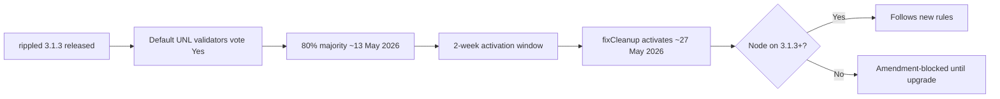
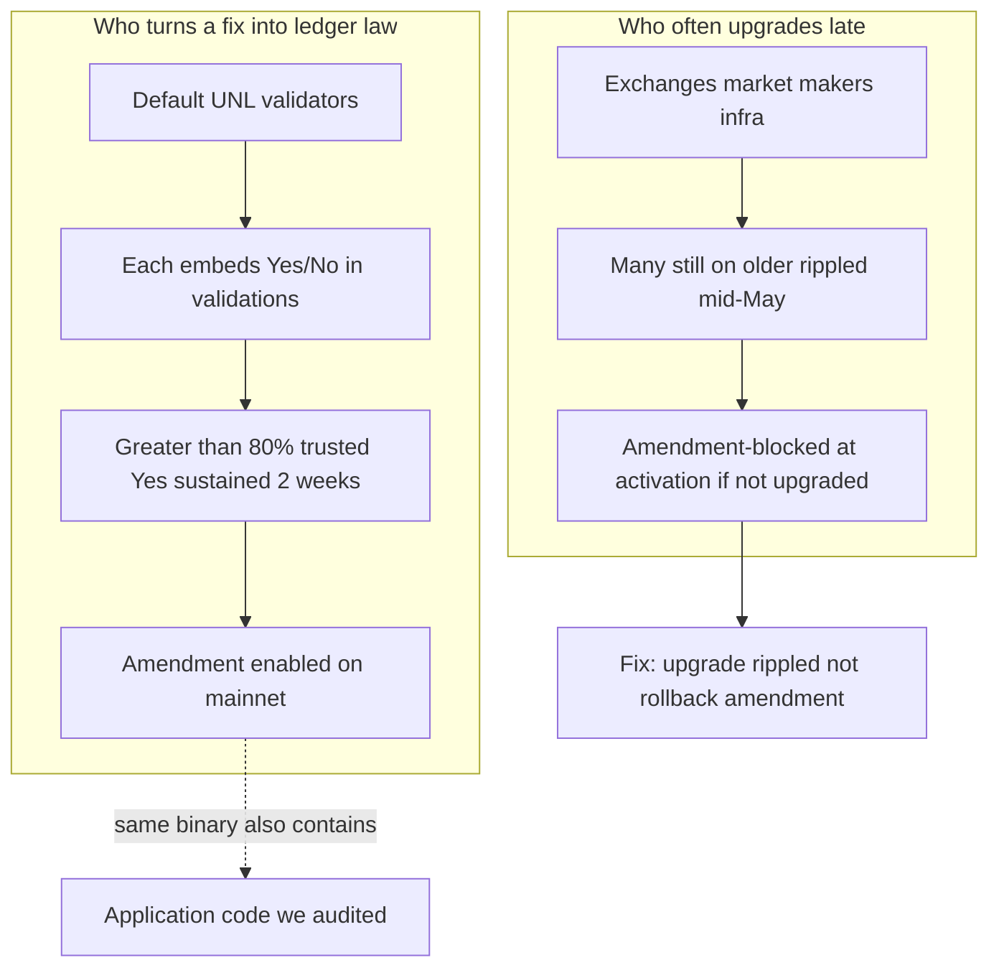
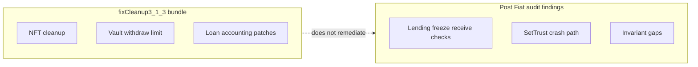
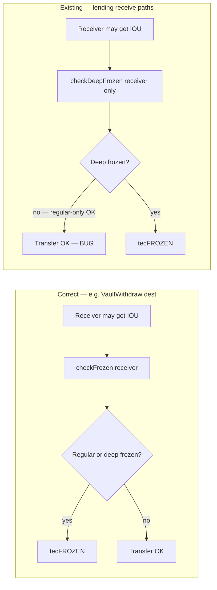
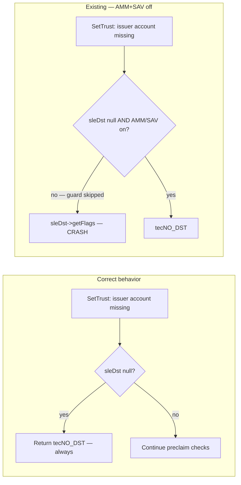
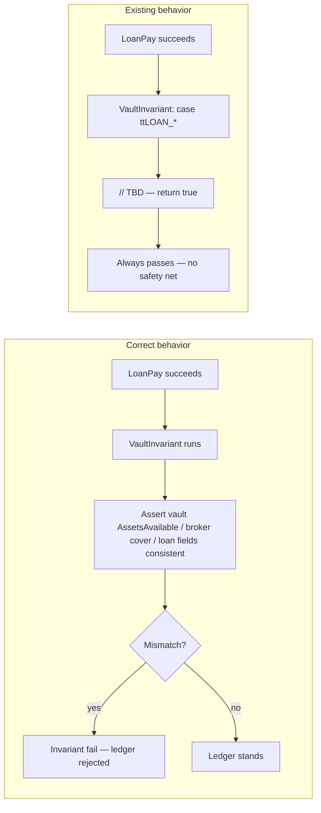
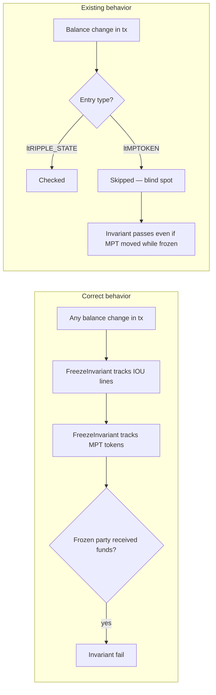
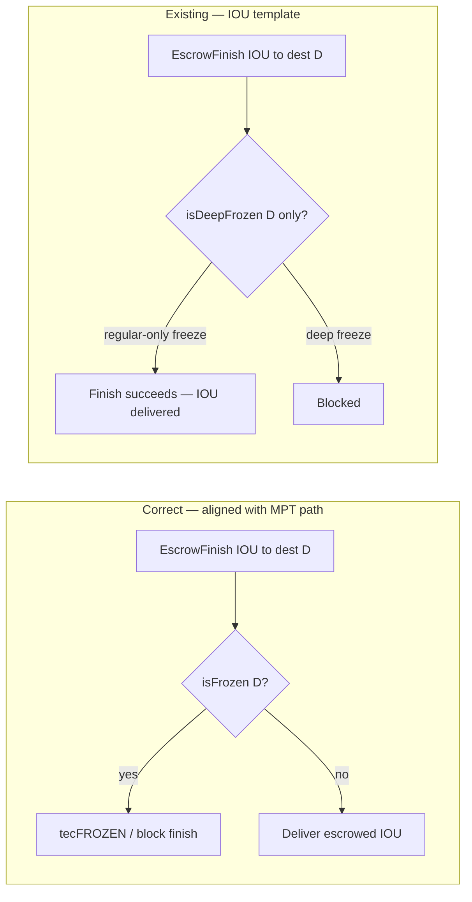
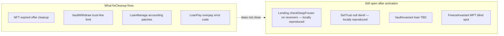

<div class="pearl-primer-box">
  <p><strong>Context:</strong> Post Fiat is a <strong>RippleD fork</strong>. Before we commit to building on or migrating off this stack, we ran an internal audit of the upstream codebase — baseline <code>release-3.1.3</code>, May 2026 — to understand what is actually broken, what is proven, and what we can rule out.</p>
  <p style="margin-top:12px">This report is that evaluation write-up: plain-English observations, hypothesized exploit paths where our testing supported them, diagrams, and local jtx reproductions. It reflects our internal research only, published for transparency.</p>
  <p style="margin-top:12px"><strong>Why now:</strong> The May 2026 <code>fixCleanup3_1_3</code> amendment episode — mandatory upgrade pressure, validator-driven rule changes, and maintenance fixes that do <em>not</em> cover the lending freeze behavior we reproduced — is what pushed us to audit the RippleD codebase ourselves before Post Fiat proceeds further.</p>
</div>

---

## Section 0 — The fixCleanup episode & why we audited the code

### Plain English: what fixCleanup is

In rippled **3.1.3**, XRPL shipped a bundled amendment called **`fixCleanup3_1_3`**. It is **routine maintenance**, not a new product feature. Official scope ([XRPL blog](https://xrpl.org/blog/2026/rippled-3.1.3), [known amendments](https://xrpl.org/resources/known-amendments)):

- Delete expired NFT offers when accepted
- Block Permissioned Domain changes on failed transactions
- Enforce vault withdraw **trust-line limits**
- Fix loan **accounting** when loans change state
- Return correct error on LoanPay overpay
- Tighten LoanBroker **cover balance** invariants

Validators on rippled 3.1.3 **default to voting Yes**. Majority was reached around **13 May 2026**; activation was scheduled for **27 May 2026** after the standard two-week hold.

### Plain English: it was not “rolled back”

**Important:** fixCleanup did **not** get rolled back or reversed on mainnet. What happened to slow operators is different:

| What people say | What actually happens |
|-----------------|----------------------|
| “The network rolled back the upgrade” | **No.** The amendment **activated** on the canonical ledger. |
| “Nodes got forked off” | Lagging nodes became **amendment-blocked** — they stop validating, submitting txs, and voting until upgraded ([XRPL docs](https://xrpl.org/docs/concepts/networks-and-servers/amendments)). |
| “There was a chain split” | **No rival UNL** campaign. One ledger stream; old software is excluded, not a second asset. |

David Schwartz framed this as XRPL’s frequent **“technical hard forks”** (every amendment changes rules old binaries cannot follow) while noting a **contentious** split would need a dissenting validator set + rival UNL + market adoption ([Protos](https://protos.com/david-schwartz-warning-about-hard-forks-because-xrp-nodes-wont-upgrade/), [CryptoSlate](https://cryptoslate.com/xrpls-coming-hard-fork-shows-who-really-controls-a-blockchain-split/)). That did **not** occur for fixCleanup.

### Timeline (what happened)



### Governance: who decides vs who lags

Roughly **100% of default UNL (dUNL) validators** supported fixCleanup while **~40–46% of observed public nodes** had upgraded to 3.1.3 mid-May ([Protos](https://protos.com/david-schwartz-warning-about-hard-forks-because-xrp-nodes-wont-upgrade/) reporting). **Node count does not vote.** Only **trusted validators on your UNL** count toward amendment majority.



**Governance takeaway for Post Fiat:** rule changes are **fast**, **default-yes**, and **validator-centric**. Dissent is not “stay on old rules and keep using XRP” — it is **upgrade or stop participating**. Application-layer code quality is **orthogonal**: fixCleanup can ship while separate lending freeze behavior remains in the same release.

### Release cadence since chain inception (context)

XRPL mainnet began in **2013**. We chart **stable semver rippled releases** (`x.y.z` tags in [XRPLF/rippled](https://github.com/XRPLF/rippled)) — a practical proxy for how often operators are asked to pick up new server builds. This is **not** the same as amendment activations (rule changes can bundle several fixes per release).

<div class="pearl-chart-figure">
  
  <p class="pearl-figure-caption">Trailing 12-month count of stable <code>x.y.z</code> rippled releases tagged in XRPLF/rippled (109 through May 2026). Early-era cadence peaked around <strong>20</strong>/year (mid-2014); recent cadence is roughly <strong>8–10</strong>/year with a step-up in the 2.x→3.x cycle. Data: <a href="{{ '/assets/research/xrpl-rippled-p0-audit/data/rippled_stable_releases.json' | relative_url }}">JSON</a> · regenerate: <code>build_release_rolling_chart.py</code>.</p>
</div>

**Read with fixCleanup:** 3.1.3 is one point on this curve — a maintenance release in a **multi-year acceleration** of rippled shipping. Validator default-Yes amendments (like fixCleanup) can activate rule changes **without** implying a full code-quality pass on unrelated modules (lending freeze checks, invariant stubs, etc.). That gap is why we expanded from governance watching into the file-level audit below.

### fixCleanup fixes vs what our audit still tracks

These are **different buckets**. fixCleanup patched real bugs in NFT cleanup, vault limits, and loan accounting. Our internal review found **other** behavior in the **same 3.1.3 tree** — especially IOU **regular-freeze** handling on lending receive paths — that fixCleanup **does not address**.

<div class="pearl-split pearl-diagram-split">
  <div class="pearl-panel good">
    <h4>fixCleanup3_1_3 fixes</h4>
    <ul class="pearl-remediation-list-plain">
      <li>Expired NFT offer deletion</li>
      <li>Permissioned Domain failed-tx invariant</li>
      <li>VaultWithdraw trust-line limit (#6645 class)</li>
      <li>LoanManage accounting on state changes</li>
      <li>LoanPay overpay error code</li>
      <li>LoanBroker cover upper-bound invariant</li>
    </ul>
  </div>
  <div class="pearl-panel bad">
    <h4>Still in our audit scope (not fixCleanup)</h4>
    <ul class="pearl-remediation-list-plain">
      <li>Lending <code>checkDeepFrozen</code> on receivers (F3.3–F3.10) — locally reproduced</li>
      <li>SetTrust null deref (F6.1) — locally reproduced</li>
      <li>VaultInvariant loan <code>// TBD</code> (F2.1)</li>
      <li>FreezeInvariant MPT blind spot (F3.1)</li>
      <li>EscrowFinish IOU semantics (F3.11 · under review)</li>
    </ul>
  </div>
</div>



### Why that pushed us into deeper code review

Post Fiat runs on a **RippleD fork**. Watching fixCleanup move through **validator supermajority** while:

1. **Public infra lagged** on the same release, and  
2. **Press treated the amendment as “security closed”** on lending/vaults, and  
3. Our later **jtx runs** still showed lending regular-freeze behavior **outside** fixCleanup’s patch list  

…told us we could not rely on **governance velocity** or **release marketing** as a substitute for **reading the code**. Section 0 frames the episode; **Sections A–H** are the file-level review that followed — including upstream links and suggested remediation prompts per issue.

---

<div class="pearl-hero-grid">
  <div class="pearl-scorecard warn">
    <span class="label">Issues in scope</span>
    <span class="value">10</span>
    <span class="hint">F2.1, F3.1, F3.3–F3.10, F6.1 — observed in upstream <code>release-3.1.3</code> at time of review.</span>
  </div>
  <div class="pearl-scorecard warn">
    <span class="label">Locally reproduced</span>
    <span class="value">7 lending</span>
    <span class="hint">Regular-freeze behavior — balance change observed in rippled unittest (F3.3).</span>
  </div>
  <div class="pearl-scorecard good">
    <span class="label">Repro wallet</span>
    <span class="value">Not required</span>
    <span class="hint">jtx standalone mints test XRP.</span>
  </div>
</div>

<div class="pearl-verdict-banner">
  <strong>How to read this report</strong>
  <p>Every section below uses the same three-part layout:</p>
  <ul class="pearl-verdict-list">
    <li><strong>Plain English</strong> — what the bug means without protocol jargon</li>
    <li><strong>How it could be exploited</strong> — who does what, and what breaks in the real world</li>
    <li><strong>Correct vs existing</strong> — diagram comparing intended behavior to rippled today</li>
    <li><strong>Upstream link &amp; remediation prompt</strong> — GitHub path on tag <code>3.1.3</code> plus suggested fix text you can hand to a developer or coding agent</li>
  </ul>
  <p class="pearl-verdict-foot">Sections below cover issues we are still tracking. Lending freeze behavior and the SetTrust crash were reproduced locally. F4.6 / B3-1 vault pseudo fund movement was investigated and <strong>not reproduced</strong> in our jtx setup.</p>
</div>

---

## Section A — IOU regular freeze vs deep freeze (root cause)

### Plain English

An IOU issuer can freeze an account in two steps. **Regular freeze** means “this account should not send or receive my token.” **Deep freeze** is a stronger lock layered on top. You can have **regular-only** freeze — and that is the normal compliance case (suspect wallet, court order, fraud response).

Rippled has two API checks: **`checkFrozen`** (blocks both) and **`checkDeepFrozen`** (blocks deep only). Lending code often uses the wrong one on **receivers**.

### How it could be exploited

1. Issuer regular-freezes account **D** (does not need deep freeze).
2. Someone submits a lending transaction that pays **D** (or a frozen broker owner, vault pseudo, etc.).
3. Preclaim calls **`checkDeepFrozen` only** → not blocked.
4. IOU is delivered to an account the issuer thought was frozen.

**Not required:** hacking validators, fake signatures, or deep freeze.

### Correct vs existing functionality

<div class="pearl-split pearl-diagram-split">
  <div class="pearl-panel good">
    <h4>Correct behavior</h4>
    <div class="pearl-mermaid"><div class="mermaid">
flowchart TB
  C1[Issuer regular-freezes D] --> C2[Tx pays D]
  C2 --> C3{checkFrozen D?}
  C3 -->|frozen| C4[tecFROZEN]
  C3 -->|not frozen| C5[IOU delivered]
    </div></div>
  </div>
  <div class="pearl-panel bad">
    <h4>Existing — lending</h4>
    <div class="pearl-mermaid"><div class="mermaid">
flowchart TB
  B1[Issuer regular-freezes D] --> B2[Tx pays D]
  B2 --> B3{checkDeepFrozen only?}
  B3 -->|regular-only| B4[Not blocked]
  B4 --> B5[IOU delivered — bug]
    </div></div>
  </div>
</div>

### Upstream reference (correct IOU receiver pattern)

<div class="pearl-remediation">
  <p class="pearl-remediation-label">Reference implementation</p>
  <p class="pearl-remediation-link"><a href="https://github.com/XRPLF/rippled/blob/3.1.3/src/xrpld/app/tx/detail/VaultWithdraw.cpp">VaultWithdraw.cpp</a> · tag <code>3.1.3</code> · merged in <a href="https://github.com/XRPLF/rippled/pull/5572">PR #5572</a></p>
  <p class="pearl-remediation-prompt"><strong>Suggested prompt:</strong> “On IOU paths where an account must not <em>receive</em> issuer tokens, use <code>checkFrozen(view, account, asset)</code> on the receiver — not <code>checkDeepFrozen</code> alone. Deep freeze requires regular freeze first; compliance regular-freeze must block delivery. Mirror the VaultWithdraw destination check across all lending receive paths introduced in PR #5270.”</p>
</div>

---

## Section B — Lending freeze bypass (F3.3, F3.5–F3.10) · locally reproduced

### Plain English

The **XLS-66 lending** feature (loan brokers, loan pay, cover withdraw, etc.) checks the **wrong freeze level** on almost every path where IOU goes to a **receiver**. The correct pattern already existed in **`VaultWithdraw`** (destination check) but was not copied into lending.

Seven transaction paths share one mistake introduced in PR [#5270](https://github.com/XRPLF/rippled/pull/5270).

### How it could be exploited

| ID | Transaction | Exploit in one sentence |
|----|-------------|-------------------------|
| **F3.3** | CoverWithdraw | Broker sends cover to a **regular-frozen** destination — IOU arrives anyway. |
| **F3.5** | BrokerDelete | Deleting broker sends leftover cover to a **regular-frozen** owner. |
| **F3.6** | LoanPay | Borrower pays loan; **broker fee** still routed to **regular-frozen** owner. |
| **F3.7** | LoanSet | New loan; **origination fee** paid to **regular-frozen** broker owner. |
| **F3.8** | LoanPay | Payment credits a **regular-frozen** vault pseudo-account. |
| **F3.9** | CoverDeposit | Cover deposited into **regular-frozen** broker pseudo. |
| **F3.10** | LoanSet | Fee sent to **regular-frozen** broker pseudo. |

**Observed in testing:** issuer compliance / fraud containment may fail — frozen wallets can still receive IOU via lending in our jtx run. **F3.3 reproduction:** destination balance increased by 10 IOU while regular-frozen.

### Correct vs existing functionality



**Representative code (F3.3):**

```cpp
if (auto const ret = checkDeepFrozen(ctx.view, dstAcct, vaultAsset))
    return ret;
// MISSING: checkFrozen(ctx.view, dstAcct, vaultAsset)
```

### Upstream links & remediation prompts

Baseline: [XRPLF/rippled](https://github.com/XRPLF/rippled) tag [`3.1.3`](https://github.com/XRPLF/rippled/tree/3.1.3). Correct receiver pattern: [VaultWithdraw.cpp](https://github.com/XRPLF/rippled/blob/3.1.3/src/xrpld/app/tx/detail/VaultWithdraw.cpp) ([#5572](https://github.com/XRPLF/rippled/pull/5572)). Bug cluster introduced in [#5270](https://github.com/XRPLF/rippled/pull/5270).

<div class="pearl-remediation">
  <p class="pearl-remediation-label">F3.3 · LoanBrokerCoverWithdraw</p>
  <p class="pearl-remediation-link"><a href="https://github.com/XRPLF/rippled/blob/3.1.3/src/xrpld/app/tx/detail/LoanBrokerCoverWithdraw.cpp#L109-L111">LoanBrokerCoverWithdraw.cpp#L109-L111</a></p>
  <p class="pearl-remediation-prompt"><strong>Suggested prompt:</strong> “In <code>LoanBrokerCoverWithdraw::preclaim</code>, after the existing <code>checkDeepFrozen(ctx.view, dstAcct, vaultAsset)</code>, add <code>checkFrozen(ctx.view, dstAcct, vaultAsset)</code> so a regular-frozen destination cannot receive cover IOU. Add jtx: issuer regular-freezes destination only → <code>tecFROZEN</code>; deep-freeze control still passes.”</p>
</div>

<div class="pearl-remediation">
  <p class="pearl-remediation-label">F3.5 · LoanBrokerDelete</p>
  <p class="pearl-remediation-link"><a href="https://github.com/XRPLF/rippled/blob/3.1.3/src/xrpld/app/tx/detail/LoanBrokerDelete.cpp#L87-L89">LoanBrokerDelete.cpp#L87-L89</a></p>
  <p class="pearl-remediation-prompt"><strong>Suggested prompt:</strong> “When deleting a loan broker with leftover cover, the owner receives IOU. Replace <code>checkDeepFrozen(ctx.view, brokerOwner, asset)</code> with <code>checkFrozen</code> (or add <code>checkFrozen</code> in addition). Regular-freeze on broker owner must block delete payout.”</p>
</div>

<div class="pearl-remediation">
  <p class="pearl-remediation-label">F3.6 · LoanPay (broker fee routing)</p>
  <p class="pearl-remediation-link"><a href="https://github.com/XRPLF/rippled/blob/3.1.3/src/xrpld/app/tx/detail/LoanPay.cpp#L305-L318">LoanPay.cpp#L305-L318</a></p>
  <p class="pearl-remediation-prompt"><strong>Suggested prompt:</strong> “In <code>LoanPay</code> fee routing, <code>sendBrokerFeeToOwner</code> uses <code>!isDeepFrozen(view, brokerOwner, asset)</code> to decide whether fees can go to the owner. Include regular freeze: use <code>!isFrozen(view, brokerOwner, asset)</code> (or equivalent <code>checkFrozen</code>). Also replace <code>checkDeepFrozen(view, brokerPayee, asset)</code> on the payee with <code>checkFrozen</code> when the payee is an IOU receiver.”</p>
</div>

<div class="pearl-remediation">
  <p class="pearl-remediation-label">F3.7 · LoanSet (origination fee → owner)</p>
  <p class="pearl-remediation-link"><a href="https://github.com/XRPLF/rippled/blob/3.1.3/src/xrpld/app/tx/detail/LoanSet.cpp#L340-L347">LoanSet.cpp#L340-L347</a></p>
  <p class="pearl-remediation-prompt"><strong>Suggested prompt:</strong> “In <code>LoanSet::preclaim</code>, broker owner may receive origination fees. Change <code>checkDeepFrozen(ctx.view, brokerOwner, asset)</code> to <code>checkFrozen</code> so regular-frozen broker owners cannot receive fees on new loans.”</p>
</div>

<div class="pearl-remediation">
  <p class="pearl-remediation-label">F3.8 · LoanPay (vault pseudo receiver)</p>
  <p class="pearl-remediation-link"><a href="https://github.com/XRPLF/rippled/blob/3.1.3/src/xrpld/app/tx/detail/LoanPay.cpp#L223-L227">LoanPay.cpp#L223-L227</a></p>
  <p class="pearl-remediation-prompt"><strong>Suggested prompt:</strong> “In <code>LoanPay::preclaim</code>, vault pseudo-account receives payment IOU via <code>checkDeepFrozen(ctx.view, vaultPseudoAccount, asset)</code> only. Add <code>checkFrozen(ctx.view, vaultPseudoAccount, asset)</code> so regular-freeze on the vault pseudo blocks loan payments crediting it.”</p>
</div>

<div class="pearl-remediation">
  <p class="pearl-remediation-label">F3.9 · LoanBrokerCoverDeposit</p>
  <p class="pearl-remediation-link"><a href="https://github.com/XRPLF/rippled/blob/3.1.3/src/xrpld/app/tx/detail/LoanBrokerCoverDeposit.cpp#L70-L74">LoanBrokerCoverDeposit.cpp#L70-L74</a></p>
  <p class="pearl-remediation-prompt"><strong>Suggested prompt:</strong> “In <code>LoanBrokerCoverDeposit::preclaim</code>, broker pseudo receives deposited cover. Replace or supplement <code>checkDeepFrozen(ctx.view, pseudoAccountID, vaultAsset)</code> with <code>checkFrozen</code> on the pseudo account as IOU receiver.”</p>
</div>

<div class="pearl-remediation">
  <p class="pearl-remediation-label">F3.10 · LoanSet (broker pseudo fee sink)</p>
  <p class="pearl-remediation-link"><a href="https://github.com/XRPLF/rippled/blob/3.1.3/src/xrpld/app/tx/detail/LoanSet.cpp#L330-L335">LoanSet.cpp#L330-L335</a></p>
  <p class="pearl-remediation-prompt"><strong>Suggested prompt:</strong> “In <code>LoanSet::preclaim</code>, <code>brokerPseudo</code> receives fees when owner cannot. Change <code>checkDeepFrozen(ctx.view, brokerPseudo, asset)</code> to <code>checkFrozen</code> for regular-freeze enforcement on the pseudo receiver.”</p>
</div>

<div class="pearl-remediation pearl-remediation-wide">
  <p class="pearl-remediation-label">Batch fix (all seven lending sites)</p>
  <p class="pearl-remediation-prompt"><strong>Suggested prompt:</strong> “Open a single PR against rippled <code>3.1.3</code>: for every lending transactor where IOU is delivered to a receiver (owner, destination, vault pseudo, broker pseudo), enforce <code>checkFrozen</code> on that receiver. Keep <code>checkDeepFrozen</code> only where deep-freeze semantics are explicitly required. Copy the VaultWithdraw destination pattern. Add jtx regression tests paralleling <code>Vault_test</code> ‘IOU frozen trust line’ cases for each tx type.”</p>
</div>

---

## Section C — SetTrust validator crash (F6.1) · locally reproduced

### Plain English

If someone submits a **SetTrust** (trust line) transaction pointing at an **issuer account that does not exist**, validators should return a clean error (`tecNO_DST`). When AMM and Single-Asset-Vault features are **off**, the code can **skip that check** and **crash** by reading flags from a null account pointer.

This is a **network availability** bug, not a “steal IOU” bug.

### How it could be exploited

1. Attacker crafts SetTrust with a non-existent issuer; features configured so the null guard is off.
2. Transaction reaches **preclaim** on validators.
3. **`sleDst->getFlags()` on null** → validator process segfaults (jtx: **exit 139**).

**Harm:** validator crash, potential consensus disruption if enough nodes hit the same malformed tx — not direct fund theft.

### Correct vs existing functionality



### Upstream link & remediation prompt

<div class="pearl-remediation">
  <p class="pearl-remediation-label">F6.1 · SetTrust preclaim null deref</p>
  <p class="pearl-remediation-link"><a href="https://github.com/XRPLF/rippled/blob/3.1.3/src/xrpld/app/tx/detail/SetTrust.cpp#L196-L204">SetTrust.cpp#L196-L204</a></p>
  <p class="pearl-remediation-prompt"><strong>Suggested prompt:</strong> “In <code>SetTrust::preclaim</code>, when <code>sleDst</code> (issuer account) is null, return <code>tecNO_DST</code> unconditionally before calling <code>sleDst->getFlags()</code>. Do not gate the null check on AMM or SingleAssetVault feature flags. Add jtx: SetTrust to non-existent issuer with those features disabled → must return <code>tecNO_DST</code>, must not crash.”</p>
</div>

---

## Section D — VaultInvariant loan gap (F2.1)

### Plain English

After every successful transaction, **invariants** are safety nets that assert ledger accounting still makes sense. For **loan** transactions (`LoanSet`, `LoanManage`, `LoanPay`), the vault invariant literally contains **`// TBD`** and **returns true** — no checks run.

### How it could be exploited

**Not directly.** You need a **second bug** in loan math or routing that corrupts vault/broker balances. Without invariants, that corruption **validates successfully** instead of failing the ledger.

**Analogy:** smoke alarm with no battery — fire only hurts you if something else ignites.

### Correct vs existing functionality



### Upstream link & remediation prompt

<div class="pearl-remediation">
  <p class="pearl-remediation-label">F2.1 · VaultInvariant loan cases</p>
  <p class="pearl-remediation-link"><a href="https://github.com/XRPLF/rippled/blob/3.1.3/src/xrpld/app/tx/detail/InvariantCheck.cpp#L3809-L3813">InvariantCheck.cpp#L3809-L3813</a> (<code>ttLOAN_SET</code>, <code>ttLOAN_MANAGE</code>, <code>ttLOAN_PAY</code> → <code>// TBD</code>)</p>
  <p class="pearl-remediation-prompt"><strong>Suggested prompt:</strong> “In <code>ValidVault::finalize</code> (InvariantCheck.cpp), replace the loan transaction branch that currently returns true with invariant checks modeled on existing <code>ttVAULT_DEPOSIT</code> / <code>ttVAULT_WITHDRAW</code> cases. After <code>LoanSet</code>, <code>LoanManage</code>, and <code>LoanPay</code>, assert vault <code>AssetsAvailable</code>, broker cover, and loan field consistency. Fail the ledger if accounting drifts.”</p>
</div>

---

## Section E — FreezeInvariant MPT gap (F3.1)

### Plain English

`FreezeInvariant` watches IOU trust line balance changes to catch forbidden transfers while frozen. It **only looks at `ltRIPPLE_STATE`** — **MPT token** balance changes are **invisible** to this invariant.

### How it could be exploited

**Not directly.** If any transactor allows a frozen MPT to move (a separate bug), this invariant **will not catch it**. IOU freeze enforcement and MPT freeze enforcement are asymmetric at the invariant layer.

### Correct vs existing functionality



### Upstream link & remediation prompt

<div class="pearl-remediation">
  <p class="pearl-remediation-label">F3.1 · TransfersNotFrozen MPT blind spot</p>
  <p class="pearl-remediation-link"><a href="https://github.com/XRPLF/rippled/blob/3.1.3/src/xrpld/app/tx/detail/InvariantCheck.cpp#L858-L883">InvariantCheck.cpp#L858-L883</a> · type filter at <a href="https://github.com/XRPLF/rippled/blob/3.1.3/src/xrpld/app/tx/detail/InvariantCheck.cpp#L120">~L120</a> (<code>ltRIPPLE_STATE</code> only)</p>
  <p class="pearl-remediation-prompt"><strong>Suggested prompt:</strong> “Extend <code>TransfersNotFrozen</code> in InvariantCheck.cpp to track <code>ltMPTOKEN</code> balance changes, not only <code>ltRIPPLE_STATE</code>. Apply MPT lock semantics (<code>lsfMPTLocked</code>, issuance global lock) symmetrically with IOU freeze invariant coverage. Add invariant tests for frozen MPT movement attempts.”</p>
</div>

---

## Section F — EscrowFinish IOU (F3.11 · under review)

### Plain English

When finishing an **IOU escrow**, the destination freeze check uses **`isDeepFrozen` only**. The **MPT escrow path in the same file** uses **`isFrozen`**. Tests expect IOU finish to **succeed** when the destination is regular-frozen after escrow was created.

**Status:** under review — may be intentional legacy behavior for in-flight escrows; we have not promoted this to our main findings list.

### How it could be exploited

1. Escrow created to destination **D**.
2. Issuer regular-freezes **D** (not deep).
3. Finisher submits **EscrowFinish** → IOU may still pay **D**.

Same freeze API mistake as lending, but product intent is unclear.

### Correct vs existing functionality



### Upstream link & remediation prompt

<div class="pearl-remediation">
  <p class="pearl-remediation-label">F3.11 · EscrowFinish IOU destination freeze</p>
  <p class="pearl-remediation-link"><a href="https://github.com/XRPLF/rippled/blob/3.1.3/src/xrpld/app/tx/detail/Escrow.cpp#L615-L617">Escrow.cpp#L615-L617</a> · compare MPT path <a href="https://github.com/XRPLF/rippled/blob/3.1.3/src/xrpld/app/tx/detail/Escrow.cpp#L647-L649">#L647-L649</a> (<code>isFrozen</code>)</p>
  <p class="pearl-remediation-prompt"><strong>Suggested prompt:</strong> “Clarify product intent for IOU escrow finish when destination is regular-frozen after escrow creation. If finish must respect issuer regular-freeze, change IOU template from <code>isDeepFrozen</code> to <code>isFrozen</code> to match the MPT escrow path in the same file. Update Escrow tests accordingly and document legacy in-flight escrow behavior if regular-freeze finish is intentionally allowed.”</p>
</div>

---

## Section G — fixCleanup3_1_3 vs issues we still track

### Plain English

**fixCleanup3_1_3** activated on mainnet around **27 May 2026** (see **Section 0**). It bundles real fixes: NFT offer cleanup, permissioned-domain failed-tx invariant, vault withdraw trust-line limits, loan accounting patches, LoanPay overpay error code, LoanBroker cover upper bound.

It **does not** fix lending regular-freeze receive checks, SetTrust crash, invariant TBD gaps, or Escrow IOU finish semantics — the items in **Sections A–F** of this report.

### How it could be exploited

The amendment itself is not an exploit — the risk we note is **false confidence**: assuming “3.1.3 + fixCleanup = lending/vault security closed” while our local tests still showed lending freeze behavior on the paths below.

### Correct vs existing functionality



---

## Section H — Local reproduction notes

### Plain English

We ran rippled’s built-in **jtx** test ledger locally — no testnet, no mainnet XRP. Tests mint accounts and assert balances.

### Results

| Finding | Method | Result |
|---------|--------|--------|
| **F3.3** lending freeze | `OpenP0Repro` | Reproduced locally — `tesSUCCESS`, dest +10 IOU |
| **F3.3 control** | deep freeze added | Reproduced locally — `tecFROZEN` |
| **F6.1** SetTrust crash | `OpenP0ReproCrash` | Reproduced locally — segfault exit 139 |
| **Freeze logic** | `freeze_check_model.py` | Consistent with code paths reviewed |

### Not reproduced in our jtx setup

| Finding | Method | Result |
|---------|--------|--------|
| **F4.6 / B3-1** vault pseudo fund movement | `OpenP0Repro` | Not reproduced — `tecLOCKED`; code-review observation only |

Repro kit: [assets/research/xrpl-rippled-p0-audit/](https://agti.net/assets/research/xrpl-rippled-p0-audit/) · [`OpenP0Repro_test.cpp`](https://agti.net/assets/research/xrpl-rippled-p0-audit/OpenP0Repro_test.cpp)

---

## Implications for Post Fiat

1. **Do not treat fixCleanup as a full code-quality closure** based on this review alone.
2. **Issuer regular-freeze on lending paths** behaved inconsistently in our local tests (7 call sites reviewed).
3. **Invariant gaps** (F2.1, F3.1) may reduce safety-net coverage if other issues appear.
4. **SetTrust crash** is an availability concern in our malformed-tx reproduction.
5. **F4.6 / B3-1** were code-review observations; we did not reproduce fund movement locally.

---

<div class="pearl-disclaimer">

**Disclaimer**

This document is published by **Post Fiat / AGTI** for informational purposes only. It describes our **internal code-quality evaluation** of the open-source **RippleD** codebase (baseline `release-3.1.3`, May 2026). Post Fiat maintains a RippleD-derived fork; we are **not** speaking on behalf of Ripple, Ripple Labs, the XRP Ledger Foundation (XRPLF), or any other third party.

Nothing here is legal, investment, tax, or security advice. Observations are based on static code review, local unit tests (jtx), and our interpretation of upstream behavior at a point in time. **We may be wrong.** Upstream code, amendments, and deployment configurations change. Readers should perform their own due diligence and consult qualified professionals before acting.

Issue identifiers (e.g. F3.3, F6.1) are **internal audit labels**, not official CVEs or vendor advisories. Descriptions of hypothetical exploit paths are **research scenarios**, not allegations of wrongdoing, negligence, or breach of duty by any person or organization. Mention of pull requests or contributors is for traceability only.

**No warranty.** This report is provided “as is” without warranty of any kind. To the fullest extent permitted by law, Post Fiat / AGTI disclaims liability for any loss or damage arising from use of or reliance on this material.

**Trademarks.** Ripple, XRP, XRPL, rippled, and related names are trademarks of their respective owners. Post Fiat is an independent project.

**Corrections.** If you believe any statement is inaccurate, contact us with reproducible evidence and we will review updates in good faith.

*Baseline: upstream rippled `release-3.1.3` · Post Fiat internal review · May 2026*

</div>
