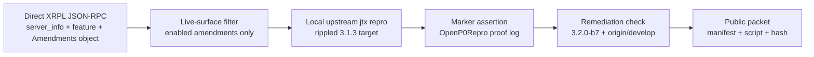
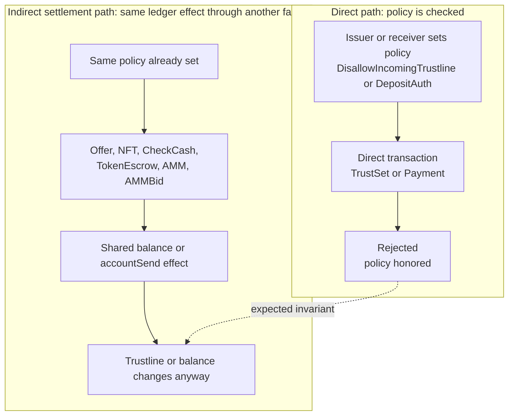

<div class="pearl-primer-box xrpl-lede">
  <p><strong>Context:</strong> Post Fiat is increasingly far along on controlled-testnet engineering. As part of deciding whether to directly support or inherit a RippleD-derived codebase, we ran a focused internal audit of upstream <code>XRPLF/rippled</code>, baseline <code>3.1.3</code>, commit <code>46b241ace8b30d9c9775d60ffba7d24b21903896</code>.</p>
  <p><strong>Current packet:</strong> The packet contains <strong>19 reproduced findings</strong> on XRPL mainnet-enabled surfaces: <strong>14 findings with no confirmed fix</strong> in the checked <code>3.2.0-b7</code> / <code>origin/develop</code> refs, and <strong>5 findings with post-3.1.3 remediation evidence</strong>.</p>
  <p><strong>Proof model:</strong> each finding is reproduced in a clean local upstream jtx harness, bound to a named marker, checked against live amendment state from direct XRPL JSON-RPC, and backed by a static packet verifier.</p>
</div>

---

## Executive Summary

This is a fork-inheritance audit, not a neutral vendor advisory and not a broad bug-note dump. The practical question is whether a new chain should inherit this code path directly, support it with local patches, or treat the underlying implementation style as too expensive to carry.

A finding only enters the inventory if it has a local reproduction wrapper, an expected marker in the `OpenP0Repro` proof log, a risk label, a live-amendment dependency, and remediation status checked against `3.2.0-b7` and `origin/develop`.

<div class="pearl-hero-grid">
  <div class="pearl-scorecard warn">
    <span class="label">Packet findings</span>
    <span class="value">19</span>
    <span class="hint">Reproduced findings on live-enabled surfaces.</span>
  </div>
  <div class="pearl-scorecard warn">
    <span class="label">No confirmed fix</span>
    <span class="value">14</span>
    <span class="hint">No confirmed fix in checked 3.2.0-b7 / origin-develop refs.</span>
  </div>
  <div class="pearl-scorecard good">
    <span class="label">Remediating</span>
    <span class="value">5</span>
    <span class="hint">Post-3.1.3 remediation present in beta/develop evidence.</span>
  </div>
</div>

The main pattern is straightforward: direct paths often enforce account policy, while indirect settlement paths sometimes reach the same ledger effect without the same checks. That shows up in offers, NFT settlement, broker fees, checks, token escrows, AMMs, AMM clawback, AMM bid refunds, MPT lock state, reserve accounting, arithmetic, and permissioned DEX invariants.

<div class="pearl-verdict-banner xrpl-verdict">
  <strong>Bottom line</strong>
  <p>The packet is a state-transition quality signal. The repeated failure mode is not "one weird transaction." It is policy and accounting logic spread across transaction families instead of being centralized at the ledger-effect boundary. For a downstream chain, that is fork-inheritance risk even where upstream might treat a given policy edge as a design-semantics dispute rather than a custody break.</p>
</div>

## Severity Calibration

The scores in this report are internal fork-inheritance risk scores. They are not CVSS scores, official CVEs, or an upstream severity assignment. They answer a narrower engineering question: "how dangerous or expensive is this behavior for a chain deciding whether to inherit `rippled 3.1.3` semantics?"

<div class="xrpl-calibration-grid">
  <div class="xrpl-calibration-card critical">
    <span>Core safety/accounting</span>
    <strong>Substantively concerning on their own</strong>
    <p><code>MPT-LOCK-UNAUTH-001</code>, <code>TRUSTLINE-POSITIVE-BALANCE-RESERVE-001</code>, and <code>MPT-TRANSFER-RATE-OVERFLOW-001</code> touch lock durability, reserve accounting, or bounded consensus arithmetic. These do not depend on a philosophical reading of issuer opt-out policy.</p>
  </div>
  <div class="xrpl-calibration-card">
    <span>Policy-enforcement cluster</span>
    <strong>Important as a repeated implementation pattern</strong>
    <p>The DisallowIncoming and DepositAuth cases generally do not allege fund loss, unauthorized minting, or consensus divergence. They show that a direct-path policy can be bypassed by indirect settlement paths. If upstream intends those flags to be soft preferences, that should be specified. If they are hard account policies, enforcement belongs at the shared ledger-effect boundary.</p>
  </div>
  <div class="xrpl-calibration-card remediated">
    <span>Remediation evidence</span>
    <strong>Upstream activity is part of the signal</strong>
    <p>The five remediating findings show that some issues are being fixed in beta/develop. This report uses those fixes to calibrate risk rather than to claim upstream is inactive.</p>
  </div>
</div>

## How To Read The Packet



The packet deliberately separates three questions:

<div class="xrpl-question-grid">
  <div>
    <span>1</span>
    <strong>Is the surface live?</strong>
    <p>Checked through direct XRPL public JSON-RPC and the raw on-ledger Amendments object, not an explorer page.</p>
  </div>
  <div>
    <span>2</span>
    <strong>Does it reproduce?</strong>
    <p>Each finding has a wrapper under <code>repros/</code> and an expected marker in the proof log.</p>
  </div>
  <div>
    <span>3</span>
    <strong>Is it fixed?</strong>
    <p>Fix status is checked against the latest beta/ref set available in this packet, not inferred from PR titles alone.</p>
  </div>
</div>

## Current Mainnet State

Direct XRPL public JSON-RPC checks on 2026-05-27 produced the current-state packet:

- Runtime receipt: [`direct_xrpl_mainnet_runtime_status_20260527.json`](/assets/research/xrpl-rippled-p0-audit/direct_xrpl_mainnet_runtime_status_20260527.json)
- Amendment receipt: [`direct_xrpl_amendment_status_20260527.json`](/assets/research/xrpl-rippled-p0-audit/direct_xrpl_amendment_status_20260527.json)
- Remediation receipt: [`upstream_remediation_status_20260527.json`](/assets/research/xrpl-rippled-p0-audit/upstream_remediation_status_20260527.json)
- Canonical manifest: [`repro_manifest.json`](/assets/research/xrpl-rippled-p0-audit/repro_manifest.json)

| Check | Result |
|---|---|
| Target release | `rippled 3.1.3`, commit `46b241ace8b30d9c9775d60ffba7d24b21903896` |
| Public server versions checked | `s1.ripple.com` and `s2.ripple.com` reported `rippled_version=3.1.3` |
| Latest checked beta | `3.2.0-b7` |
| Live enabled surfaces used here | `AMM`, `AMMClawback`, `Checks`, `CheckCashMakesTrustLine`, `Credentials`, `DepositAuth`, `DisallowIncoming`, `fixDisallowIncomingV1`, `MPTokensV1`, `NonFungibleTokensV1_1`, `PermissionedDomains`, `PermissionedDEX`, `TokenEscrow`, `fixMPTDeliveredAmount`, `fixAMMv1_3`, `fixTokenEscrowV1`, `fixAMMClawbackRounding`, `fixCleanup3_1_3` |
| Disabled surfaces excluded | `LendingProtocol`, `SingleAssetVault`, `PermissionDelegation`, `Batch`, `fixDelegateV1_1`, `fixDisallowIncomingV1_1` |
| Cleanup-era gate | `fixCleanup3_1_3` was enabled by raw on-ledger amendment hash, so cleanup-era-only candidates are excluded |

## The Dominant Failure Pattern



The system-level lesson is that receiver/issuer policy should live at the shared ledger-effect boundary. If each transaction family has to remember every policy check independently, every new settlement path becomes another bypass candidate. The policy cluster is therefore not framed as "every instance independently drains funds." It is framed as evidence that the implementation distributes policy across too many call sites.

<div class="xrpl-surface-map">
  <div class="xrpl-surface-card hot">
    <span>9</span>
    <strong>Issuer-policy bypasses</strong>
    <p>DisallowIncomingTrustline bypassed through offers, NFTs, broker fees, checks, escrows, AMM create/deposit/withdraw, and AMM clawback paired returns.</p>
  </div>
  <div class="xrpl-surface-card hot">
    <span>2</span>
    <strong>Receiver-policy bypasses</strong>
    <p>DepositAuth bypassed through AMM clawback paired returns and AMMBid LP-token refunds.</p>
  </div>
  <div class="xrpl-surface-card warn">
    <span>3</span>
    <strong>Accounting and arithmetic</strong>
    <p>MPT lock-state deletion, positive-balance trustline reserve drift, and MPT transfer-rate overflow.</p>
  </div>
  <div class="xrpl-surface-card cool">
    <span>5</span>
    <strong>Remediating items</strong>
    <p>Escrow cancellation, stale AMM authorization, MPT amount canonicalization, and permissioned DEX metadata/invariant fixes.</p>
  </div>
</div>

## Inventory

Read the `Risk` column as internal fork-inheritance risk. For the policy cluster, the score reflects repeated cross-path enforcement drift and downstream audit burden; for the core safety/accounting findings, it reflects direct state-safety impact.

| ID | Risk | Status | Surface | Exploit class | Repro |
|---|---:|---|---|---|---|
| [MPT-LOCK-UNAUTH-001](#mpt-lock-unauth-001) | 8.2 | No confirmed fix | `MPTokensV1` | Lock-state deletion | [`sh`](/assets/research/xrpl-rippled-p0-audit/repros/MPT-LOCK-UNAUTH-001.sh) |
| [TRUSTLINE-POSITIVE-BALANCE-RESERVE-001](#trustline-positive-balance-reserve-001) | 8.1 | No confirmed fix | Baseline IOU trustlines | Reserve/owner-count bypass | [`sh`](/assets/research/xrpl-rippled-p0-audit/repros/TRUSTLINE-POSITIVE-BALANCE-RESERVE-001.sh) |
| [TRUSTLINE-DISALLOW-INCOMING-OFFER-001](#trustline-disallow-incoming-offer-001) | 8.0 | No confirmed fix | `DisallowIncoming` + offers | Issuer policy bypass | [`sh`](/assets/research/xrpl-rippled-p0-audit/repros/TRUSTLINE-DISALLOW-INCOMING-OFFER-001.sh) |
| [NFTOKEN-DISALLOW-INCOMING-ACCEPT-001](#nftoken-disallow-incoming-accept-001) | 8.0 | No confirmed fix | NFT settlement | Issuer policy bypass | [`sh`](/assets/research/xrpl-rippled-p0-audit/repros/NFTOKEN-DISALLOW-INCOMING-ACCEPT-001.sh) |
| [NFTOKEN-BROKER-FEE-DISALLOW-INCOMING-TRUSTLINE-001](#nftoken-broker-fee-disallow-incoming-trustline-001) | 8.0 | No confirmed fix | NFT broker fee | Issuer policy bypass | [`sh`](/assets/research/xrpl-rippled-p0-audit/repros/NFTOKEN-BROKER-FEE-DISALLOW-INCOMING-TRUSTLINE-001.sh) |
| [CHECKCASH-DISALLOW-INCOMING-TRUSTLINE-001](#checkcash-disallow-incoming-trustline-001) | 8.0 | No confirmed fix | Checks | Issuer policy bypass | [`sh`](/assets/research/xrpl-rippled-p0-audit/repros/CHECKCASH-DISALLOW-INCOMING-TRUSTLINE-001.sh) |
| [TOKENESCROW-DISALLOW-INCOMING-FINISH-001](#tokenescrow-disallow-incoming-finish-001) | 8.0 | No confirmed fix | TokenEscrow | Issuer policy bypass | [`sh`](/assets/research/xrpl-rippled-p0-audit/repros/TOKENESCROW-DISALLOW-INCOMING-FINISH-001.sh) |
| [AMMWITHDRAW-DISALLOW-INCOMING-TRUSTLINE-001](#ammwithdraw-disallow-incoming-trustline-001) | 8.0 | No confirmed fix | AMM withdraw | Issuer policy bypass | [`sh`](/assets/research/xrpl-rippled-p0-audit/repros/AMMWITHDRAW-DISALLOW-INCOMING-TRUSTLINE-001.sh) |
| [AMMCREATE-DISALLOW-INCOMING-TRUSTLINE-001](#ammcreate-disallow-incoming-trustline-001) | 8.0 | No confirmed fix | AMM create | Issuer policy bypass | [`sh`](/assets/research/xrpl-rippled-p0-audit/repros/AMMCREATE-DISALLOW-INCOMING-TRUSTLINE-001.sh) |
| [AMMDEPOSIT-EMPTY-DISALLOW-INCOMING-TRUSTLINE-001](#ammdeposit-empty-disallow-incoming-trustline-001) | 8.0 | No confirmed fix | AMM empty-pool deposit | Issuer policy bypass | [`sh`](/assets/research/xrpl-rippled-p0-audit/repros/AMMDEPOSIT-EMPTY-DISALLOW-INCOMING-TRUSTLINE-001.sh) |
| [AMMCLAWBACK-DISALLOW-INCOMING-PAIRED-ASSET-001](#ammclawback-disallow-incoming-paired-asset-001) | 8.0 | No confirmed fix | AMMClawback | Issuer policy bypass | [`sh`](/assets/research/xrpl-rippled-p0-audit/repros/AMMCLAWBACK-DISALLOW-INCOMING-PAIRED-ASSET-001.sh) |
| [AMMCLAWBACK-DEPOSITAUTH-PAIRED-ASSET-001](#ammclawback-depositauth-paired-asset-001) | 8.0 | No confirmed fix | AMMClawback | Holder receive-policy bypass | [`sh`](/assets/research/xrpl-rippled-p0-audit/repros/AMMCLAWBACK-DEPOSITAUTH-PAIRED-ASSET-001.sh) |
| [AMMBID-DEPOSITAUTH-REFUND-001](#ammbid-depositauth-refund-001) | 8.0 | No confirmed fix | AMMBid | Holder receive-policy bypass | [`sh`](/assets/research/xrpl-rippled-p0-audit/repros/AMMBID-DEPOSITAUTH-REFUND-001.sh) |
| [MPT-TRANSFER-RATE-OVERFLOW-001](#mpt-transfer-rate-overflow-001) | 7.4 | No confirmed fix | `MPTokensV1` | Arithmetic overflow | [`sh`](/assets/research/xrpl-rippled-p0-audit/repros/MPT-TRANSFER-RATE-OVERFLOW-001.sh) |
| [ESCROW-CANCEL-IOU-001](#escrow-cancel-iou-001) | 8.1 | Remediated after 3.1.3 | TokenEscrow | Deterministic exception | [`sh`](/assets/research/xrpl-rippled-p0-audit/repros/ESCROW-CANCEL-IOU-001.sh) |
| [AMM-STALE-AUTH-001](#amm-stale-auth-001) | 8.0 | Remediated after 3.1.3 | AMM | Stale authorization state | [`sh`](/assets/research/xrpl-rippled-p0-audit/repros/AMM-STALE-AUTH-001.sh) |
| [MPT-NONCANONICAL-AMOUNT-001](#mpt-noncanonical-amount-001) | 7.6 | Fixed in develop, not confirmed in `3.2.0-b7` | `MPTokensV1` | Non-canonical amount validation | [`sh`](/assets/research/xrpl-rippled-p0-audit/repros/MPT-NONCANONICAL-AMOUNT-001.sh) |
| [PDEX-HYBRID-QUALITY-001](#pdex-hybrid-quality-001) | 7.7 | Remediated after 3.1.3 | PermissionedDEX | Order-book metadata corruption | [`sh`](/assets/research/xrpl-rippled-p0-audit/repros/PDEX-HYBRID-QUALITY-001.sh) |
| [PDEX-CANCEL-INVARIANT-001](#pdex-cancel-invariant-001) | 7.5 | Remediated after 3.1.3 | PermissionedDEX | Valid transaction invariant failure | [`sh`](/assets/research/xrpl-rippled-p0-audit/repros/PDEX-CANCEL-INVARIANT-001.sh) |

## Finding Cards

### Unfixed In Checked 3.2.0-b7 / origin-develop

<div class="xrpl-finding-grid">
  <section class="xrpl-finding-card unfixed" id="mpt-lock-unauth-001">
    <div class="xrpl-finding-head"><span class="xrpl-badge">8.2 fork risk</span><span>No confirmed fix</span></div>
    <h4>MPT-LOCK-UNAUTH-001</h4>
    <p class="xrpl-finding-title">MPT locked holder lock-state deletion</p>
    <dl>
      <dt>What is this?</dt><dd>MPTokens are XRPL multi-purpose tokens. Issuers can authorize holders and mark holder token objects as locked.</dd>
      <dt>Why it matters</dt><dd>A lock should be durable issuer control, not state a holder can erase by deleting and recreating its token object.</dd>
      <dt>Bug</dt><dd>A holder can <code>tfMPTUnauthorize</code> a locked zero-balance MPToken, deleting the lock state, then re-authorize without <code>lsfMPTLocked</code>.</dd>
      <dt>Intended behavior</dt><dd>Locked-token deletion should preserve the issuer lock or reject deletion while locked.</dd>
      <dt>Actual behavior</dt><dd>The reproduced path deletes the locked holder object and recreates it unlocked.</dd>
      <dt>Remediation</dt><dd>Enforce locked MPToken deletion checks in the MPT authorization path.</dd>
    </dl>
    <a href="/assets/research/xrpl-rippled-p0-audit/repros/MPT-LOCK-UNAUTH-001.sh">Repro script</a>
  </section>

  <section class="xrpl-finding-card unfixed" id="trustline-positive-balance-reserve-001">
    <div class="xrpl-finding-head"><span class="xrpl-badge">8.1 fork risk</span><span>No confirmed fix</span></div>
    <h4>TRUSTLINE-POSITIVE-BALANCE-RESERVE-001</h4>
    <p class="xrpl-finding-title">Positive IOU balance without receiver owner reserve</p>
    <dl>
      <dt>What is this?</dt><dd>XRPL IOUs live on trustlines; a positive holder balance normally creates owned ledger state and consumes owner reserve.</dd>
      <dt>Why it matters</dt><dd>Reserve accounting is XRPL's anti-state-spam mechanism. Positive balance without owner reserve means durable ledger state exists without the normal cost.</dd>
      <dt>Bug</dt><dd>Offer crossing can give a holder a positive IOU balance while <code>OwnerCount</code> stays zero and the receiver reserve flag stays unset.</dd>
      <dt>Intended behavior</dt><dd>A receiver crossing from non-positive to positive balance should pay owner reserve or the transaction should fail.</dd>
      <dt>Actual behavior</dt><dd>The reproduced path creates the positive balance without the reserve-side accounting.</dd>
      <dt>Remediation</dt><dd>Charge receiver owner reserve on the balance transition, or fail if reserve is unavailable.</dd>
    </dl>
    <a href="/assets/research/xrpl-rippled-p0-audit/repros/TRUSTLINE-POSITIVE-BALANCE-RESERVE-001.sh">Repro script</a>
  </section>

  <section class="xrpl-finding-card unfixed" id="trustline-disallow-incoming-offer-001">
    <div class="xrpl-finding-head"><span class="xrpl-badge">8.0 fork risk</span><span>No confirmed fix</span></div>
    <h4>TRUSTLINE-DISALLOW-INCOMING-OFFER-001</h4>
    <p class="xrpl-finding-title">OfferCreate bypasses issuer DisallowIncomingTrustline</p>
    <dl>
      <dt>What is this?</dt><dd><code>asfDisallowIncomingTrustline</code> is an issuer flag intended to block new incoming trustlines. <code>OfferCreate</code> is the DEX path for crossing IOU offers.</dd>
      <dt>Why it matters</dt><dd>If direct <code>TrustSet</code> is blocked but DEX settlement creates the same trustline, the issuer policy is not actually enforced.</dd>
      <dt>Bug</dt><dd>An issuer can block direct trustline creation, but a taker without a trustline can still cross an offer and receive the issuer IOU.</dd>
      <dt>Intended behavior</dt><dd><code>OfferCreate</code> should apply the same incoming-trustline opt-out check before creating the trustline.</dd>
      <dt>Actual behavior</dt><dd>Direct <code>TrustSet</code> is rejected, then offer crossing creates the trustline anyway.</dd>
      <dt>Remediation</dt><dd>Reject offer acceptance that would create a blocked issuer trustline.</dd>
    </dl>
    <a href="/assets/research/xrpl-rippled-p0-audit/repros/TRUSTLINE-DISALLOW-INCOMING-OFFER-001.sh">Repro script</a>
  </section>

  <section class="xrpl-finding-card unfixed" id="nftoken-disallow-incoming-accept-001">
    <div class="xrpl-finding-head"><span class="xrpl-badge">8.0 fork risk</span><span>No confirmed fix</span></div>
    <h4>NFTOKEN-DISALLOW-INCOMING-ACCEPT-001</h4>
    <p class="xrpl-finding-title">NFTokenAcceptOffer bypasses issuer DisallowIncomingTrustline</p>
    <dl>
      <dt>What is this?</dt><dd><code>NFTokenAcceptOffer</code> settles NFT sales and can pay the seller in an issued IOU.</dd>
      <dt>Why it matters</dt><dd>NFT settlement should not be a second route to create a trustline that direct issuer policy forbids.</dd>
      <dt>Bug</dt><dd>The seller can receive an issuer IOU through NFT settlement despite the issuer setting <code>asfDisallowIncomingTrustline</code>.</dd>
      <dt>Intended behavior</dt><dd>NFT IOU settlement should enforce the issuer's incoming-trustline opt-out.</dd>
      <dt>Actual behavior</dt><dd>Direct <code>TrustSet</code> is rejected, but <code>NFTokenAcceptOffer</code> creates the seller trustline.</dd>
      <dt>Remediation</dt><dd>Add the same issuer-policy check to NFT IOU settlement.</dd>
    </dl>
    <a href="/assets/research/xrpl-rippled-p0-audit/repros/NFTOKEN-DISALLOW-INCOMING-ACCEPT-001.sh">Repro script</a>
  </section>

  <section class="xrpl-finding-card unfixed" id="nftoken-broker-fee-disallow-incoming-trustline-001">
    <div class="xrpl-finding-head"><span class="xrpl-badge">8.0 fork risk</span><span>No confirmed fix</span></div>
    <h4>NFTOKEN-BROKER-FEE-DISALLOW-INCOMING-TRUSTLINE-001</h4>
    <p class="xrpl-finding-title">NFToken broker fee bypasses issuer DisallowIncomingTrustline</p>
    <dl>
      <dt>What is this?</dt><dd>Brokered NFT settlement can pay a broker fee in an issuer IOU.</dd>
      <dt>Why it matters</dt><dd>Broker fees are easy to miss because the broker is neither buyer nor seller; this tests whether receive-policy enforcement is centralized.</dd>
      <dt>Bug</dt><dd>The broker can receive an issuer IOU fee and get a new trustline despite the issuer opt-out.</dd>
      <dt>Intended behavior</dt><dd>Broker-fee payment should enforce <code>asfDisallowIncomingTrustline</code> before creating a broker trustline.</dd>
      <dt>Actual behavior</dt><dd>The broker-fee path creates the trustline through settlement.</dd>
      <dt>Remediation</dt><dd>Apply issuer-policy checks to NFT broker-fee IOU payment.</dd>
    </dl>
    <a href="/assets/research/xrpl-rippled-p0-audit/repros/NFTOKEN-BROKER-FEE-DISALLOW-INCOMING-TRUSTLINE-001.sh">Repro script</a>
  </section>

  <section class="xrpl-finding-card unfixed" id="checkcash-disallow-incoming-trustline-001">
    <div class="xrpl-finding-head"><span class="xrpl-badge">8.0 fork risk</span><span>No confirmed fix</span></div>
    <h4>CHECKCASH-DISALLOW-INCOMING-TRUSTLINE-001</h4>
    <p class="xrpl-finding-title">CheckCash bypasses issuer DisallowIncomingTrustline</p>
    <dl>
      <dt>What is this?</dt><dd>Checks allow delayed settlement; with <code>CheckCashMakesTrustLine</code>, cashing an IOU check can create the receiver trustline.</dd>
      <dt>Why it matters</dt><dd>Delayed settlement should not bypass the same issuer policy that direct trustline creation must obey.</dd>
      <dt>Bug</dt><dd><code>CheckCash</code> can create an incoming trustline to an issuer that has opted out of new incoming trustlines.</dd>
      <dt>Intended behavior</dt><dd><code>CheckCash</code> should reject IOU cashing when it would create a blocked trustline.</dd>
      <dt>Actual behavior</dt><dd>Direct <code>TrustSet</code> is blocked, then the check-cash path creates the trustline.</dd>
      <dt>Remediation</dt><dd>Add issuer-policy checks to automatic trustline creation during <code>CheckCash</code>.</dd>
    </dl>
    <a href="/assets/research/xrpl-rippled-p0-audit/repros/CHECKCASH-DISALLOW-INCOMING-TRUSTLINE-001.sh">Repro script</a>
  </section>

  <section class="xrpl-finding-card unfixed" id="tokenescrow-disallow-incoming-finish-001">
    <div class="xrpl-finding-head"><span class="xrpl-badge">8.0 fork risk</span><span>No confirmed fix</span></div>
    <h4>TOKENESCROW-DISALLOW-INCOMING-FINISH-001</h4>
    <p class="xrpl-finding-title">EscrowFinish bypasses issuer DisallowIncomingTrustline</p>
    <dl>
      <dt>What is this?</dt><dd>TokenEscrow releases issued assets when <code>EscrowFinish</code> completes.</dd>
      <dt>Why it matters</dt><dd>Escrow completion is non-interactive for the destination; it should not force a policy-blocked trustline onto the account.</dd>
      <dt>Bug</dt><dd><code>EscrowFinish</code> can deliver an IOU and create a destination trustline despite issuer <code>DisallowIncomingTrustline</code>.</dd>
      <dt>Intended behavior</dt><dd>Finishing an IOU escrow should enforce the issuer's incoming-trustline opt-out.</dd>
      <dt>Actual behavior</dt><dd>Direct <code>TrustSet</code> is rejected, then escrow completion creates the trustline.</dd>
      <dt>Remediation</dt><dd>Add issuer-policy checks to TokenEscrow finish settlement.</dd>
    </dl>
    <a href="/assets/research/xrpl-rippled-p0-audit/repros/TOKENESCROW-DISALLOW-INCOMING-FINISH-001.sh">Repro script</a>
  </section>

  <section class="xrpl-finding-card unfixed" id="ammwithdraw-disallow-incoming-trustline-001">
    <div class="xrpl-finding-head"><span class="xrpl-badge">8.0 fork risk</span><span>No confirmed fix</span></div>
    <h4>AMMWITHDRAW-DISALLOW-INCOMING-TRUSTLINE-001</h4>
    <p class="xrpl-finding-title">AMMWithdraw bypasses issuer DisallowIncomingTrustline</p>
    <dl>
      <dt>What is this?</dt><dd><code>AMMWithdraw</code> returns pooled assets to a liquidity provider.</dd>
      <dt>Why it matters</dt><dd>AMMs are a major indirect settlement surface. If withdrawal skips issuer policy, liquidity mechanics can create blocked trustlines.</dd>
      <dt>Bug</dt><dd>A withdrawal can send an issuer IOU to an account with no trustline even after the issuer has opted out.</dd>
      <dt>Intended behavior</dt><dd>AMM withdrawal should enforce issuer trustline policy before creating a receiver trustline.</dd>
      <dt>Actual behavior</dt><dd>The AMM withdrawal path creates the trustline through <code>accountSend</code>.</dd>
      <dt>Remediation</dt><dd>Apply issuer-policy checks to AMM withdrawal sends.</dd>
    </dl>
    <a href="/assets/research/xrpl-rippled-p0-audit/repros/AMMWITHDRAW-DISALLOW-INCOMING-TRUSTLINE-001.sh">Repro script</a>
  </section>

  <section class="xrpl-finding-card unfixed" id="ammcreate-disallow-incoming-trustline-001">
    <div class="xrpl-finding-head"><span class="xrpl-badge">8.0 fork risk</span><span>No confirmed fix</span></div>
    <h4>AMMCREATE-DISALLOW-INCOMING-TRUSTLINE-001</h4>
    <p class="xrpl-finding-title">AMMCreate bypasses issuer DisallowIncomingTrustline</p>
    <dl>
      <dt>What is this?</dt><dd><code>AMMCreate</code> creates the special AMM account and the initial pool.</dd>
      <dt>Why it matters</dt><dd>Pool creation creates durable ledger state. It should not create an AMM-account trustline to an issuer that opted out.</dd>
      <dt>Bug</dt><dd>A pool can be created for an issuer IOU despite issuer <code>DisallowIncomingTrustline</code>.</dd>
      <dt>Intended behavior</dt><dd>AMM creation should reject pool creation when it would create a blocked issuer trustline.</dd>
      <dt>Actual behavior</dt><dd>The AMM account trustline is created through the pool creation path.</dd>
      <dt>Remediation</dt><dd>Apply issuer-policy checks to AMM account trustline creation.</dd>
    </dl>
    <a href="/assets/research/xrpl-rippled-p0-audit/repros/AMMCREATE-DISALLOW-INCOMING-TRUSTLINE-001.sh">Repro script</a>
  </section>

  <section class="xrpl-finding-card unfixed" id="ammdeposit-empty-disallow-incoming-trustline-001">
    <div class="xrpl-finding-head"><span class="xrpl-badge">8.0 fork risk</span><span>No confirmed fix</span></div>
    <h4>AMMDEPOSIT-EMPTY-DISALLOW-INCOMING-TRUSTLINE-001</h4>
    <p class="xrpl-finding-title">AMMDeposit empty-pool bypass</p>
    <dl>
      <dt>What is this?</dt><dd><code>AMMDeposit</code> with <code>tfTwoAssetIfEmpty</code> can reinitialize an empty pool.</dd>
      <dt>Why it matters</dt><dd>Reinitialization is a lifecycle edge case where old state is recreated; those paths must re-run the same policy checks as first creation.</dd>
      <dt>Bug</dt><dd>Empty-pool reinitialization can recreate an AMM trustline to an issuer that has opted out.</dd>
      <dt>Intended behavior</dt><dd>Empty-pool deposit should enforce issuer policy before recreating the AMM account trustline.</dd>
      <dt>Actual behavior</dt><dd>The reinit path recreates the trustline despite <code>DisallowIncomingTrustline</code>.</dd>
      <dt>Remediation</dt><dd>Apply issuer-policy checks to empty-pool reinitialization.</dd>
    </dl>
    <a href="/assets/research/xrpl-rippled-p0-audit/repros/AMMDEPOSIT-EMPTY-DISALLOW-INCOMING-TRUSTLINE-001.sh">Repro script</a>
  </section>

  <section class="xrpl-finding-card unfixed" id="ammclawback-disallow-incoming-paired-asset-001">
    <div class="xrpl-finding-head"><span class="xrpl-badge">8.0 fork risk</span><span>No confirmed fix</span></div>
    <h4>AMMCLAWBACK-DISALLOW-INCOMING-PAIRED-ASSET-001</h4>
    <p class="xrpl-finding-title">AMMClawback paired-asset DisallowIncoming bypass</p>
    <dl>
      <dt>What is this?</dt><dd><code>AMMClawback</code> lets issuer A claw back its asset from a two-asset AMM pool, which can return issuer B's paired asset to a holder.</dd>
      <dt>Why it matters</dt><dd>Cross-issuer AMM operations must respect both issuers' policies, not only the issuer initiating the clawback.</dd>
      <dt>Bug</dt><dd>Issuer A's clawback can force-return issuer B's IOU to a holder after issuer B opted out of incoming trustlines.</dd>
      <dt>Intended behavior</dt><dd>Returning the paired asset should enforce issuer B's trustline policy.</dd>
      <dt>Actual behavior</dt><dd>The paired asset is returned and the issuer B trustline is recreated.</dd>
      <dt>Remediation</dt><dd>Apply issuer-policy checks to paired-asset returns in AMM clawback.</dd>
    </dl>
    <a href="/assets/research/xrpl-rippled-p0-audit/repros/AMMCLAWBACK-DISALLOW-INCOMING-PAIRED-ASSET-001.sh">Repro script</a>
  </section>

  <section class="xrpl-finding-card unfixed" id="ammclawback-depositauth-paired-asset-001">
    <div class="xrpl-finding-head"><span class="xrpl-badge">8.0 fork risk</span><span>No confirmed fix</span></div>
    <h4>AMMCLAWBACK-DEPOSITAUTH-PAIRED-ASSET-001</h4>
    <p class="xrpl-finding-title">AMMClawback paired-asset DepositAuth bypass</p>
    <dl>
      <dt>What is this?</dt><dd><code>DepositAuth</code> is a receiver-side flag that requires authorization before unsolicited funds can be delivered.</dd>
      <dt>Why it matters</dt><dd>A protocol-generated AMM return is still a delivery to the receiver; it should not bypass the receiver's no-unsolicited-deposits policy.</dd>
      <dt>Bug</dt><dd>AMM clawback can force-return a paired IOU to a holder that rejects direct payment under <code>DepositAuth</code>.</dd>
      <dt>Intended behavior</dt><dd>AMM clawback should enforce the holder's receive authorization before delivering paired assets.</dd>
      <dt>Actual behavior</dt><dd>Direct payment is rejected, but the AMM clawback return delivers the asset.</dd>
      <dt>Remediation</dt><dd>Apply <code>DepositAuth</code> checks to paired-asset returns.</dd>
    </dl>
    <a href="/assets/research/xrpl-rippled-p0-audit/repros/AMMCLAWBACK-DEPOSITAUTH-PAIRED-ASSET-001.sh">Repro script</a>
  </section>

  <section class="xrpl-finding-card unfixed" id="ammbid-depositauth-refund-001">
    <div class="xrpl-finding-head"><span class="xrpl-badge">8.0 fork risk</span><span>No confirmed fix</span></div>
    <h4>AMMBID-DEPOSITAUTH-REFUND-001</h4>
    <p class="xrpl-finding-title">AMMBid auction refund bypasses DepositAuth</p>
    <dl>
      <dt>What is this?</dt><dd><code>AMMBid</code> replaces the current AMM auction-slot owner and refunds LP tokens to the previous owner.</dd>
      <dt>Why it matters</dt><dd>The previous owner is not signing the later bid. Protocol-generated refunds still need to obey receiver policy.</dd>
      <dt>Bug</dt><dd>The previous owner can set <code>DepositAuth</code>, reject direct LP-token payment, and still receive an LP-token refund through a later <code>AMMBid</code>.</dd>
      <dt>Intended behavior</dt><dd>AMM bid refunds should respect the previous owner's <code>DepositAuth</code> state.</dd>
      <dt>Actual behavior</dt><dd>The refund path delivers LP tokens despite the receiver policy.</dd>
      <dt>Remediation</dt><dd>Apply <code>DepositAuth</code> checks to AMM bid refunds.</dd>
    </dl>
    <a href="/assets/research/xrpl-rippled-p0-audit/repros/AMMBID-DEPOSITAUTH-REFUND-001.sh">Repro script</a>
  </section>

  <section class="xrpl-finding-card unfixed" id="mpt-transfer-rate-overflow-001">
    <div class="xrpl-finding-head"><span class="xrpl-badge">7.4 fork risk</span><span>No confirmed fix</span></div>
    <h4>MPT-TRANSFER-RATE-OVERFLOW-001</h4>
    <p class="xrpl-finding-title">MPT transfer-rate scaling overflow</p>
    <dl>
      <dt>What is this?</dt><dd>MPT transfer rates scale token movements to account for issuer transfer fees.</dd>
      <dt>Why it matters</dt><dd>Consensus transaction code should not throw arithmetic exceptions on transaction amounts; it should compute deterministically or reject cleanly.</dd>
      <dt>Bug</dt><dd>A large integral MPT amount with a 1.5 transfer rate reaches a scaled-mantissa overflow path.</dd>
      <dt>Intended behavior</dt><dd>Transfer-rate math should be bounded and deterministic, or fail before application.</dd>
      <dt>Actual behavior</dt><dd>The reproduced path hits an <code>overflow_error</code>.</dd>
      <dt>Remediation</dt><dd>Route MPT transfer-rate math through bounded consensus arithmetic.</dd>
    </dl>
    <a href="/assets/research/xrpl-rippled-p0-audit/repros/MPT-TRANSFER-RATE-OVERFLOW-001.sh">Repro script</a>
  </section>
</div>

### Remediated Or Remediating After 3.1.3

<div class="xrpl-finding-grid">
  <section class="xrpl-finding-card remediated" id="escrow-cancel-iou-001">
    <div class="xrpl-finding-head"><span class="xrpl-badge">8.1 fork risk</span><span>Remediated after 3.1.3</span></div>
    <h4>ESCROW-CANCEL-IOU-001</h4>
    <p class="xrpl-finding-title">EscrowCancel deleted IOU trustline exception</p>
    <dl>
      <dt>What is this?</dt><dd>TokenEscrow cancellation should unwind escrow accounting after normal trustline lifecycle changes.</dd>
      <dt>Why it matters</dt><dd>Cancellation should not strand state or throw a deterministic exception because a related trustline was deleted.</dd>
      <dt>Bug</dt><dd>Canceling an IOU escrow after sender trustline deletion returns <code>tefEXCEPTION</code> / owner-count template-field failure.</dd>
      <dt>Intended behavior</dt><dd>Escrow cancellation should account from durable account state, not require the old trustline to still exist.</dd>
      <dt>Actual behavior</dt><dd>The cancellation path depends on deleted trustline state and throws.</dd>
      <dt>Remediation</dt><dd>Patched after 3.1.3 by using the account ledger entry for cancellation accounting; confirmed in <code>3.2.0-b7</code> and <code>origin/develop</code>.</dd>
    </dl>
    <a href="/assets/research/xrpl-rippled-p0-audit/repros/ESCROW-CANCEL-IOU-001.sh">Repro script</a>
  </section>

  <section class="xrpl-finding-card remediated" id="amm-stale-auth-001">
    <div class="xrpl-finding-head"><span class="xrpl-badge">8.0 fork risk</span><span>Remediated after 3.1.3</span></div>
    <h4>AMM-STALE-AUTH-001</h4>
    <p class="xrpl-finding-title">AMM stale AuthAccounts after empty reinit</p>
    <dl>
      <dt>What is this?</dt><dd>AMM auction authorization state controls the current discounted trading slot.</dd>
      <dt>Why it matters</dt><dd>Empty-pool reinitialization should not inherit privilege metadata from a prior pool lifecycle.</dd>
      <dt>Bug</dt><dd>Reinitializing an empty AMM leaves stale <code>sfAuthAccounts</code> from the previous auction slot.</dd>
      <dt>Intended behavior</dt><dd>Empty-pool reinit should clear stale auction authorization state.</dd>
      <dt>Actual behavior</dt><dd>The old authorization list survives into the new pool lifecycle.</dd>
      <dt>Remediation</dt><dd>Patched after 3.1.3 by clearing <code>AuthAccounts</code>; confirmed in <code>3.2.0-b7</code> and <code>origin/develop</code>.</dd>
    </dl>
    <a href="/assets/research/xrpl-rippled-p0-audit/repros/AMM-STALE-AUTH-001.sh">Repro script</a>
  </section>

  <section class="xrpl-finding-card remediated" id="mpt-noncanonical-amount-001">
    <div class="xrpl-finding-head"><span class="xrpl-badge">7.6 fork risk</span><span>Fixed in develop</span></div>
    <h4>MPT-NONCANONICAL-AMOUNT-001</h4>
    <p class="xrpl-finding-title">Non-canonical MPT amount reaches ledger engine</p>
    <dl>
      <dt>What is this?</dt><dd>XRPL amount encodings are supposed to be canonical before ledger application.</dd>
      <dt>Why it matters</dt><dd>Malformed values should fail preflight, not reach fee-burning application paths.</dd>
      <dt>Bug</dt><dd>A non-canonical MPT amount reaches transaction application and returns <code>tecPATH_PARTIAL</code> instead of <code>temBAD_AMOUNT</code>.</dd>
      <dt>Intended behavior</dt><dd>Non-canonical MPT amounts should be rejected before application.</dd>
      <dt>Actual behavior</dt><dd>The malformed amount reaches the ledger engine and burns a fee.</dd>
      <dt>Remediation</dt><dd>Patched in <code>origin/develop</code>; not confirmed in checked <code>3.2.0-b7</code>.</dd>
    </dl>
    <a href="/assets/research/xrpl-rippled-p0-audit/repros/MPT-NONCANONICAL-AMOUNT-001.sh">Repro script</a>
  </section>

  <section class="xrpl-finding-card remediated" id="pdex-hybrid-quality-001">
    <div class="xrpl-finding-head"><span class="xrpl-badge">7.7 fork risk</span><span>Remediated after 3.1.3</span></div>
    <h4>PDEX-HYBRID-QUALITY-001</h4>
    <p class="xrpl-finding-title">Permissioned-DEX hybrid-offer quality mismatch</p>
    <dl>
      <dt>What is this?</dt><dd>Permissioned DEX hybrid offers are indexed by quality for matching and settlement metadata.</dd>
      <dt>Why it matters</dt><dd>Offer quality is not cosmetic; mismatched quality changes order-book interpretation and can corrupt market metadata.</dd>
      <dt>Bug</dt><dd>A partially crossed hybrid offer leaves its open-book directory key at one quality while <code>sfExchangeRate</code> records another.</dd>
      <dt>Intended behavior</dt><dd>Directory key quality and <code>sfExchangeRate</code> should agree after partial crossing.</dd>
      <dt>Actual behavior</dt><dd>The reproduced path leaves those values inconsistent.</dd>
      <dt>Remediation</dt><dd>Patched after 3.1.3 by fixing hybrid offer placement and metadata repair; confirmed in <code>3.2.0-b7</code> and <code>origin/develop</code>.</dd>
    </dl>
    <a href="/assets/research/xrpl-rippled-p0-audit/repros/PDEX-HYBRID-QUALITY-001.sh">Repro script</a>
  </section>

  <section class="xrpl-finding-card remediated" id="pdex-cancel-invariant-001">
    <div class="xrpl-finding-head"><span class="xrpl-badge">7.5 fork risk</span><span>Remediated after 3.1.3</span></div>
    <h4>PDEX-CANCEL-INVARIANT-001</h4>
    <p class="xrpl-finding-title">Permissioned-DEX regular-offer cancel invariant failure</p>
    <dl>
      <dt>What is this?</dt><dd>Permissioned DEX offers can cancel or interact with regular offers from the same account.</dd>
      <dt>Why it matters</dt><dd>Invariants should catch impossible ledger mutation, not reject a valid transaction because two offer families interact.</dd>
      <dt>Bug</dt><dd>A valid domain <code>OfferCreate</code> that cancels a regular offer fails with <code>tecINVARIANT_FAILED</code>.</dd>
      <dt>Intended behavior</dt><dd>The invariant should permit the valid deletion caused by the domain offer path.</dd>
      <dt>Actual behavior</dt><dd>The invariant treats the deleted regular offer as forbidden mutation.</dd>
      <dt>Remediation</dt><dd>Patched after 3.1.3 by updating the permissioned-DEX invariant; confirmed in <code>3.2.0-b7</code> and <code>origin/develop</code>.</dd>
    </dl>
    <a href="/assets/research/xrpl-rippled-p0-audit/repros/PDEX-CANCEL-INVARIANT-001.sh">Repro script</a>
  </section>
</div>

## Evidence Packet

| Evidence object | Link |
|---|---|
| Packet index | [`AUDIT_PACKET.md`](/assets/research/xrpl-rippled-p0-audit/AUDIT_PACKET.md) |
| Canonical manifest | [`repro_manifest.json`](/assets/research/xrpl-rippled-p0-audit/repro_manifest.json) |
| Direct XRPL amendment receipt | [`direct_xrpl_amendment_status_20260527.json`](/assets/research/xrpl-rippled-p0-audit/direct_xrpl_amendment_status_20260527.json) |
| Direct XRPL runtime receipt | [`direct_xrpl_mainnet_runtime_status_20260527.json`](/assets/research/xrpl-rippled-p0-audit/direct_xrpl_mainnet_runtime_status_20260527.json) |
| Upstream remediation receipt | [`upstream_remediation_status_20260527.json`](/assets/research/xrpl-rippled-p0-audit/upstream_remediation_status_20260527.json) |
| Live-only triage | [`live_p0_hunt_v2_triage.md`](/assets/research/xrpl-rippled-p0-audit/runs/20260527-p0-hunt/live_p0_hunt_v2_triage.md) |
| Static packet verifier | [`verify_packet.py`](/assets/research/xrpl-rippled-p0-audit/verify_packet.py) |
| Common repro runner | [`run_repro.sh`](/assets/research/xrpl-rippled-p0-audit/run_repro.sh) |
| Proof extract | [`live_mainnet_enabled_proof_extract_20260527_v13.log`](/assets/research/xrpl-rippled-p0-audit/runs/20260527-p0-hunt/live_mainnet_enabled_proof_extract_20260527_v13.log) |

Proof extract hash:

```text
302da1ccf25b3ab103cdccf231be443515e81561593c34912aca87849a22cfd6
```

## Reproduction Model

Run the static packet verifier:

```bash
cd /home/postfiat/repos/agtico.github.io/assets/research/xrpl-rippled-p0-audit
python3 verify_packet.py
```

Run one finding:

```bash
cd /home/postfiat/repos/agtico.github.io/assets/research/xrpl-rippled-p0-audit
./repros/TRUSTLINE-POSITIVE-BALANCE-RESERVE-001.sh
```

Expected proof footer:

```text
ripple.tx.OpenP0Repro had 0 failures.
59 cases, 16068 tests total, 0 failures
```

The per-finding wrapper reads `repro_manifest.json`, runs the upstream local jtx proof suite, asserts the targeted marker, and requires the zero-failure proof footer.

## Upstream And Disclosure Boundary

This report does not claim to speak for Ripple, XRPLF, or upstream maintainers. It records our reproducibility packet and the upstream source state we checked.

Some behaviors may be resolved by upstream as bugs, some as amendment-semantics changes, and some as intended product semantics. That distinction matters. In particular, the DisallowIncoming and DepositAuth cluster is strongest as an architectural critique of distributed policy enforcement; the lock-state, reserve-accounting, and overflow findings are stronger standalone safety/accounting findings.

The five remediating findings are explicitly labeled as such because public beta/develop evidence shows fixes landing after `3.1.3`. For the fourteen "no confirmed fix" findings, the claim is only that our checked `3.2.0-b7` / `origin/develop` refs did not contain a confirmed remediation at the time of the packet.

Post Fiat's immediate use of this report is internal engineering due diligence: whether to inherit a RippleD-derived path, support it with local hardening, or avoid the inherited surface. Any downstream production decision should also consider upstream's later response, amendment policy, and any coordinated-disclosure outcome after this packet.

## Excluded Boundary

`MPT-DOMAIN-AUTH-001` is excluded from the live packet. The reproduced MPT `DomainID` path requires `SingleAssetVault` in the current `MPTokenIssuanceCreate` / `MPTokenIssuanceSet` feature gate, and direct XRPL mainnet status shows `SingleAssetVault=false`.

Cleanup-era candidates are also excluded unless they reproduce with `fixCleanup3_1_3` enabled. The raw on-ledger `Amendments` object contains the `fixCleanup3_1_3` hash, so old pre-cleanup reproduction alone is not enough for this public live inventory.

## Implications For Post Fiat

1. A RippleD-derived implementation path cannot inherit enabled XRPL surfaces blindly. The current packet shows repeated gaps between direct policy checks and indirect settlement paths.
2. Receive-policy enforcement should be centralized. If every transaction family is responsible for remembering `DisallowIncomingTrustline`, `DepositAuth`, freeze, authorization, reserve, and owner-count rules, the surface grows faster than review coverage.
3. Fork authors should treat `3.1.3` as unsafe to inherit without this packet's fixes or equivalent negative controls.

---

<div class="pearl-disclaimer">

**Disclaimer**

This document is published by **Post Fiat / AGTI** for informational purposes only. It describes our **internal code-quality evaluation** of the open-source **RippleD** codebase (baseline `release-3.1.3`, May 2026). Post Fiat evaluated RippleD-derived implementation paths; we are **not** speaking on behalf of Ripple, Ripple Labs, the XRP Ledger Foundation (XRPLF), or any other third party.

Nothing here is legal, investment, tax, or security advice. Observations are based on static code review, local unit tests (jtx), helper/protocol-wire checks, live amendment-status filtering, and our interpretation of upstream behavior at a point in time. Upstream code, amendments, and deployment configurations change. Readers should perform their own due diligence and consult qualified professionals before acting.

Issue identifiers are **internal audit labels**, not official CVEs or vendor advisories. Descriptions of hypothetical exploit paths are **research scenarios**, not allegations of wrongdoing, negligence, or breach of duty by any person or organization.

**No warranty.** This report is provided "as is" without warranty of any kind. To the fullest extent permitted by law, Post Fiat / AGTI disclaims liability for any loss or damage arising from use of or reliance on this material.

**Trademarks.** Ripple, XRP, XRPL, rippled, and related names are trademarks of their respective owners. Post Fiat is an independent project.

**Corrections.** If you believe any statement is inaccurate, contact us with reproducible evidence and we will review updates in good faith.

*Baseline: upstream rippled `release-3.1.3` - direct XRPL validated-ledger amendment receipt checked 2026-05-27T20:06:02Z*

</div>
