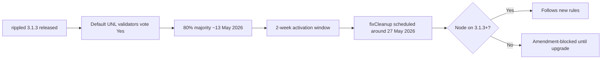
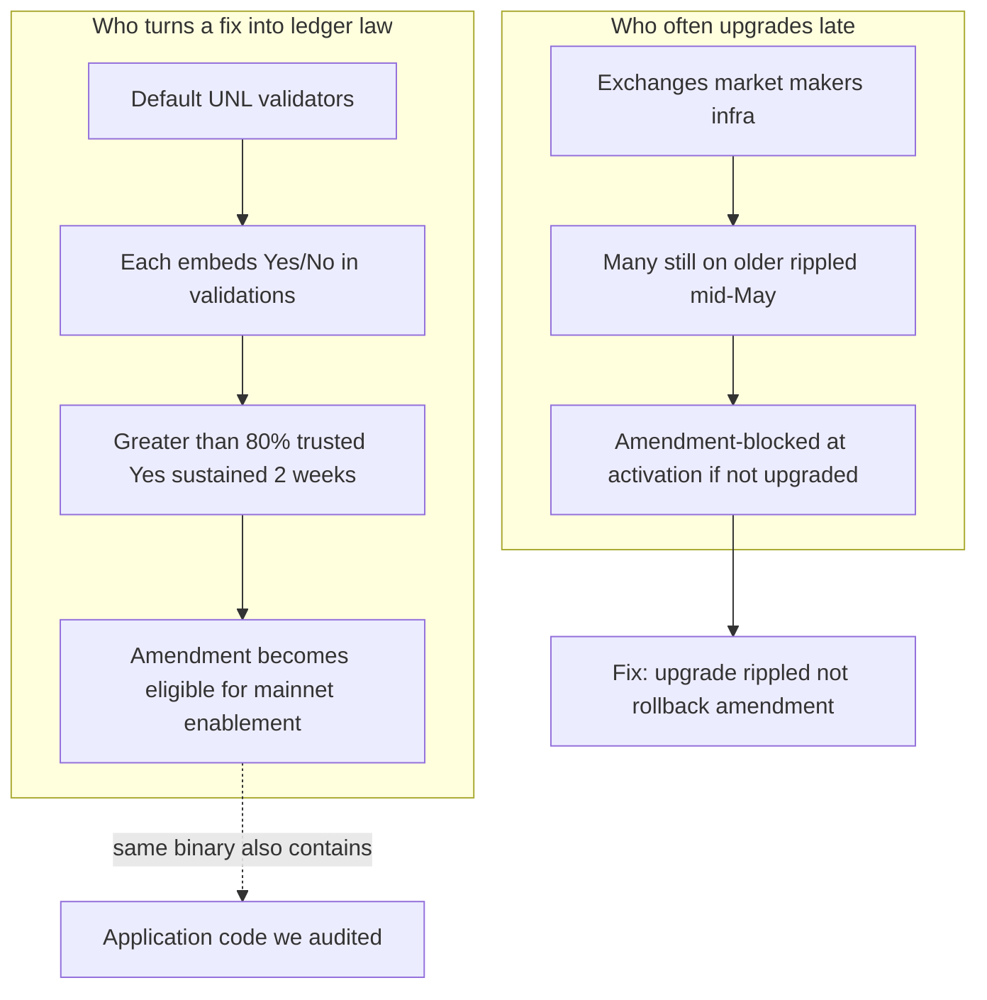
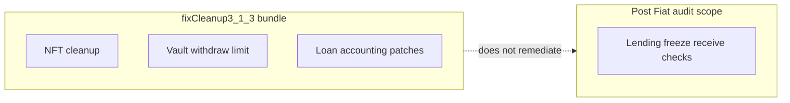
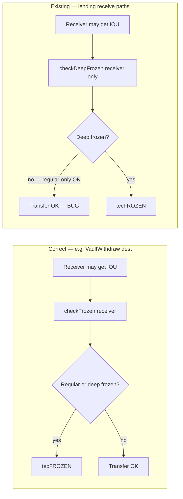
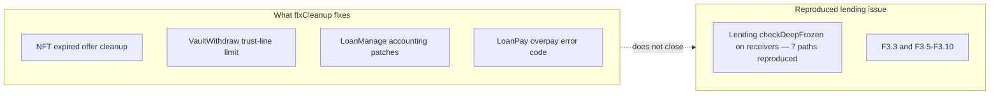

<div class="pearl-primer-box">
  <p><strong>Context:</strong> Post Fiat evaluated a <strong>RippleD-derived implementation path</strong>. Before we commit to building on or migrating off this stack, we ran an internal audit of upstream <code>rippled</code> — baseline <code>release-3.1.3</code>, May 2026 — to separate reproduced behavior from code-review hypotheses.</p>
  <p style="margin-top:12px">This is a narrowed evidence report, not a vendor advisory. It covers only behavior reproduced on a clean upstream jtx test build.</p>
  <p style="margin-top:12px"><strong>Why now:</strong> The May 2026 <code>fixCleanup3_1_3</code> amendment episode — mandatory upgrade pressure, validator-driven rule changes, and maintenance fixes that do <em>not</em> cover the lending freeze behavior we reproduced — is what pushed us to audit the RippleD codebase ourselves before Post Fiat proceeds further.</p>
</div>

---

## Section 0 — The fixCleanup episode & why we audited the code

### Plain English: what fixCleanup is

In rippled **3.1.3**, XRPL shipped a bundled amendment called **`fixCleanup3_1_3`**. It is **routine maintenance**, not a new product feature. Official scope ([XRPL blog](https://xrpl.org/blog/2026/rippled-3.1.3), [known amendments](https://xrpl.org/resources/known-amendments)):

- Delete expired NFT offers when accepted
- Block Permissioned Domain changes on failed transactions
- Enforce vault withdraw **trust-line limits**
- Fix loan **accounting** when loans change state
- Return correct error on LoanPay overpay
- Tighten LoanBroker **cover balance** invariants

Validators on rippled 3.1.3 **default to voting Yes**. Majority was reached around **13 May 2026**; activation was scheduled for **27 May 2026** after the standard two-week hold.

### Plain English: it was not “rolled back”

**Important:** fixCleanup was not framed by XRPL as a rollback or reversal. What happens to slow operators under XRPL amendments is different:

| What people say | What actually happens |
|-----------------|----------------------|
| “The network rolled back the upgrade” | **No.** The amendment follows the canonical amendment process. |
| “Nodes got forked off” | Lagging nodes become **amendment-blocked** — they stop validating, submitting txs, and voting until upgraded ([XRPL docs](https://xrpl.org/docs/concepts/networks-and-servers/amendments)). |
| “There was a chain split” | **No rival UNL** campaign. One ledger stream; old software is excluded, not a second asset. |

David Schwartz framed amendments as XRPL’s frequent **“technical hard forks”** because enabled amendments change rules old binaries cannot follow, while noting a **contentious** split would need a dissenting validator set, rival UNL, old-rule code, infrastructure support, and market adoption ([Protos](https://protos.com/david-schwartz-warning-about-hard-forks-because-xrp-nodes-wont-upgrade/), [CryptoSlate](https://cryptoslate.com/xrpls-coming-hard-fork-shows-who-really-controls-a-blockchain-split/)). We did not see evidence of that for fixCleanup.

### Timeline (what happened)



### Governance: who decides vs who lags

Roughly **100% of default UNL (dUNL) validators** supported fixCleanup while **~40–46% of observed public nodes** had upgraded to 3.1.3 mid-May ([Protos](https://protos.com/david-schwartz-warning-about-hard-forks-because-xrp-nodes-wont-upgrade/) reporting). **Node count does not vote.** Only **trusted validators on your UNL** count toward amendment majority.



**Governance takeaway for Post Fiat:** rule changes are **fast**, **default-yes**, and **validator-centric**. Dissent is not simply “stay on old rules and keep using XRP” — a durable split requires a rival coordination stack. Application-layer code quality is **orthogonal**: fixCleanup can ship while separate lending freeze behavior remains in the same release.

### Release cadence since chain inception (context)

XRPL mainnet began in **2013**. We chart **stable semver rippled releases** (`x.y.z` tags in [XRPLF/rippled](https://github.com/XRPLF/rippled)) — a practical proxy for how often operators are asked to pick up new server builds. This is **not** the same as amendment activations (rule changes can bundle several fixes per release).

<div class="pearl-chart-figure">
  
  <p class="pearl-figure-caption">Trailing 12-month count of stable <code>x.y.z</code> rippled releases tagged in XRPLF/rippled (109 through May 2026). Early-era cadence peaked around <strong>20</strong>/year (mid-2014); recent cadence is roughly <strong>8–10</strong>/year with a step-up in the 2.x→3.x cycle. Data: <a href="{{ '/assets/research/xrpl-rippled-p0-audit/data/rippled_stable_releases.json' | relative_url }}">JSON</a> · regenerate: <code>build_release_rolling_chart.py</code>.</p>
</div>

**Read with fixCleanup:** 3.1.3 is one point on this curve — a maintenance release in a **multi-year acceleration** of rippled shipping. Validator default-Yes amendments (like fixCleanup) can activate rule changes **without** implying a full code-quality pass on unrelated modules such as lending freeze receive checks. That gap is why we expanded from governance watching into the file-level audit below.

### fixCleanup fixes vs what our audit still tracks

These are **different buckets**. fixCleanup patched real bugs in NFT cleanup, vault limits, and loan accounting. Our internal review found **other** behavior in the **same 3.1.3 tree** — especially IOU **regular-freeze** handling on lending receive paths — that fixCleanup **does not address**.

<div class="pearl-split pearl-diagram-split">
  <div class="pearl-panel good">
    <h4>fixCleanup3_1_3 fixes</h4>
    <ul class="pearl-remediation-list-plain">
      <li>Expired NFT offer deletion</li>
      <li>Permissioned Domain failed-tx invariant</li>
      <li>VaultWithdraw trust-line limit (#6645 class)</li>
      <li>LoanManage accounting on state changes</li>
      <li>LoanPay overpay error code</li>
      <li>LoanBroker cover upper-bound invariant</li>
    </ul>
  </div>
  <div class="pearl-panel bad">
    <h4>Still in our audit scope (not fixCleanup)</h4>
    <ul class="pearl-remediation-list-plain">
      <li>Lending <code>checkDeepFrozen</code> on receivers — F3.3 and F3.5–F3.10 locally reproduced</li>
    </ul>
  </div>
</div>



### Why that pushed us into deeper code review

Post Fiat was evaluating a **RippleD-derived implementation path**. Watching fixCleanup move through **validator supermajority** while:

1. **Public infra lagged** on the same release, and
2. **Press treated the amendment as “security closed”** on lending/vaults, and
3. Our later **jtx runs** still showed lending regular-freeze behavior **outside** fixCleanup’s patch list

…told us we could not rely on **governance velocity** or **release marketing** as a substitute for **reading the code**. Section 0 frames the episode; the sections below document the reproduced lending freeze behavior, upstream links, and suggested remediation prompts.

---

<div class="pearl-hero-grid">
  <div class="pearl-scorecard warn">
    <span class="label">Reproduced findings</span>
    <span class="value">37 evidence items</span>
    <span class="hint">One lending root cause across seven paths, nine historical cleanup-era root causes, twenty-five current transaction/helper root causes, one feature-bound MPT lock-state root cause, and one current protocol-wire proof.</span>
  </div>
  <div class="pearl-scorecard warn">
    <span class="label">Locally reproduced</span>
    <span class="value">47 proof cases</span>
    <span class="hint">All promoted claims are backed by clean local jtx, helper/accounting, or protocol-wire repros.</span>
  </div>
  <div class="pearl-scorecard good">
    <span class="label">Repro wallet</span>
    <span class="value">Not required</span>
    <span class="hint">jtx standalone mints test XRP.</span>
  </div>
</div>

<div class="pearl-verdict-banner">
  <strong>How to read this report</strong>
  <p>Every section below uses the same three-part layout:</p>
  <ul class="pearl-verdict-list">
    <li><strong>Plain English</strong> — what the bug means without protocol jargon</li>
    <li><strong>How it could be exploited</strong> — who does what, and what breaks in the real world</li>
    <li><strong>Correct vs existing</strong> — diagram comparing intended behavior to rippled today</li>
    <li><strong>Upstream link &amp; remediation prompt</strong> — GitHub path on tag <code>3.1.3</code> plus suggested fix text you can hand to a developer or coding agent</li>
  </ul>
  <p class="pearl-verdict-foot">Sections below cover only reproduced behavior. Seven lending regular-freeze receive paths, nine historical cleanup-era root causes across eleven paths, twenty-seven current 3.1.3 transaction/helper paths, one feature-bound MPT lock-state path, and one MPT protocol-wire serialization proof were reproduced locally.</p>
</div>

---

## Section A — IOU regular freeze vs deep freeze (root cause)

### Plain English

An IOU issuer can freeze an account in two steps. **Regular freeze** means “this account should not send or receive my token.” **Deep freeze** is a stronger lock layered on top. You can have **regular-only** freeze — and that is the normal compliance case (suspect wallet, court order, fraud response).

Rippled has two API checks: **`checkFrozen`** (regular or deep freeze) and **`checkDeepFrozen`** (deep freeze only). Several lending receive paths use the narrower check on accounts that can receive issuer IOU.

### How it could be exploited

1. Issuer regular-freezes account **D** (does not need deep freeze).
2. Someone submits a lending transaction that pays **D** (or a frozen broker owner, vault pseudo, etc.).
3. Preclaim calls **`checkDeepFrozen` only** → not blocked.
4. IOU is delivered to an account the issuer thought was frozen.

**Not required:** hacking validators, fake signatures, or deep freeze.

### Correct vs existing functionality

<div class="pearl-split pearl-diagram-split">
  <div class="pearl-panel good">
    <h4>Correct behavior</h4>
    <div class="pearl-mermaid"><div class="mermaid">
flowchart TB
  C1[Issuer regular-freezes D] --> C2[Tx pays D]
  C2 --> C3{checkFrozen D?}
  C3 -->|frozen| C4[tecFROZEN]
  C3 -->|not frozen| C5[IOU delivered]
    </div></div>
  </div>
  <div class="pearl-panel bad">
    <h4>Existing — lending</h4>
    <div class="pearl-mermaid"><div class="mermaid">
flowchart TB
  B1[Issuer regular-freezes D] --> B2[Tx pays D]
  B2 --> B3{checkDeepFrozen only?}
  B3 -->|regular-only| B4[Not blocked]
  B4 --> B5[IOU delivered — bug]
    </div></div>
  </div>
</div>

### Upstream reference (correct IOU receiver pattern)

<div class="pearl-remediation">
  <p class="pearl-remediation-label">Reference implementation</p>
  <p class="pearl-remediation-link"><a href="https://github.com/XRPLF/rippled/blob/3.1.3/src/xrpld/app/tx/detail/VaultWithdraw.cpp">VaultWithdraw.cpp</a> · tag <code>3.1.3</code> · merged in <a href="https://github.com/XRPLF/rippled/pull/5572">PR #5572</a></p>
  <p class="pearl-remediation-prompt"><strong>Suggested prompt:</strong> “On IOU paths where an account must not <em>receive</em> issuer tokens, use <code>checkFrozen(view, account, asset)</code> on the receiver — not <code>checkDeepFrozen</code> alone. Deep freeze requires regular freeze first; compliance regular-freeze must block delivery. Mirror the VaultWithdraw destination check across all lending receive paths introduced in PR #5270.”</p>
</div>

---

## Section B — Lending freeze bypasses (F3.3 and F3.5-F3.10 reproduced)

### Plain English

The **XLS-66 lending** feature (loan brokers, loan pay, cover withdraw, etc.) uses the deep-freeze-only check on several paths where IOU can go to a **receiver**. The stricter receiver pattern already existed in **`VaultWithdraw`** but was not applied consistently across lending.

Seven transaction paths share the same review pattern introduced in PR [#5270](https://github.com/XRPLF/rippled/pull/5270). The expanded local jtx proof directly reproduces all seven paths: F3.3 and F3.5-F3.10.

### How it could be exploited

| ID | Transaction | Reproduced result |
|----|-------------|-------------------------|
| **F3.3** | CoverWithdraw | Broker sends cover to a **regular-frozen** destination — IOU arrives anyway. |
| **F3.5** | BrokerDelete | Deleting broker sends leftover cover to a **regular-frozen** owner. |
| **F3.6** | LoanPay | Borrower pays loan; **broker fee** still routed to **regular-frozen** owner. |
| **F3.7** | LoanSet | New loan; **origination fee** paid to **regular-frozen** broker owner. |
| **F3.8** | LoanPay | Payment credits a **regular-frozen** vault pseudo-account. |
| **F3.9** | CoverDeposit | Cover deposited into **regular-frozen** broker pseudo. |
| **F3.10** | LoanPay | Fallback fee sent to **regular-frozen** broker pseudo. |

**Observed in testing:** issuer compliance / fraud containment failed across the lending receive paths above. A regular-frozen destination, broker owner, vault pseudo-account, or broker pseudo-account received IOU while only deep freeze was enforced.

### Correct vs existing functionality



**Representative code (F3.3):**

```cpp
if (auto const ret = checkDeepFrozen(ctx.view, dstAcct, vaultAsset))
    return ret;
// MISSING: checkFrozen(ctx.view, dstAcct, vaultAsset)
```

### Upstream links & remediation prompts

Baseline: [XRPLF/rippled](https://github.com/XRPLF/rippled) tag [`3.1.3`](https://github.com/XRPLF/rippled/tree/3.1.3). Correct receiver pattern: [VaultWithdraw.cpp](https://github.com/XRPLF/rippled/blob/3.1.3/src/xrpld/app/tx/detail/VaultWithdraw.cpp) ([#5572](https://github.com/XRPLF/rippled/pull/5572)). Bug cluster introduced in [#5270](https://github.com/XRPLF/rippled/pull/5270).

<div class="pearl-remediation">
  <p class="pearl-remediation-label">F3.3 · LoanBrokerCoverWithdraw</p>
  <p class="pearl-remediation-link"><a href="https://github.com/XRPLF/rippled/blob/3.1.3/src/xrpld/app/tx/detail/LoanBrokerCoverWithdraw.cpp#L109-L111">LoanBrokerCoverWithdraw.cpp#L109-L111</a></p>
  <p class="pearl-remediation-prompt"><strong>Suggested prompt:</strong> “In <code>LoanBrokerCoverWithdraw::preclaim</code>, after the existing <code>checkDeepFrozen(ctx.view, dstAcct, vaultAsset)</code>, add <code>checkFrozen(ctx.view, dstAcct, vaultAsset)</code> so a regular-frozen destination cannot receive cover IOU. Add jtx: issuer regular-freezes destination only → <code>tecFROZEN</code>; deep-freeze control still passes.”</p>
</div>

<div class="pearl-remediation">
  <p class="pearl-remediation-label">F3.5 · LoanBrokerDelete</p>
  <p class="pearl-remediation-link"><a href="https://github.com/XRPLF/rippled/blob/3.1.3/src/xrpld/app/tx/detail/LoanBrokerDelete.cpp#L87-L89">LoanBrokerDelete.cpp#L87-L89</a></p>
  <p class="pearl-remediation-prompt"><strong>Suggested prompt:</strong> “When deleting a loan broker with leftover cover, the owner receives IOU. Replace <code>checkDeepFrozen(ctx.view, brokerOwner, asset)</code> with <code>checkFrozen</code> (or add <code>checkFrozen</code> in addition). Regular-freeze on broker owner must block delete payout.”</p>
</div>

<div class="pearl-remediation">
  <p class="pearl-remediation-label">F3.6 · LoanPay (broker fee routing)</p>
  <p class="pearl-remediation-link"><a href="https://github.com/XRPLF/rippled/blob/3.1.3/src/xrpld/app/tx/detail/LoanPay.cpp#L305-L318">LoanPay.cpp#L305-L318</a></p>
  <p class="pearl-remediation-prompt"><strong>Suggested prompt:</strong> “In <code>LoanPay</code> fee routing, <code>sendBrokerFeeToOwner</code> uses <code>!isDeepFrozen(view, brokerOwner, asset)</code> to decide whether fees can go to the owner. Include regular freeze: use <code>!isFrozen(view, brokerOwner, asset)</code> (or equivalent <code>checkFrozen</code>). Also replace <code>checkDeepFrozen(view, brokerPayee, asset)</code> on the payee with <code>checkFrozen</code> when the payee is an IOU receiver.”</p>
</div>

<div class="pearl-remediation">
  <p class="pearl-remediation-label">F3.7 · LoanSet (origination fee → owner)</p>
  <p class="pearl-remediation-link"><a href="https://github.com/XRPLF/rippled/blob/3.1.3/src/xrpld/app/tx/detail/LoanSet.cpp#L340-L347">LoanSet.cpp#L340-L347</a></p>
  <p class="pearl-remediation-prompt"><strong>Suggested prompt:</strong> “In <code>LoanSet::preclaim</code>, broker owner may receive origination fees. Change <code>checkDeepFrozen(ctx.view, brokerOwner, asset)</code> to <code>checkFrozen</code> so regular-frozen broker owners cannot receive fees on new loans.”</p>
</div>

<div class="pearl-remediation">
  <p class="pearl-remediation-label">F3.8 · LoanPay (vault pseudo receiver)</p>
  <p class="pearl-remediation-link"><a href="https://github.com/XRPLF/rippled/blob/3.1.3/src/xrpld/app/tx/detail/LoanPay.cpp#L223-L227">LoanPay.cpp#L223-L227</a></p>
  <p class="pearl-remediation-prompt"><strong>Suggested prompt:</strong> “In <code>LoanPay::preclaim</code>, vault pseudo-account receives payment IOU via <code>checkDeepFrozen(ctx.view, vaultPseudoAccount, asset)</code> only. Add <code>checkFrozen(ctx.view, vaultPseudoAccount, asset)</code> so regular-freeze on the vault pseudo blocks loan payments crediting it.”</p>
</div>

<div class="pearl-remediation">
  <p class="pearl-remediation-label">F3.9 · LoanBrokerCoverDeposit</p>
  <p class="pearl-remediation-link"><a href="https://github.com/XRPLF/rippled/blob/3.1.3/src/xrpld/app/tx/detail/LoanBrokerCoverDeposit.cpp#L70-L74">LoanBrokerCoverDeposit.cpp#L70-L74</a></p>
  <p class="pearl-remediation-prompt"><strong>Suggested prompt:</strong> “In <code>LoanBrokerCoverDeposit::preclaim</code>, broker pseudo receives deposited cover. Replace or supplement <code>checkDeepFrozen(ctx.view, pseudoAccountID, vaultAsset)</code> with <code>checkFrozen</code> on the pseudo account as IOU receiver.”</p>
</div>

<div class="pearl-remediation">
  <p class="pearl-remediation-label">F3.10 · LoanPay (broker pseudo fallback fee sink)</p>
  <p class="pearl-remediation-link"><a href="https://github.com/XRPLF/rippled/blob/3.1.3/src/xrpld/app/tx/detail/LoanPay.cpp#L332-L340">LoanPay.cpp#L332-L340</a></p>
  <p class="pearl-remediation-prompt"><strong>Suggested prompt:</strong> “In <code>LoanPay</code>, when the broker owner cannot receive the service fee and the broker pseudo-account becomes the fallback payee, enforce <code>checkFrozen</code> on the broker pseudo receiver. Regular-freeze on the pseudo account must block fallback fee delivery, not only deep-freeze.”</p>
</div>

<div class="pearl-remediation pearl-remediation-wide">
  <p class="pearl-remediation-label">Batch fix (all seven lending sites)</p>
  <p class="pearl-remediation-prompt"><strong>Suggested prompt:</strong> “Open a single PR against rippled <code>3.1.3</code>: for every lending transactor where IOU is delivered to a receiver (owner, destination, vault pseudo, broker pseudo), enforce <code>checkFrozen</code> on that receiver. Keep <code>checkDeepFrozen</code> only where deep-freeze semantics are explicitly required. Copy the VaultWithdraw destination pattern. Add jtx regression tests for F3.3 and F3.5-F3.10 by flipping the current repro expectations from <code>tesSUCCESS</code> to <code>tecFROZEN</code>.”</p>
</div>

---

## Section C — fixCleanup3_1_3 vs reproduced lending paths

### Plain English

**fixCleanup3_1_3** was scheduled around **27 May 2026** after the standard amendment majority window (see **Section 0**). It bundles real fixes: NFT offer cleanup, permissioned-domain failed-tx invariant, vault withdraw trust-line limits, loan accounting patches, LoanPay overpay error code, LoanBroker cover upper bound.

It **does not** fix the seven lending regular-freeze receive paths reproduced in this report.

### How it could be exploited

The amendment itself is not an exploit — the risk we note is **false confidence**: assuming “3.1.3 + fixCleanup = lending/vault security closed” while our local tests still showed lending freeze behavior on the paths below.

### Correct vs existing functionality



---

## Section D — Local reproduction notes

### Plain English

We ran rippled’s built-in **jtx** test ledger locally — no testnet, no mainnet XRP. Tests mint accounts and assert balances.

### Results

| Finding | Method | Result |
|---------|--------|--------|
| **F3.3** lending freeze | `OpenP0Repro` | Reproduced locally — `tesSUCCESS`, dest +10 IOU |
| **F3.3 control** | deep freeze added | Reproduced locally — `tecFROZEN` |
| **F3.5** broker delete | `OpenP0Repro` | Reproduced locally — regular-frozen owner +10 IOU |
| **F3.6** LoanPay broker owner fee | `OpenP0Repro` | Reproduced locally — regular-frozen owner +100 IOU |
| **F3.7** LoanSet origination fee | `OpenP0Repro` | Reproduced locally — regular-frozen owner +100 IOU |
| **F3.8** LoanPay vault pseudo repayment | `OpenP0Repro` | Reproduced locally — regular-frozen vault pseudo balance increased |
| **F3.9** broker cover deposit | `OpenP0Repro` | Reproduced locally — regular-frozen broker pseudo +10 IOU |
| **F3.10** LoanPay broker pseudo fallback fee | `OpenP0Repro` | Reproduced locally — regular-frozen broker pseudo +100 IOU |
| **Freeze logic** | `freeze_check_model.py` | Consistent with code paths reviewed |

Repro kit: [assets/research/xrpl-rippled-p0-audit/](https://agti.net/assets/research/xrpl-rippled-p0-audit/) · [`OpenP0Repro_test.cpp`](https://agti.net/assets/research/xrpl-rippled-p0-audit/OpenP0Repro_test.cpp)

---

## Section E — Follow-up P0 hunt: additional fixCleanup3_1_3-era repros

After narrowing this report to reproduced lending freeze paths, we ran a separate release-history and source-churn hunt over upstream `rippled` 3.1.3. Nine additional pre-fix root causes were promoted with fixed-path negative controls. They are **not** the same root cause as the lending freeze issue.

| Finding | Scope | Result |
|---------|-------|--------|
| PermissionedDomain ticket sequence collision | transaction path, pre-fix | second ticket-paid create returns `tefEXCEPTION` / `dirInsert: double insertion`; fixed control creates distinct keys |
| MPT aggregate `MaximumAmount` bypass | helper/accounting path, pre-fix | aggregate 100+100 exceeds max 150; fixed control returns `tecPATH_DRY` |
| VaultWithdraw share limit bypass | transaction path, pre-fix | share-denominated withdraw bypasses destination trustline limit; fixed control returns `tecNO_LINE` |
| Vault share-MPT locked escrow deletion | transaction path, pre-fix | spendable-share withdraw deletes MPToken with `sfLockedAmount=500`; fixed control preserves token |
| VaultClawback zero-amount unclamped clawback | transaction path, pre-fix | outstanding loan leaves only 60 available assets; zero-amount clawback tries full share value and returns `tefINTERNAL`; fixed control clamps and succeeds |
| LoanPay uncapped fee DoS | transaction fee path, pre-fix | high-amount payment requires a fee above the actual handler cap; fixed control accepts capped fee |
| Invariant bool overwrite | invariant helper path, pre-fix | later valid ledger entries hide earlier bad XRP trustline, bad deep-freeze trustline, and bad MPT issuance entries; fixed control fails all three invariant checks |
| Expired credential cleanup delete failure | cleanup-consumer helper path, pre-fix | credential cleanup reports expired/success while the expired credential remains; fixed control returns `tecINTERNAL` |
| Permissioned-DEX empty AdditionalBooks | invariant helper path, pre-fix | empty `sfAdditionalBooks` hides a malformed hybrid offer; fixed control fails with `hybrid offer is malformed` |

We treat these as historical / replay-era paths fixed by `fixCleanup3_1_3`, not as evidence that the seven lending freeze paths are fixed. The MPT aggregate, invariant overwrite, expired-credential cleanup, and permissioned-DEX empty-`AdditionalBooks` cases are helper/accounting, cleanup-consumer, or invariant-path repros following upstream regression style, not standalone transaction-path claims in this proof suite.

Repro artifact: [`OpenP0Repro_test.cpp`](https://agti.net/assets/research/xrpl-rippled-p0-audit/OpenP0Repro_test.cpp).

---

## Section F — Follow-up P0 hunt: additional current 3.1.3 repros from later upstream fixes and source review

The same hunt also inspected fixes that landed after tag `3.1.3`. Twenty-five transaction/helper root causes produced clean current-tag repros, one feature-bound MPT lock-state root cause produced a clean current-tag repro with `MPTokensV1` active and `SingleAssetVault` inactive, and one additional MPT codec defect produced a current protocol-wire proof.

| Finding | Scope | Result |
|---------|-------|--------|
| LoanBrokerCover IOU precision drift | current `3.1.3` transaction path | deposit of `1.8e-14` credits cover by `2e-14`; positive zero-at-scale deposit succeeds without changing cover |
| LoanPay minimum-cover scale inconsistency | current `3.1.3` transaction path | the same broker-level cover state routes service fees differently depending on the individual loan's scale |
| Vault share MPT transfer-restriction bypass | current `3.1.3` vault-share authority path | after the underlying MPT issuer clears `CanTransfer`, peer-to-peer vault-share payment still succeeds; later upstream makes shares inherit the underlying transfer restriction |
| LoanBrokerDelete locked MPT cover | current `3.1.3` transaction path | deleting a broker returns locked MPT cover and deletes the locked pseudo-account MPToken |
| Loan payment-factor cancellation | current `3.1.3` core accounting helper path | near-zero-rate `computePaymentFactor` diverges from an independent polynomial reference; later upstream switched to a stable power-minus-one calculation |
| VaultWithdraw IOU scale-boundary invariant | current `3.1.3` transaction path | withdrawing across an IOU precision boundary returns `tecINVARIANT_FAILED` with vault-balance and destination-balance invariant failures |
| VaultDeposit issuer IOU edge invariant | current `3.1.3` transaction path | issuer deposit at a vault IOU edge returns `tecINVARIANT_FAILED` instead of a proactive precision-loss rejection |
| Vault sole-shareholder impaired exit | current `3.1.3` transaction path | after a non-sole shareholder exits an impaired vault, the sole remaining shareholder cannot withdraw available cash without hitting the zero-sized-vault invariant |
| VaultDeposit opposite-limit internal failure | current `3.1.3` transaction path | raw balance 100 plus opposite trustline limit admits deposit 500, then returns `tefINTERNAL` through negative account-assets guard |
| EscrowCancel deleted IOU trustline exception | current `3.1.3` transaction path | canceling an IOU escrow after the sender trustline was deleted returns `tefEXCEPTION` / `OwnerCount` template-field error |
| AMM stale AuthAccounts after reinit | current `3.1.3` AMM state path | empty-pool reinitialization with `tfTwoAssetIfEmpty` leaves stale `sfAuthAccounts` from the prior auction slot |
| Delegatee account-delete stale delegation | current `3.1.3` authority-state path | an authorized/delegatee account can delete itself while the `Delegate` ledger entry and delegator reserve remain behind |
| Domain-bound MPT `RequireAuth` clearing | current `3.1.3` authorization-state path | an issuer can clear `RequireAuth` while retaining `DomainID`, making a domain-bound issuance permissionless |
| Number upward-rounding cusp violation | current `3.1.3` consensus arithmetic helper path | under upward rounding, multiplying two large `Number` values can store a value below the exact product at the `maxRep` cusp |
| Number upward-division rounding violation | current `3.1.3` consensus arithmetic helper path | under upward rounding, dividing `2` by `1,000,000,000,000,000,007` can store a value below the exact quotient; later upstream expands correction precision in `Number::operator/=` |
| MPT transfer-rate overflow | current `3.1.3` consensus arithmetic helper path | scaling a large integral MPT amount by a transfer rate reaches the legacy scaled-mantissa path and throws `overflow_error`; later upstream routes the MPT/V2 profile through `Number` arithmetic |
| Delegated-payment fee/reserve coupling | current `3.1.3` delegated-payment path | delegated payment fails even when the delegate can pay the fee because the delegator reserve check incorrectly includes the delegate-paid fee |
| SAV transaction delegation | current `3.1.3` authority-surface path | a delegate can create a Single Asset Vault for another account through `VaultCreate`; later upstream marked SAV/lending transactions non-delegable |
| Delegated multisign self-check rejection | current `3.1.3` delegated-payment authorization path | delegated payment signed by the delegator as part of the delegatee's signer list is rejected before ledger application, even though the delegatee is the acting authority and fee payer |
| MPT non-canonical amount ledger acceptance | current `3.1.3` malformed-amount path | a transaction with a non-canonical MPT amount reaches the ledger engine and returns fee-burning `tecPATH_PARTIAL` instead of failing preflight as `temBAD_AMOUNT` |
| MPT STIssue legacy wire order | current `3.1.3` protocol-wire path | canonical MPTID sequence bytes `de ad be ef` serialize as `ef be ad de`; internal round-trip hides the defect, while a canonical raw-MPTID payload parses to a different MPTID |
| Delegated MPT issuance metadata/fee mutation | current `3.1.3` authority-surface path | a delegate with only `MPTokenIssuanceLock` authority can submit `MPTokenIssuanceSet` with `sfMPTokenMetadata` and `sfTransferFee`; current permission checks inspect lock/unlock flags but not mutation fields |
| Delegated empty AccountSet sequence consumption | current `3.1.3` authority-surface path | a delegate with only unrelated `Payment` authority can submit an empty `AccountSet` for the principal; the transaction succeeds, advances the principal sequence, and charges the delegate fee |
| Batch signer outer-account replay | current `3.1.3` batch authorization path | captured `BatchSigners` signatures from one valid batch can be replayed under a different outer account while authorizing the same inner transaction IDs; later upstream binds signatures to the outer account and sequence |
| MPT locked-holder unauthorize without SAV | current `3.1.3` feature-bound MPT lock-state path | with `MPTokensV1` active and `SingleAssetVault` inactive, a holder can `tfMPTUnauthorize` a locked zero-balance MPToken, delete the issuer's lock state, then re-authorize without `lsfMPTLocked` |
| Permissioned DEX hybrid-offer quality mismatch | current `3.1.3` order-book state path | a partially-crossed hybrid offer leaves its open-book directory key at one quality while `sfExchangeRate` records a different quality |
| Permissioned DEX regular-offer cancel invariant | current `3.1.3` transaction path | a valid domain `OfferCreate` that cancels the user's regular offer fails with `tecINVARIANT_FAILED` |

These are current-tag repros, not `fixCleanup3_1_3` historical controls. The MPT locked-holder item is a feature-bound path: it requires `MPTokensV1` without `SingleAssetVault`, because the current locked-token deletion check is gated on `featureSingleAssetVault`. The MPT `STIssue` item is protocol-wire evidence, not a standalone transaction path. They came from later upstream fix history and source review, and were reproduced against clean upstream `3.1.3`.

Source signals: upstream commits `7fdaa0a5e` / PR #7274, `a911f9089` / PR #7093, `9cb049276` / PR #7077, `179e73594` / PR #7125, `ad2195f12` / PR #7033, `633ef4706` / PR #7272, `49567e728` / PR #7139, `93ac1aa7a` / PR #7288, `ad3d172a1` / PR #6171, `e1fe35993` / PR #6996, `4da46d31` / PR #6681, `366899d5` / PR #6712, `4094f7f6c` / PR #7051, `48b1716e6`, `22fbf4d06`, `17f26ba97` / PR #6568, `46d5c67a` / PR #6489, `9cb074067` / PR #7064, `dcd2ff0b5` / PR #7117, `4b2d7871f`, `87e951470` / PR #6831, `7618b726b`, `28cc20c81` / PR #7087, `8c0080020` / PR #7118, source review of the `SetAccount::checkPermission` no-field granular path, and source review of the `MPTokenAuthorize::preclaim` locked-deletion gate plus upstream no-SAV MPToken lock/delete coverage.

Repro artifact: [`OpenP0Repro_test.cpp`](https://agti.net/assets/research/xrpl-rippled-p0-audit/OpenP0Repro_test.cpp).

---

## Implications for Post Fiat

1. **Do not treat fixCleanup as a full code-quality closure** based on this review alone.
2. **Issuer regular-freeze on lending paths** behaved inconsistently in seven local jtx cases: F3.3 and F3.5-F3.10.
3. **Release-history review found nine separate pre-fix `fixCleanup3_1_3`-era root causes, twenty-five additional current `3.1.3` transaction/helper behaviors, one feature-bound MPT lock-state behavior, and one current MPT protocol-wire serialization proof**, which reinforces that amendment bundles and later fix history should be read as targeted evidence, not broad assurances that adjacent transaction code is clean.

---

<div class="pearl-disclaimer">

**Disclaimer**

This document is published by **Post Fiat / AGTI** for informational purposes only. It describes our **internal code-quality evaluation** of the open-source **RippleD** codebase (baseline `release-3.1.3`, May 2026). Post Fiat evaluated RippleD-derived implementation paths; we are **not** speaking on behalf of Ripple, Ripple Labs, the XRP Ledger Foundation (XRPLF), or any other third party.

Nothing here is legal, investment, tax, or security advice. Observations are based on static code review, local unit tests (jtx), and our interpretation of upstream behavior at a point in time. **We may be wrong.** Upstream code, amendments, and deployment configurations change. Readers should perform their own due diligence and consult qualified professionals before acting.

Issue identifiers (e.g. F3.3, F3.10) are **internal audit labels**, not official CVEs or vendor advisories. Descriptions of hypothetical exploit paths are **research scenarios**, not allegations of wrongdoing, negligence, or breach of duty by any person or organization. Mention of pull requests or contributors is for traceability only.

**No warranty.** This report is provided “as is” without warranty of any kind. To the fullest extent permitted by law, Post Fiat / AGTI disclaims liability for any loss or damage arising from use of or reliance on this material.

**Trademarks.** Ripple, XRP, XRPL, rippled, and related names are trademarks of their respective owners. Post Fiat is an independent project.

**Corrections.** If you believe any statement is inaccurate, contact us with reproducible evidence and we will review updates in good faith.

*Baseline: upstream rippled `release-3.1.3` · Post Fiat internal review · May 2026*

</div>
